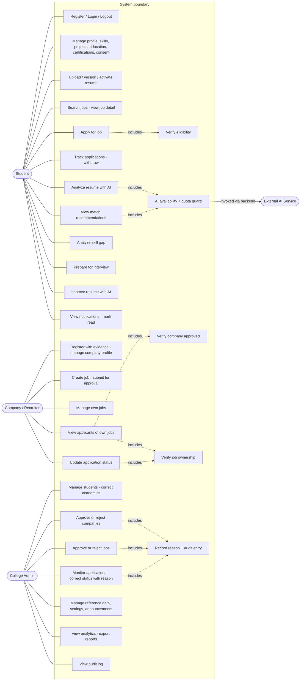
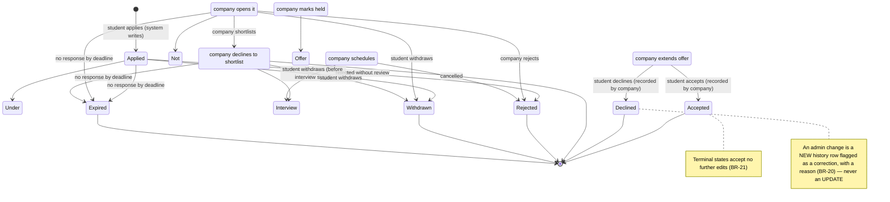

# AI-Powered Student Placement Management System

## Phase 5 — System Design & Diagrams

| Field | Value |
|---|---|
| Stage | Phase 5 of 21 |
| Purpose | Convert the approved **requirements** (Phase 3), **architecture** (Phase 2) and **database** (Phase 4) into a complete visual + conceptual system-design specification |
| Contents | **36 numbered diagram entries** (D-01…D-36) across **42 sections**, each with an explanation. Three entries are *families* (D-26 five sequences, D-27 four activity diagrams, D-28 three state machines) and D-25 is a pair, so the count of individually drawn views is **51** — the index in §41 lists every one and explains what each adds. |
| Contains **no** | Implementation code · React/Node/Express/SQL/AI/auth/CSS code · UI page design (Phase 6) · detailed API endpoint specification (later phase) · any database redesign (Phase 4 is authoritative) |
| Terminology | Fixed in §0.2 and used identically in every diagram — the most common way a student report contradicts itself is by renaming things between diagrams |

### How to use this document in your report

| Section of your final report | Take from |
|---|---|
| "System Design" chapter | Diagrams D-01…D-12 + their explanations (paste the ASCII blocks in a monospaced style, or re-draw from them) |
| "Diagrams" appendix (the examiner's favourite) | D-13…D-31 — the DFD levels, sequence, activity and state diagrams |
| "Security & AI integration" chapter | D-19…D-22, D-30, D-32, D-33 |
| Viva preparation | Each section's **"Say this in the viva"** line, plus §40 (consistency) and §42.L (design decisions) |

**Rendering note.** Every diagram is given as ASCII so it survives copy-paste into Word and printing in the report. Where a diagram would genuinely look better drawn (use-case, sequence, state, DFD), a **Mermaid source block** is included; paste it into `mermaid.live` and export SVG/PNG for your slides and front matter. Mermaid is a *drawing* tool, not code you will run — nothing here is implementation.

---

## 0.1 Phase 5's one job

Phases 1–4 answered *what* the system is, *what it's built with*, *what it must do*, and *where data lives*. Phase 5 answers: **how do those pieces move, in what order, through which boundary, and who is allowed to touch what.** If a diagram in this phase cannot be traced to a Phase 3 requirement or a Phase 4 table, it does not belong here.

## 0.2 Fixed terminology (identical in all 35 diagrams)

| Term | Means | Never written as |
|---|---|---|
| **Frontend / Client Tier** | The React single-page app in the browser | "UI layer", "client-side app", "React app layer" (pick one) |
| **Backend / Application Tier** | The single Node.js + Express process | "server", "API server", "middleware layer" |
| **REST API boundary** | The contract between the two — a *boundary*, not a separate process | "API tier" (Phase 2 says layered monolith; inventing a fourth tier contradicts it) |
| **Data Tier (MySQL)** | The 37 Phase-4 tables, integrity, history | "DB", "database server" (mixing is fine in speech, not in a report) |
| **File Storage** | Server disk, non-web-accessible path | "S3", "cloud bucket" (Phase 2 rejected external buckets) |
| **AI Service** | External LLM endpoint | "AI engine", "ML model", "the AI" (ambiguous with the AI layer) |
| **AI layer** | The backend's `ai-client` seam + payload builder + validators | "AI service" (the service is *outside*; the layer is *inside*) |
| **Eligibility Service** | The one deterministic rules function, 3 call sites | "eligibility check", "criteria validator" |
| **Status Processor** | The single write door for application status | "status updater", "status API" |
| **Notification Service** | Event → per-recipient rows | "mailer", "alerts" |
| **Student / Company / Admin** | The three roles (DB values `Student`, `Company`, `Admin`) | "user", "candidate", "recruiter" as a role name |
| **Pending / Approved / Rejected / Suspended** | Company states | "awaiting", "verified", "blocked" |
| **Draft / Pending Approval / Approved / Rejected / Closed / Expired** | Job states | "pending" alone (it means different things for a company and a job — hence "Pending **Approval**" for jobs) |
| **the 12 application statuses** | `Applied · Under Review · Shortlisted · Interview Scheduled · Interview Completed · Offer Received · Accepted · Declined · Not Shortlisted · Rejected · Withdrawn · Expired` | "Interview", "Selected", "Hired", "Placed" as statuses |
| **Advisory result** | Anything an `ai_*` table stores | "score", "rating", "prediction" (a band is not a prediction) |

**Why this table exists:** three of the diagrams the Phase 5 prompt sketches use status names that Phase 3/4 deliberately replaced (`Interview`, `Selected`). §16 and §30 map them explicitly instead of silently obeying either version — a report that draws "Selected" while its database ENUM says `Accepted` loses marks in exactly the place examiners look.

---

## Table of Contents

1. System Design Overview · 2 System Boundary · 3 Context Diagram · 4 Architecture Diagram · 5 Layered Architecture · 6 Use Cases · 7 Module Architecture · 8 Student Flow · 9 Company Flow · 10 Admin Flow · 11 Authentication Flow · 12 RBAC Flow · 13 Company Approval · 14 Job Approval · 15 Application Flow · 16 Status Flow · 17 Notification Flow · 18 Resume Processing · 19 AI Architecture · 20 AI Features · 21 AI Matching · 22 AI Skill Gap · 23 AI Interview Prep · 24 AI Resume Improvement · 25 DFD-0 · 26 DFD-1 · 27 DFD-2 · 28 Sequence · 29 Activity · 30 State · 31 DB Architecture · 32 Data Relationships · 33 Security Architecture · 34 File Handling · 35 Error Handling · 36 AI Failure · 37 Complete Data Flow · 38 Module Dependency · 39 Traceability · 40 Consistency Check · 41 Diagram Index · 42 Final Summary

---

# Section 1 — System Design Overview

### 1.1 What "system design" means for this project

System design is the step where a list of *requirements* becomes a description of a *working mechanism*: which parts exist, what each is responsible for, in what order data travels, where the boundaries of trust are, and what happens when something fails. It is deliberately **not** implementation — no syntax, no endpoints, no CSS. The test of a good Phase 5 is that a competent developer could build Phase 7+ without inventing any policy, and that an examiner can read it and see *why* the system behaves as it does.

### 1.2 Why it matters here specifically

| Reason | What it prevents in this project |
|---|---|
| The **trust boundary** must be drawn once, on paper | "The React app checks whether the company may view this student" → the rule exists twice and drifts; Phase 2 rule A forbids it |
| **Approval and status flows are state machines**, not forms | A company that can self-approve, or a status that can jump from `Applied` to `Accepted` |
| **AI must be visibly a side trip** | If AI sits *in* the application path on the diagram, it sits in it in the examiner's mind — and later in the code |
| Failure paths are cheap to design and expensive to retrofit | "What if the AI is down?" answered in Phase 19 instead of Phase 13 |
| Diagrams are the **only** part most external readers study | Marks are won here by clarity, not by line count |

### 1.3 How Phase 5 connects everything

```
Phase 1  why/what the system is ────────────┐
Phase 2  stack + architecture rules ────────┤
Phase 3  141 FRs, 34 BRs, 16 flows ─────────┼──► PHASE 5 ──► Phase 6  pages & interactions
Phase 4  37 tables, constraints, states ────┘    (design &      Phase 7+ backend/DB build
                                                  diagrams)    Phase 13–16 AI features
                                                       │       Phase 19 tests
                                                       ▼
                                    every diagram here cites a Phase 3
                                    requirement id or a Phase 4 table name
```
Phase 5 is the **last purely conceptual phase**. From Phase 6 onward, every artefact is buildable, so every ambiguity left here becomes a decision someone makes under time pressure later.

### 1.4 The five views — what each answers (do not blur them)

| View | Question it answers | Diagrams here | Owner phase |
|---|---|---|---|
| **System architecture** | What layers exist, where is the boundary, what may talk to what | D-02, D-03, D-19, D-30 | Phase 2 defined it; Phase 5 draws it |
| **Module design** | Which functional units exist and which may depend on which | D-05, D-35 | Phase 3 specified them |
| **Data flow** | Where information enters, is transformed, is stored, leaves | D-23, D-24, D-25, D-34 | New in Phase 5 |
| **Database design** | What is stored, with what keys and constraints | *(Phase 4; D-29/D-30 only **show** it)* | Phase 4 |
| **User workflow** | What a person does, in order, including the dead ends | D-06…D-15, D-27 | Phase 3's 16 flows, drawn |

A viva question that catches students out: *"what's the difference between your data-flow diagram and your architecture diagram?"* Answer: **architecture says who may talk to whom; data flow says what information moves and where it is kept.** Same system, two projections — which is why §41 keeps both rather than "consolidating" them into one unreadable picture.

**Say this in the viva:** *"Phase 5 turns an approved requirement list into a mechanism. Nothing new is invented — every box and every arrow already had a reason in Phases 1–4; here they get placed."*

---

# Section 2 — System Boundary

### 2.1 Why draw a boundary at all

The boundary is the single most examinable line in this project, because it *is* the security design and the AI design at the same time: **everything that can decide anything is inside; everything untrusted is outside.**

```
┌──────────────────────────────────────────────────────────────────────────────┐
│  INSIDE THE SYSTEM (your software)                                           │
│                                                                              │
│  Presentation      React SPA: render, collect input, UX-time validation      │
│  Application       Express: authN · authZ · ownership · validation · rules   │
│                    Eligibility Service (shared) · Status Processor (single    │
│                    write door) · Notification generation · Analytics          │
│                    computation · File receive/validate/store                  │
│                    AI layer (ai-client seam: payload builder, timeout, quota, │
│                             response shape-validation, sanitising)            │
│  Data              MySQL: 37 tables — integrity, status history, audit       │
│                    File Storage: resume + evidence bytes, non-web path        │
│                    Settings: limits, bands, AI kill switch & quota            │
└───────┬─────────────────────────────────────────────────────────┬────────────┘
        │ HTTPS + JSON (REST boundary)                            │ HTTPS, server-side key
        ▼                                                         ▼
┌───────────────────────────────┐                 ┌────────────────────────────┐
│ OUTSIDE — ACTORS              │                 │ OUTSIDE — SERVICES         │
│  Student (browser)            │                 │  External AI Service (LLM) │
│  Company / Recruiter          │                 │   untrusted · stateless    │
│  College Admin (TPO)          │                 │  Time / deadline source    │
│  (all three are humans using  │                 │   evaluated on read, not   │
│   a browser; the browser is   │                 │   scheduled                │
│   NOT part of the system)     │                 │  Email/SMS delivery        │
└───────────────────────────────┘                 │   OUT OF SCOPE (EX-08)     │
                                                  │  Object storage / CDN       │
┌──────────────────────────────────────────────┐  │   REJECTED (Phase 2)       │
│ ALSO OUTSIDE — deliberately, and importantly │  └────────────────────────────┘
│  The AI provider's model & its training data │
│  MySQL Workbench / Postman (dev tooling)     │  ← used to build/inspect, not part
│  Git hosting (GitHub)                        │    of runtime
│  The college's existing ERP / academic DB    │  ← no integration (Phase 1 scope);
│                                                │    data is entered & verified here
└───────────────────────────────────────────────┘
```

### 2.2 The boundary rules that follow from this picture

| Rule | Consequence | Traces to |
|---|---|---|
| **Nothing outside may write inside directly** | No DB access from the browser, no writes requested by the AI service, no file dropped into storage by an actor | Phase 2 rules A–C |
| **Everything crossing the boundary is validated on entry** | Input from a user *and* output from the AI are both untrusted; both get shape/length/type checks | FR-AI-GEN-06, VAL-01..16 |
| **Data may leave only in role-scoped, field-limited form** | A recruiter receives applicant fields for their own job; the AI receives stripped text with no identifiers | BR-13, SEC-10 |
| **An external service may be removed without removing a capability other than the AI one** | Delete the AI boundary box → core flows still complete | FR-AI-GEN-01 |

### 2.3 What is *not* an external service here (resisted on purpose)

No payment gateway, no email/SMS provider, no auth provider (Google login), no resume-parsing vendor, no cloud storage bucket, no analytics platform, no message queue, no cache cluster, no search engine service. Each would add credentials, a failure mode and a bill for zero marks. **Prompt-engineering rule of this project: the number of external systems is exactly one** — the AI service — plus the OS file system, which is a capability you already have.

**Say this in the viva:** *"One external dependency, and I can switch it off with a setting without breaking placement management. That is the boundary I chose deliberately, because every additional external system is a way for a college project to fail during a demo."*

---

# Section 3 — Context Diagram (D-01, Level-0)

### D-01 · System Context Diagram

```
                            ┌─────────────────────────────┐
                            │        EXTERNAL AI SERVICE   │
                            │   (LLM API · untrusted)      │
                            └───▲─────────────────────┬────┘
     stripped, capped text      │                     │  advisory content
     (no names, no ids)         │                     │  (shape-validated,
                                │                     │   sanitised, stored)
┌──────────────────┐            │                     │
│     STUDENT      │            │                     │
│──────────────────│  register · profile · skills · resume upload · consent ·  │
│ owns: identity,  │  search filters · apply · withdraw · "analyze" · "For You"│
│ academics,       │  · gap target pick · interview-prep answers · accept/reject│
│ resume versions, │  edit proposals · mark notifications read · feedback on AI│
│ applications,    └──────────────┐         ┌─────────────────────────────────┘
│ AI results       │              │         │
└──────────────────┘   ┌──────────┴─────────▼──────────────┐
                       │   AI-POWERED STUDENT PLACEMENT     │
                       │        MANAGEMENT SYSTEM           │
                       │   (the whole software, as one box) │
                       │                                    │
┌──────────────────┐   │  Processes: authentication ·       │   ┌──────────────────────┐
│ COMPANY/RECRUITER│   │  profile · resume · company & job  │   │     COLLEGE ADMIN    │
│──────────────────│   │  approval · search · applications  │   │──────────────────────│
│ owns: company    │──►│  status lifecycle · notifications ·│◄──│ sole authority over: │
│ profile, jobs,   │   │  analytics/reports · audit         │   │ company approval ·     │
│ applicant view,  │   │                                    │   │ job approval · student │
│ status updates   │   │  Data stores: user · student ·     │   │ & company accounts ·   │
└──────────────────┘   │  resume · company · job ·          │   │ announcements · config │
                       │  application · notification ·      │   │ · reports · audit log  │
┌──────────────────┐   │  audit · AI-result records         │   └────────────────────────┘
│ (time/deadline)  │──►│                                    │
│ evaluated on read│   │  Files: resume & evidence bytes     │
└──────────────────┘   │  stored on server disk             │
                       └───┬───────────────┬────────────────┘
                           │               │
                    resume/evidence     placement analytics,
                           ▼               ▼
                  ┌────────────────┐ ┌──────────────────────────┐
                  │ FILE STORAGE   │ │ REPORTS / EXPORT (admin) │
                  │ (server disk)  │ │ aggregate-first          │
                  └────────────────┘ └──────────────────────────┘
```

### 3.1 Inputs and outputs, per actor (the part examiners actually check)

| Actor | Inputs to the system | Outputs from the system | Boundary checks applied on the way in |
|---|---|---|---|
| **Student** | Registration; profile/education/projects/skills; resume file; search filters; apply + resume version choice; withdrawal; interview-prep answers; decisions on AI edit proposals; read-state | Eligible job list with reasons; application timeline; AI advisory results (band + explanation + date); notifications; own statistics | Role = Student; ownership of every record id referenced; consent present before applying; duplicate-application rule |
| **Company/Recruiter** | Registration + verification evidence; company profile edits; job posting incl. structured criteria; applicant filters; status change + note | Approval state & reason; own job list with counts; applicant list (policy-limited fields); resume download for their own applicants; notifications; own-job analytics | Role = Company; `company_status = Approved` gate; **derived ownership** (`job.company_id` / `application.company_id`) on every row; legal transition only |
| **Admin** | Login; approval decisions + reasons; academic corrections + reasons; suspension/reactivation; announcements; reference data & settings edits; report filters | Pending queues; monitoring views; analytics & exports; audit history; configuration confirmations | Role = Admin; mandatory `reason`; every sensitive action logged to `audit_log`; report logging |
| **AI Service** | One capped, identifier-stripped payload per request | Text/structured advisory content | Response shape validated, values range-checked, lengths capped, text sanitised; **invalid ⇒ typed failure, nothing stored** |

### 3.2 Reading notes on this diagram

1. **`job_notifications` fan-out is the only output that has no actor at the other end of a request.** It is generated by an approval event, which is why it appears inside the system box rather than as a data flow from a user.
2. **Reports/exports are drawn as an output of the system, not a store.** The data is read, aggregated, and rendered; nothing is persisted as "the report" (BR-22, §21 of Phase 4).
3. **`(time/deadline)` is an input with no box of its own** — expiry is evaluated when data is requested. Drawing a scheduler here would invent a component the requirements don't need.
4. Notice what is *missing*: there is no arrow from **Company** to **AI Service**, and none from any actor to **MySQL** or **File Storage**. Both absences are requirements (rules 1 and 3 of the stack), and a context diagram is as much about missing arrows as present ones.

**Say this in the viva:** *"Four external entities, one of them a system rather than a person. Students and companies mostly *edit*; the admin mostly *decides*; the AI only ever *comments* — and no arrow lets the AI reach a decision box."*

---

# Section 4 — System Architecture Diagram (D-02)

### D-02 · Final System Architecture (three tiers + one external service + one file store)

```
┌────────────────────────────────────────────────────────────────────────────────┐
│                                   USERS                                        │
│        Student                        Company / Recruiter            Admin     │
│   (profile, resume, apply,            (company profile, jobs,       (approvals,│
│    track, practise)                    review applicants)            oversight) │
└───────────────┬───────────────────────────┬──────────────────────────┬──────────┘
                │         browser · HTTPS · JSON (the REST API boundary — not a process)
┌───────────────▼───────────────────────────▼──────────────────────────▼──────────┐
│                            PRESENTATION TIER  — React SPA                        │
│  role-specific screens · form capture · client-side checks FOR UX ONLY ·          │
│  spinners & disabled buttons (a courtesy, never a control) ·                    │
│  error mapping from typed responses · status/advisory labels rendered as stored   │
│  ⛔ holds no business rule · ⛔ no SQL · ⛔ no AI key · ⛔ no "am I allowed" logic │
└───────────────────────────────────────┬─────────────────────────────────────────┘
                                        │  requests carry JWT only (never a role hint,
                                        │   never a company/student id as authority)
┌───────────────────────────────────────▼─────────────────────────────────────────┐
│                      APPLICATION TIER — Node.js + Express  (one process)         │
│                                                                                  │
│  ① MIDDLEWARE PIPELINE (in this fixed order, on every protected route)           │
│     authenticate(JWT verify + token_version/user_tokens revocation)              │
│        → authorize(role) → authorize(ownership/scope) → validate input           │
│                                                                                  │
│  ② CONTROLLERS — thin: translate request → call one service → shape response      │
│                                                                                  │
│  ③ SERVICES — where every rule lives                                              │
│     auth · student · resume · company · job · search · application                │
│       └ ELIGIBILITY SERVICE (shared, deterministic, 3 call sites)                 │
│       └ STATUS PROCESSOR  (single write door: verify actor+state+transition)      │
│     notification · analytics (aggregate on request) · admin/settings · audit      │
│       └ AI layer: payload builder → ai-client → response validator → writer        │
│                                                                                  │
│  ④ DATA ACCESS — parameterised SQL only · transactions where multi-write          │
│     ⛔ no stored procedures, no triggers holding rules (they are untestable)       │
└──────┬────────────────────────────┬──────────────────────────┬─────────────────┘
       │ parameterised SQL          │ validated file bytes     │ HTTPS, key in env
       ▼                            ▼                          ▼
┌──────────────────────┐  ┌───────────────────────┐  ┌──────────────────────────┐
│   DATA TIER — MySQL  │  │  FILE STORAGE         │  │  EXTERNAL AI SERVICE      │
│──────────────────────│  │───────────────────────│  │──────────────────────────│
│ 37 InnoDB tables     │  │ resumes · evidence  │  │ LLM endpoint (free tier) │
│ reference · identity │  │ non-web path          │  │ stateless · no storage   │
│ student · resume meta│  │ random filenames      │  │ receives no identifiers  │
│ company · job · app  │  │ served only via       │  │ output NOT trusted:      │
│ history · notif ·    │  │ permission check      │  │ validated before storing │
│ audit · settings ·   │  │ ⛔ no bytes in MySQL   │  │ ⛔ never in a write path │
│ 9 ai_* advisory tbls │  └───────────▲───────────┘  └────────────┬─────────────┘
│ integrity: 23 UNIQUE│              │                            │
│ 60 FK · 15 CHECK    │◄─────────────┴────────── result stored ────┘
└──────────────────────┘               (by the service, not by ai-client)
```

### 4.1 Every layer, explained

| Layer | Owns | Must never own | Why this split |
|---|---|---|---|
| **Presentation (React)** | Rendering, input collection, immediate feedback, formatting | Any decision, any secret, any SQL | Deleting the frontend entirely must not weaken any rule — that is the definition of a correct client tier (Phase 2 §4.2) |
| **REST API boundary** | Message shape: JSON in, JSON out, HTTP status semantics | Being a *layer that decides* | It is one process, not two. Calling it a tier invites someone to put validation "in the API gateway", where nobody can unit-test it |
| **Application (Express)** | Authentication, authorization, eligibility, status legality, visibility gating, notification generation, aggregation, file handling, AI orchestration, transaction boundaries | Long-lived in-memory user state; the AI key beyond one module; stored procedures | One place to audit ("where is the rule?" has one answer: services) and one place to test |
| **Data (MySQL)** | Records, relationships, uniqueness, referential integrity, append-only history | Business logic beyond constraints | Constraints catch what code forgets; rules in triggers cannot be unit-tested (NFR-14) and hide policy |
| **File storage** | Resume/evidence bytes | Being reachable by URL, being inside the DB | Backups stay logical, access control stays in one place, the DB stays a database |
| **External AI** | Text analysis, explanation, prioritisation | Truth, storage, decisions, keys | Advisory by contract: called at most once per action, output validated, absent ⇒ degraded, never broken |

### 4.2 Three details in this diagram that are *design*, not decoration

1. **`ai-client` performs no writes.** The service that called it stores the result, after validation. That keeps the AI's output out of the trust path structurally (§19).
2. **Revocation is checked inside ①** — `token_version` + `user_tokens` — so suspension takes effect on the *next request*, which is BR-11 drawn as a position in a pipeline.
3. **The middleware order is part of the design.** `ownership` runs *after* `role` and *before* `validate`, because permission failures must be answered without ever touching record data (BR-32's determinism-before-probability principle, applied to the request path).

**Say this in the viva:** *"Three tiers, one external dependency, one file store, and one rule: the application tier is the only place a decision can be made. That is why the AI can be removed without removing a feature — it never had a decision to begin with."*

---

# Section 5 — Layered (Three-Tier) Architecture

### D-03 · Layered View with Responsibilities

```
┌─────────────────────────────────────────────────────────────────────────┐
│ L1  PRESENTATION        React SPA · Tailwind/CSS (OD-2 pending)         │
│     renders · collects · reflects state · formats · shows typed errors   │
│     state kept: session token, current filters, form drafts              │
│     contracts: no rule, no secret, no query                               │
├─────────────────────────────────────────────────────────────────────────┤
│ L2  APPLICATION         Express (layered monolith, one process)         │
│     L2a routes + middleware  (authN → role → scope → validation)         │
│     L2b controllers          (thin translation in/out)                   │
│     L2c services             (auth · student · resume · company · job ·  │
│                               search · application · notification ·        │
│                               analytics · admin · audit)                  │
│     L2d shared doors         Eligibility Service · Status Processor       │
│     L2e ai seam              ai-client (sole holder of key/timeout/quota) │
│     L2f data access          parameterised SQL, transactions               │
├─────────────────────────────────────────────────────────────────────────┤
│ L3  DATA                MySQL 8 (37 tables) · server-disk file storage   │
│     records · constraints · status history · audit · settings · files     │
├─────────────────────────────────────────────────────────────────────────┤
│ EXT  EXTERNAL AI SERVICE  provider API · stateless · advisory · untrusted │
│      (accessed only through L2e — it has no view of L3, and L3 has no      │
│       column any AI response can write into directly)                       │
└─────────────────────────────────────────────────────────────────────────┘

  Dependency direction is downward only.  L1 ↛ L3   L2 ↛ (L1)   EXT ↛ L3
  A layer may use the layer immediately below it and nothing further.
```

### 5.1 Responsibilities, in the terms an examiner wants

| Layer | Responsibilities | Concrete artefacts in *this* project |
|---|---|---|
| **Presentation** | Show role-appropriate screens, gather input, give instant feedback, present stored labels honestly | 3 role homes, job search list, application timeline, advisory panels with the disclaimer text **as stored in the DB** |
| **Application** | Decide everything: identity, permission, eligibility, status legality, visibility, notification content, aggregation, file acceptance, AI orchestration | The six service groups + 2 shared doors + the AI seam |
| **Data** | Hold truth and enforce integrity | `UNIQUE(student_user_id, job_id)`, `active_slot` uniqueness, `ck_company_approved`, append-only `application_status_history`, `audit_log` with no FK |
| **External AI** | Explain, prioritise, draft | Reads only a stripped payload; returns bands/lists/text; never writes |

### 5.2 Advantages of layered architecture **for this project** (not in general)

1. **Testability without a browser or a database for rules** — eligibility and transition legality are plain functions in L2c (NFR-14).
2. **Swappable AI** — the free-tier provider may change limits or vanish (it did in Dec-2025); only `ai-client` knows it exists (Phase 2 rule E).
3. **Parallel work by one student** — L1 can be built against known response shapes while L2/L3 progress, because the boundary is fixed rather than emergent.
4. **Reportability** — a reviewer can criticise or praise one layer at a time; "the security is in the middleware" is a sentence you can defend with three files.
5. **Honest scaling** — if the college later wants more, the first cut is a second service for AI only; the layer seams make that a *possible* change, which is worth saying even though you will not do it.

### 5.3 Why *this* layering and not the alternatives

| Alternative | Rejected because |
|---|---|
| **Microservices** | Multiple deployables, service discovery, distributed transactions for a system with 500 users. Phase 2 §29 forbade it; NFR-11's "one transaction" is *only* easy in one process |
| **MVC without a service layer (fat controllers)** | Rules get copied into 6 controllers; BR-19's "one write door" becomes 6 doors |
| **Server-rendered monolith (no SPA)** | Rejected in Phase 2 — an interactive application-tracking UI is far cheaper in React, and the SPA keeps the API boundary visible for Postman testing |
| **Two databases (one for AI)** | Explicitly forbidden (quality rule 17, Phase 2 §29); AI results are relational rows with FKs — separating them would *weaken* the "referenced by nothing, but referencing something valid" property |
| **Putting logic in MySQL (views/procedures/triggers)** | Phase 2 §4.2 rule; it hides policy from unit tests and from the reader of the code |

### 5.4 Separation of concerns, stated as a checkable rule

> **For every requirement of the form "the system shall refuse …", there is exactly one place in L2 where it is enforced, and that place is reachable from every entry point.**

Two consequences worth drawing attention to in the report: the **Eligibility Service** is shared by three call sites so search, apply and notification fan-out can never disagree (BR-32); the **Status Processor** is shared by company, bulk and admin-correction paths so no actor has a private status route (BR-19/20).

**Say this in the viva:** *"Layering here isn't decoration — it's what makes 'AI is optional' and 'rules live in one place' both true at the same time."*

---

# Section 6 — Actors & Use-Case Overview

### D-04 · Use-Case Diagram (actors · use cases · include/extend)

```
                                 ┌───────────────┐
                                 │  AI Service   │ «external»
                                 │ (secondary)   │
                                 └───────▲───────┘
              «include» for every ai_*   │  invoked by backend, never by an actor
                 use case below          │
                                         │
  ┌──────────┐          ┌────────────────┴─────────────────────┐         ┌──────────────┐
  │ STUDENT  │          │        SYSTEM BOUNDARY               │         │    ADMIN     │
  └────┬─────┘          └──────────────────────────────────────┘         └──────┬───────┘
       │                                                                        │
 ┌─────┴─────────────────────────────────────────────────┐        ┌────────────┴──────────────────────┐
 │ 〔Auth〕 Register · Login · Logout                     │        │ 〔Admin〕 Login · View Dashboard    │
 │ 〔Profile〕 Manage Profile § · Manage Skills §         │        │  Manage Students § · View/Correct  │
 │           Manage Projects § · Manage Education §       │        │  Academics (reason) § ·            │
 │           Manage Certifications/Awards § · Consent      │        │  Manage Reference Data · Settings  │
 │ 〔Resume〕 Upload Resume · List/Activate/Delete Ver §   │        │  Announcements § · Reports/Export   │
 │ 〔AI〕  Analyze Resume ○ · View Match Recommendations ○│        └──────┬───────────────────────────────┘
 │        Analyze Skill Gap ○ · Prepare for Interview ○   │               │ include
 │        Improve Resume ○ · Give AI Feedback ○            │               ▼
 │ 〔Jobs〕 Search Jobs · View Job Detail                  │   ┌───────────────────────────────┐
 │ 〔Apps〕 Apply for Job ○ · Track Applications ·         │   │ «include»  Verify Eligibility │
 │         Withdraw Application ○                          │   │ «include»  Accept Consent     │
 │ 〔Notif〕View Notifications · Mark Read                  │   │ «extend»   AI Unavailable ⇒   │
 └─────┬───────────────────────────────────────────────────┘   │            Deterministic Order│
       │ include                                               └───────────────────────────────┘
       ▼
 ┌────────────────────────────────────────────────────────────┐
 │                    COMPANY / RECRUITER                     │
 │ 〔Auth〕 Register (with evidence) · Login · Logout           │
 │ 〔Company〕 Manage Company Profile · Re-submit after Reject  │
 │ 〔Jobs〕 Create Job ○ · Edit Job · Submit for Approval ○ ·   │
 │         Manage Jobs (close) · View Own Job Stats            │
 │ 〔Apps〕 View Applicant List ○ · View Applicant Profile ○ ·  │
 │         Download Resume ○ · Update Application Status ○ ·    │
 │         Add Internal Note · Bulk Shortlist                  │
 │ 〔Notif〕 View Notifications · Mark Read                     │
 └────────────────────────────────────────────────────────────┘
        every company use case marked ○ «includes» Verify Company Approved
        + «includes» Verify Job Ownership (BR-13)

 ┌──────────────────────────────────────────────────────────────────────────┐
 │ ADMIN use cases continued: Approve/Reject Company ○ · Approve/Reject Job │
 │ ○ · Monitor Applications · Correct Application Status (reason) ○ ·       │
 │ Suspend/Reactivate Accounts ○ · View Audit Log                            │
 │        every admin ○ above «includes» Record Reason + Append Audit Log    │
 └──────────────────────────────────────────────────────────────────────────┘

Legend   〔grouping〕   § = CRUD-style, always available to the role after login
         ○ = gated (an «include» or a business rule decides)   «include» = mandatory
         «extend» = conditional extra behaviour
```

### 6.1 Actor table (with the *why*, not just the what)

| Actor | Type | Primary goals | What they explicitly **cannot** do |
|---|---|---|---|
| **Student** | Primary | Be seen fairly: complete a profile, have a readable resume, find suitable jobs, know what happened to an application | See other students; see unapproved jobs; alter a status; hide an application from a recruiter who legitimately received it |
| **Company / Recruiter** | Primary | Find and progress candidates for *their* jobs | See any student who didn't apply to them; approve their own company or job; see AI output (BR-04); change a status illegally |
| **College Admin (TPO)** | Primary | Keep the process legitimate and knowable: verify, approve, monitor, report | Edit a resume; decide a hire (they approve *process*, not *people*); silently change anything — every act carries a reason + audit row |
| **External AI Service** | **Secondary** (system actor) | Produce advisory content from a stripped payload | Trigger an action; write a core record; see identifiers; reach a recruiter |
| **Time / deadlines** | Data condition, not an actor | Expire jobs, mark deadlines near | Run jobs or schedulers (expiry evaluated on read) |

### 6.2 The four relationships that make this diagram more than a feature list

| Relationship | Where drawn | Requirement it encodes |
|---|---|---|
| `Apply for Job` **«includes»** `Verify Eligibility` **and** `Accept Consent` | Centre box | FR-APP-01, FR-STU-06, FR-STU-08, BR-24 |
| `Analyze Resume` / `View Recommendations` / … **«include»** the AI service *via the backend* | Top of diagram | Rules 5 & 8 of the stack — no actor touches the AI directly |
| Every gated company use case **«includes»** `Verify Company Approved` + `Verify Job Ownership` | Bottom box | BR-05, BR-13 — permission is derived from the workflow, not the role |
| Every admin sensitive use case **«includes»** `Record Reason + Append Audit Log` | Right box | BR-15/16/17/18/20, FR-ADM-08 — admin power is bounded by logging |
| `View Match Recommendations` **«extends»** with `Deterministic Order` on failure | Centre-right | FR-AI-MATCH-08, FR-AI-GEN-03 |

### 6.3 Two "missing" use cases, so nobody asks twice

- **No "Schedule Interview" use case.** Interviews are conducted offline; the system records `Interview Scheduled` and a free-text slot (Phase 2 §2 exclusion). If an examiner asks, that's the answer.
- **No "Approve Student / Reject Student" use case.** There is nothing to approve about a student: their academic data is verified by the college and correctable with a reason (FR-STU-07). The *company* is what gets approved.
- Also absent: "Email resume", "Download shortlist as PDF" beyond the aggregate-first report (FR-ANA-10), and any admin action on AI output beyond the kill switch — AI is not manageable into becoming a decision-maker.

**Mermaid source** (paste into `mermaid.live` → export PNG for slides; GitHub renders this inline):



**Say this in the viva:** *"The arrows that matter aren't actor-to-use-case, they're the dotted `include` lines: eligibility, company-approval, ownership, and reason-plus-audit. Those four are where an untrained system gets hacked."*

---

# Section 7 — Module Architecture

### D-05 · Module Architecture (16 modules + 2 shared doors + 1 external seam)

```
                            ┌──────────────────────────┐
                            │      SYSTEM              │
                            └────────────┬─────────────┘
        ┌────────────────┬──────────────┼───────────────┬────────────────┐
        ↓                ↓              ↓               ↓                ↓
 ┌────────────┐  ┌──────────────┐ ┌───────────┐ ┌─────────────┐ ┌────────────┐
 │ 1 AUTH     │  │ 2 STUDENT    │ │ 4 COMPANY │ │ 5 JOB       │ │ 16 FILE    │
 │ registration│ │ MGMT         │ │ MGMT      │ │ MGMT        │ │ MGMT       │
 │ JWT +      │  │ profile ·    │ │ profile · │ │ create ·    │ │ upload ·   │
 │ revocation │  │ education ·  │ │ approval  │ │ criteria ·  │ │ validate · │
 │ lockout ·  │  │ projects ·   │ │ state ·   │ │ approval ·  │ │ store ·    │
 │ roles      │  │ skills ·     │ │ re-verify │ │ lifecycle   │ │ serve      │
 └─────┬──────┘  │ consent      │ └─────┬─────┘ └──────┬──────┘ └─────┬──────┘
       │         └──────┬───────┘       │              │              │
       │                ↓               ↓              ↓              │
       │         ┌──────────────────────────────────────────┐         │
       │         │ 3 RESUME MGMT  (versions, active, links) │◄────────┘
       │         └──────────────────┬───────────────────────┘
       │                            │
       ├──────────────┬─────────────┼──────────────────────┐
       ↓              ↓             ↓                      ↓
 ┌───────────┐ ┌──────────────┐ ┌────────────────┐  ┌──────────────────┐
 │ 6 JOB     │ │ 7 APPLICATION│ │ ELIGIBILITY    │  │ 9 ADMIN MGMT     │
 │ SEARCH &  │ │ MGMT         │ │ SERVICE        │  │ queues · accounts│
 │ VISIBILITY│ │ apply ·      │ │ (shared,       │  │ · config ·       │
 │ rules-only│ │ duplicate ·  │ │  deterministic)│  │ announcements ·  │
 │ filters   │ │ snapshots ·  │ └───────┬────────┘  │ audit access     │
 └─────┬─────┘ │ withdraw ·   │         │ reads     └────────┬─────────┘
       │       │ eligibility  │         │                    │
       │       └──────┬───────┘         │                    │
       │              ↓                 │                    │
       │       ┌──────────────────┐     │      ┌─────────────▼────────────┐
       └──────►│ STATUS PROCESSOR │◄────┘      │ 10 ANALYTICS  (compute,   │
              │ (THE single write │            │     no storage of its own)│
              │  door) + history  │            └─────────────┬────────────┘
              └────────┬─────────┘                          │
                       ↓                                    ↓
              ┌──────────────────┐                ┌────────────────┐
              │ 8 NOTIFICATIONS  │◄───────────────┤ reports/export │
              │ event → rows     │                └────────────────┘
              └──────────────────┘
                       ▲
        ┌──────────────┴───────────────────────────────────────────┐
        │  AI MODULES (11–15) — read core, write only ai_* records  │
        │  11 Resume Analyzer · 12 Job Matching · 13 Skill Gap      │
        │  14 Interview Prep · 15 Resume Improvement               │
        │        all five → 17 ai-client seam → External AI Service │
        │        and → Notification Service only for "failed" note  │
        └───────────────────────────────────────────────────────────┘
```

### 7.1 Dependency rules between modules (these are the design, not the boxes)

| Rule | Meaning | Breaks which requirement |
|---|---|---|
| **M1. One direction, downward only** | 1→2/4→3/5→6/7→8→9/10; no upward call | Prevents the circular "notification module calls the application module to look up the status it just changed" |
| **M2. Only 7 may write `applications.status`, and only via STATUS PROCESSOR** | Company, bulk and admin corrections all pass through one door | BR-19/20/21 — a private write path is how illegal transitions happen |
| **M3. 6, 7 and the notification fan-out all call ELIGIBILITY; nobody re-implements it** | One definition of "eligible", three call sites | BR-32, FR-SRCH-01, FR-APP-01, FR-NOT-02 |
| **M4. 10 reads; it never writes** | Analytics aggregates on request from 7/5/2/4 | BR-22 — one source for the placement number |
| **M5. AI modules read core modules and write `ai_*` only** | No AI module may call 7 or 9, and no core module imports an AI module | BR-02/03/04; Phase 4's one-way FK rule |
| **M6. 8 is the *only* module that creates notifications** | Modules emit events; 8 composes and persists | BR-28 + "no duplicated side-channel messages" (Section 17's requirement) |
| **M7. 16 owns files; 3 owns resume *records*** | Upload validation and storage in one place; metadata/versioning in the other; neither reads the other's internals | FR-FILE-01..07 vs FR-RES-01..05 |
| **M8. 1 (auth) is used by all; it uses none** | Identity is a leaf dependency | FR-AUTH-10, BR-12 |
| **M9. 9 ADMIN wraps 2/4/5/7 with reason+audit, it does not replace them** | An admin edit goes *through* the same service the actor would use | BR-17/20 — no "admin path" that skips validation |

### 7.2 Where each AI module plugs in, and where it may not

| AI module | Reads from | Writes to | May influence | May never influence |
|---|---|---|---|---|
| 11 Analyzer | 3 (resume text), 2 (profile), skills taxonomy | `ai_resume_analyses` | student's own next actions | eligibility, job visibility |
| 12 Matching | 2, 3, 6's *eligible set*, skills | `ai_match_runs/results/skill_items` | ordering of a recommendation list | who may apply; whether a job is shown at all |
| 13 Skill Gap | 2 (`student_skills`), 5 (`job_skills`), skills | `ai_skill_gap_runs/items` | the student's study plan | job requirements themselves |
| 14 Interview Prep | 5 (job), 2/3 (projects, stack), 13's gaps | `ai_interview_prep_sessions/questions` | practice content | anything about an application |
| 15 Improvement | 11's findings, 3's text, 2's facts | `ai_resume_improvements` → (on accept) 3's normal write path | a **new draft** the student must still act on | the active resume, silently (BR-26) |

**Say this in the viva:** *"Two modules — Eligibility and Status Processor — are single doors. Nine modules could have re-implemented those rules; the design forbids it, which is why 'no bypass' is a structural claim rather than a promise."*

---

# Section 8 — Student System Flow (D-06)

### D-06 · Student End-to-End Flow with Alternate Paths

```
  START
    │
    ▼
  Register ─────────────► duplicate roll no / email ───────────────────┐
    │                       (rejected, ERR-02)                        │
    ▼                                                                 │
  Login ──► token issued (role + state read from DB)                 │
    │                                                                 │
    ▼                                                                 ▼
  Complete Profile ─────► completeness computed (never stored) ◄──────┘
    │  · education · projects/internships · certifications/awards
    │  · skills (self-declared + project-derived)  · preferences
    │  · backlogs · CGPA (+ scale)
    ▼
  Consent for profile sharing ── not given ──► profile stays private;
    │                                    applications blocked (BR-24)
    ▼
  Upload Resume ──► invalid type / too large ──► rejected before storage
    │                                            (ERR-04/05)
    ▼
  Resume stored (new version · auto-active if first) + metadata in DB
    │
    ├──► ANALYZE RESUME (AI, optional) ──► AI down ──► last result + date,
    │        │                                          "unavailable" (§36)
    │        ▼
    │   strengths · gaps · coverage · readiness band · next actions
    │        │
    ▼        ▼
  View Job Listings (deterministic: approved + open + company approved)
    │        ▲
    │        └── "show all eligible jobs" is ALWAYS available (FR-SRCH-07)
    ├──► filters/sort/page ──► empty result ──► honest empty state + how to widen
    ▼
  AI Job Recommendations ("For You") ──► rules first: eligible set
    │        │─ empty set ─► no AI call, say so
    │        │─ thin profile ─► cold-start notice (FR-AI-MATCH-06)
    │        │─ AI down ─► deterministic order + note
    │        ▼
    │   ranked cards: band + matched/missing + why + why-not
    ▼
  View Job Detail (criteria, skills, company summary, deadline, my state)
    ▼
  ELIGIBILITY CHECK (shared service, deterministic)
    ├──► NOT eligible ──► reason shown per rule (CGPA/backlog/dept/stream/
    │                     deadline) · "improve these and re-check" · NO AI band
    │                     shown as a blocker (BR-02)
    └──► eligible
          ▼
        Apply ──► duplicate? ──► yes: show existing application (ERR-13)
          │              └─► no: one transaction
          ▼                    · application row (status=Applied)
  Application stored + resume ref + eligibility snapshot · history row
          │                    · notifications queued (student + company)
          ▼
  Application Tracking (student timeline = history rows, not predictions)
          │
          ├──► Withdraw (before interview stage) ──► status=Withdrawn
          │                                            + history + notify
          ▼
  Interview Preparation (optional, per job/role)
          ▼
  Application Status Update (set by COMPANY, seen by student)
          ▼
  Outcome: Offer Received → Accepted / Declined  ·  Not Shortlisted / Rejected
          ▼
  (loop) Re-analyze resume after improving it → movement shown (5 → 2 issues)
          ▼
        END (of one placement cycle)
```

### 8.1 Stage explanations — what the backend is doing at each box

| # | Stage | Backend responsibility | Failure/alternate path |
|--:|---|---|---|
| 1 | Register | Validate → duplicate check → hash → create `users` + empty `student_profiles` | ERR-02 duplicate; VAL-01..05 |
| 2 | Login | Verify hash → check `account_status` → issue JWT; revocation via `token_version` | ERR-01 throttled/locked; ERR-03 generic |
| 3 | Profile | Persist each section; completeness computed by query, not stored | ERR-07 (validation), stale-edit refusal via `updated_at` |
| 4 | Consent | Timestamp + policy version recorded | NULL consent ⇒ apply blocked (BR-24) |
| 5 | Resume | Type/size/signature validation → random name → non-web path → version row; first becomes active | ERR-04/05; delete refused if referenced (ERR-06) |
| 6 | Analyze | Quota → extract text → deterministic checks → stripped payload → AI → **shape-validate** → store | ERR-15/16/17 (typed), nothing stored on failure (FR-AI-GEN-04) |
| 7 | Listings | Apply `job_status='Approved' AND deadline>NOW() AND company_status='Approved'` in SQL | Closed/expired jobs disappear from search but remain in *their own* application view |
| 8 | Recommendations | Assemble eligible set → matched/missing computed in code → AI explains/ranks → snapshot run | AI down ⇒ `method='deterministic_fallback'` |
| 9 | Detail | Join job + company(approved) + student's own state | ERR-09 not found / not visible |
| 10 | Eligibility | One shared function → per-rule reasons | Ineligible ⇒ no Apply button *and no route that works* |
| 11 | Apply | Ownership + re-check + **duplicate check via UNIQUE** + transaction + history + snapshots | 1062 ⇒ ERR-13 conflict message, not a crash |
| 12 | Tracking | Read `application_status_history` for this application | No prediction, no ETA promise |
| 13 | Withdraw | Legal transition + before-interview rule (BR-23) | Already-interviewing ⇒ refusal + reason |
| 14 | Interview prep | Generate → guidance → student answer → feedback (3 separate column groups) | AI down ⇒ past sessions still readable (FR-AI-INT-07) |
| 15 | Status update | Company acts; student sees the fact | Student cannot edit; only company/admin (via processor) |
| 16 | Outcome | `Accepted` is the placement event; everything downstream derives from it | `Declined` ⇒ not counted placed, still reportable |

### 8.2 The five alternate paths the prompt demanded, each with its gate

| Alternate path | Gate location | Data effect | What the student sees |
|---|---|---|---|
| **Incomplete profile** | profile/consent before apply | nothing written | "complete X to apply" with the missing items listed |
| **Invalid resume** | file validation (step 5) | file never stored, no row | precise reason (type/size), retry |
| **Ineligible student** | Eligibility Service (step 10) | no application row | the *specific* failed criterion + what would change it |
| **Closed/expired job** | visibility predicate + apply-time re-check | existing applications remain | "this job is closed" on the timeline; job absent from search |
| **AI unavailable** | `ai-client` timeout/quota/kill-switch | no partial write, or fallback `method` recorded | last dated result + "unavailable, try later"; every non-AI control still works |

**Say this in the viva:** *"Notice the AI boxes are all optional branches off the spine. A student who never clicks 'Analyze' completes the entire placement cycle. That's the requirement, drawn as a shape."*

---

# Section 9 — Company System Flow (D-07)

### D-07 · Company / Recruiter End-to-End Flow

```
  Company Registration (organisation + recruiter + verification evidence)
    │
    ├─ validation failure (missing evidence / duplicates) ─► corrected, resubmit
    ▼
  Account + Company record created  ·  users.account_status = Active
                                      companies.company_status = PENDING
    │
    ▼
  Company logs in  ──►  PROFILE-ONLY WORKSPACE (BR-05, ERR-08)
    │                    · view/edit company profile
    │                    · see "awaiting verification" state
    │                    · job creation route REFUSED (not hidden — refused)
    │                    · any student-data route refused
    ▼
  Admin Review ──────────────┬─────────────────┐
                      Approve            Reject (reason required)
                             ▼                   ▼
                     company_status      company_status = REJECTED
                     = APPROVED                │
                     (+ approved_by,           ▼
                      approved_at,          Company corrects profile
                      audit row,           ──► status back to PENDING
                      1 row in             (re-submission flow, FR-COMP-04)
                      company_approvals)       │
    │                                          └────► back to Admin Review
    ▼
  Maintain Company Profile (contacts, about, openings context, evidence)
    │
    ├─ sensitive edit (name/registration/contact) ─► sensitive_edited_at set
    │       └─ if edit crosses the re-verification line
    │          ─► back to PENDING (BR-25) + admins notified
    ▼
  Create Job  (content + STRUCTURED eligibility criteria + deadline)
    │
    ├─ validation: deadline > today · min_cgpa ≤ scale · skills from taxonomy
    ▼
  jobs.job_status = DRAFT  ──(edit freely while draft)──┐
    │                                                    │
    ▼  Submit for approval                               │
  PENDING APPROVAL · content frozen (hash + submitted_at)│
    │                                                    │
    ├─ company edits while pending ─► auto-returned to DRAFT (ERR-11)
    ▼
  Admin Review ──────────────┬──────────────────────────┐
                       Approve                    Reject (reason)
                          ▼                             ▼
                   job_status = APPROVED          job_status = REJECTED
                   · eligible students notified     │
                     ("new eligible job")            ▼
                   · appears in search +          edit + resubmit
                     recommendation set
    ▼
  Students View Job & Apply  ──►  Applications arrive (status = Applied)
    │
    ▼
  Company Reviews Applicants  (ONLY for their own jobs — BR-13)
    │   list → filter → candidate row → profile fields (consent-limited)
    │   → resume download (only the version applied with)
    ▼
  Update Application Status  via the STATUS PROCESSOR (one door)
    │   · Under Review → Shortlisted / Not Shortlisted
    │   · Interview Scheduled → Interview Completed
    │   · Offer Received → (student's decision, recorded) Accepted / Declined
    ▼
  Terminal state reached ──► edits closed (BR-21); audit/history complete
    │
    ▼
  Own-job analytics (FR-COMP-08, FR-ANA-02/03/05) ──► next posting
    │
    └─── Admin suspends company ─► open jobs auto-Closed (BR-06)
                                   new actions refused, existing data
                                   preserved and still reportable
```

### 9.1 Step notes that matter for the viva

| Step | Design point |
|---|---|
| **Two states at registration** | `users.account_status` (can this *person* log in?) and `companies.company_status` (may this *organisation* act?) are separate columns for separate questions. Collapsing them into one flag is the classic mistake that makes "suspended company, still able to log in and read past applicants" unrepresentable |
| **"Refused, not hidden"** | The job-creation capability is denied by the backend predicate; the UI hiding it is a courtesy (§12, Phase 2 §10.4) |
| **Content freeze at submission** | `submitted_at` + content hash give the reviewer a stable object; editing after submission invalidates the review rather than silently changing what was approved (BR-08) |
| **Approval notifies eligible students** | Fan-out is computed by the *eligibility service*, and `job_notifications` has `UNIQUE(job_id, recipient_user_id)` so a re-approval cannot double-notify (FR-NOT-02) |
| **Applicant view is derived** | A company sees a student only through `applications.company_id = their company` — not through the role (Phase 3 §3.1 point 1) |
| **Suspension ≠ deletion** | Closing open jobs and freezing status changes protects every prior application record (BR-06, Phase 4 §29) |

### 9.2 Company-flow invariants (each assertable, each a Phase-4 fact)

1. `company_status ≠ Approved` ⇒ no job of that company can be in `Pending Approval` or `Approved` — a student can never reach a job whose employer isn't verified.
2. Every job belongs to exactly one company, and `jobs.company_id` is `RESTRICT`ed, so the organisational attribution cannot vanish from a past application.
3. A company can read `applications` only where `applications.company_id = their_id` — a *single indexed column*, because Phase 4 deliberately denormalised it (D-7). Scoping is cheap, so there is no excuse for skipping it.
4. `applications.status` is written by exactly one code path; therefore "who changed it, and when" is always answerable.

**Say this in the viva:** *"A company has two states, not one: whether the person can log in, and whether the organisation may act. That separation is what lets me suspend a company without erasing the students they hired."*

---

# Section 10 — Admin System Flow (D-08)

### D-08 · Admin Flow

```
   Admin Login (seeded account; no self-registration path — PERM-01)
      │
      ▼
   ┌──────────────────────── ADMIN DASHBOARD ─────────────────────────┐
   │ counts computed on request · pending queues surfaced ·           │
   │ stalled-application list · season summary · announcement status    │
   └───┬──────────────┬───────────────┬────────────────┬──────────────┘
       ▼              ▼               ▼                ▼
  ┌─────────┐   ┌───────────┐   ┌───────────┐    ┌────────────────┐
  │ STUDENTS│   │ COMPANIES │   │   JOBS    │    │  APPLICATIONS  │
  │ manage  │   │  approval │   │ approval  │    │   monitoring   │
  └────┬────┘   └─────┬─────┘   └─────┬─────┘    └───────┬────────┘
       │              │               │                   │
       │ suspend /    │ approve /     │ approve /         │ view all ·
       │ reactivate / │ reject+reason │ reject+reason /   │ correct status
       │ correct      │ suspend /     │ flag for          │ (reason → recorded
       │ academics    │ reactivate    │ correction        │  AS a correction)
       │ (reason      │               │                   │
       │  required)   │               │                   │
       └──────────────┴───────┬───────┴───────────────────┘
                              ▼
                    ┌──────────────────────┐
                    │  EVERY sensitive     │
                    │  action → audit row  │
                    │  (actor · action ·   │
                    │   entity · reason ·  │
                    │   timestamp)         │
                    └──────────┬───────────┘
                               ▼
                    ┌──────────────────────┐     ┌────────────────────────┐
                    │  ANALYTICS           │────►│  REPORTS / EXPORT      │
                    │  filters: year ·     │     │  aggregate-first ·     │
                    │  department · batch ·│     │  personal fields       │
                    │  company · status    │     │  excluded · logged     │
                    └──────────────────────┘     └────────────────────────┘
                               ▲
        ┌──────────────────────┴───────────────────────┐
        │  CONFIGURATION (also admin, also audited)     │
        │  skills taxonomy · departments · batches ·    │
        │  academic years · upload limits · package     │
        │  bands · AI kill switch · AI daily quota      │
        │  announcements (draft → publish → fan-out)    │
        └───────────────────────────────────────────────┘
```

### 10.1 Admin responsibilities and, more importantly, admin *limits*

| Admin **may** | Admin **may not** | Why the limit exists |
|---|---|---|
| Approve/reject companies (sole authority, BR-15) | Let a company self-approve, or approve without a reason | `ck_company_approved` makes "Approved with no approver and no timestamp" un-storable |
| Approve/reject jobs (sole authority, BR-16) | Approve a job whose company isn't approved | V-05 asserts it; the service refuses before insert |
| Correct academic data **with a reason** (BR-17) | Edit a resume, a skill claim or a project description | The student owns their own evidence; the college owns verification of *official* numbers |
| Correct an application status **as a correction** (BR-20) | Delete status history, or "fix" it silently | `is_correction=1` + `reason`; the history table stays append-only |
| Suspend / reactivate accounts | Physically delete a student/company/job that has applications | Phase 4 `RESTRICT` — placement history is protected (BR-29) |
| View global analytics, export aggregate reports | Rank individuals in an export | FR-ANA-10, SEC-19: reports are aggregate-first; at-risk lists are *support* lists, not leaderboards |
| See AI **metadata** (used? when? which feature? feedback given?) | Use AI output as a reason to shortlist/reject, or read result content by default | BR-04, BR-27 — and there is no relational path from an approval record to an `ai_*` row |
| Turn AI off entirely, set the quota | Turn *off* the audit trail, or store API keys in `settings` | Keys live in environment variables only (SEC-12) |

### 10.2 Why the admin flow loops back through the same services

The diagram shows `Students / Companies / Jobs / Applications` feeding **one** audit box rather than four admin-only write paths. An admin correction is the *same* service call with an extra `reason` argument — which is how BR-17/20 stay true without a parallel "admin implementation" that can drift out of sync. **One code path per business object, two entry roles.**

**Say this in the viva:** *"The admin has the most power and the least privacy: every admin action carries a mandatory reason and lands in the audit log. Power without logging is what makes placement offices distrusted."*

---

# Section 11 — Authentication Flow (D-09)

### D-09 · Conceptual Authentication + Authorisation Flow

```
  USER (Student | Company | Admin)
    │  email + password  (submitted over HTTPS)
    ▼
  FRONTEND  · format-only checks (email shape, min length) — for UX, nothing more
    │  credentials
    ▼
  BACKEND · auth service
    │
    ├─ 1. rate limit / lockout check ──► failed_attempts, locked_until (in users)
    │        locked?  ──► "temporarily locked, try later"  (ERR-01)
    ▼
    ├─ 2. find user by email  ──► not found ──► GENERIC failure (no enumeration)
    ▼
    ├─ 3. verify against password_hash  (bcrypt/argon2 — never plaintext)
    │        mismatch ──► increment counter, GENERIC failure
    ▼
    ├─ 4. read account_status ──► Suspended/Rejected/Deleted ──► refuse, with the
    │        │                                                    policy reason
    │        └─► Pending (company) ──► login allowed, capabilities gated (§12)
    ▼
    ├─ 5. ISSUE JWT: { sub: user id · role · jti · iat · exp }  signed, short-lived
    │        · role READ FROM DB — never accepted from the client (BR-12)
    ▼
  AUTHENTICATED SESSION  (frontend holds the token; sends it on every request)
    │
    ▼  ── EVERY subsequent request ──────────────────────────────────────────
  BACKEND MIDDLEWARE  (the authorisation pipeline; runs before any handler)
    │
    ├─ A. verify signature + expiry        ── bad/expired ─► 401 re-login
    ├─ B. REVOCATION CHECK  (the JWT-specific step most projects skip)
    │      · users.token_version == the version in this token ?  (bumped on
    │        password change / admin action / forced global logout)
    │      · is this jti revoked in user_tokens ?
    │      ── no ─► 401 "session ended"  (FR-AUTH-06, BR-11, ERR-24)
    ├─ C. load identity + role + state     (never trust the client's claim)
    ├─ D. authorize(ROLE)                  (which module this role may enter)
    ├─ E. authorize(SCOPE)                 (which ROWS this actor may touch)
    ▼
  PROTECTED RESOURCE  → handler → service → DB (parameterised)
    │
    ▼
  LOGOUT: revoke this jti in user_tokens  (+ bump token_version for "everywhere")
```

### 11.1 The four concepts, stated precisely

| Concept | In this system | Where enforced |
|---|---|---|
| **Authentication** | "Who is this, and is the account usable right now?" | Steps 1–5; account state re-read from the DB, not trusted from the token |
| **Authorisation** | "May this identity perform this action on this record?" | Steps D + E — *two* checks, because role alone is insufficient (a company may read only *its* applicants) |
| **JWT** | A signed, short-lived bearer assertion carrying `sub`, `role`, `jti`, `exp` | Minted by the backend; verified at A |
| **Revocation** | Server-side invalidation of tokens already issued | `users.token_version` (account-wide) + `user_tokens.revoked_at` (per-session) — Phase 4 D-2 |

### 11.2 Why JWT *plus* one small table, and not the usual two extremes

| Extreme | Problem | This design |
|---|---|---|
| "Pure stateless JWT, no server state" | A suspended recruiter keeps access until the token expires — BR-11 violated *by construction* | Stateless token **and** one indexed revocation lookup per request |
| "Server-side sessions in a store" | Solves revocation, but adds a session backend, sticky sessions, and a second source of truth for "who is logged in" | Rejected in Phase 2 (JWT selected); a Redis/session store would be an external service this project doesn't need |

**Short expiry is a mitigation, not a control.** Say that out loud in the report, because an examiner who knows JWT will ask what happens in minute one of a suspension. The answer is middleware step B: every request, one index lookup.

### 11.3 What counts as a "protected resource" here

Anything that (a) reads another person's record, (b) writes a business state, or (c) touches a file. Each is reachable only through A→E. There is deliberately **no** protected route that bypasses step E, because E is where BR-13 (company scoping) and BR-24 (consent) live — and those two rules are the difference between a placement system and a privacy incident.

**Say this in the viva:** *"JWT gives me stateless authentication; the `token_version` column gives me stateful revocation. That combination is the whole reason `user_tokens` exists — suspension takes effect on the next click, not on the next hour."*

---

# Section 12 — Role-Based Access Flow (D-10)

### D-10 · RBAC Enforcement Pipeline, with the "Hiding Is Not Security" Contrast

```
                    Authenticated User (JWT verified, not revoked)
                                    │
                          Role read from the DATABASE
                     ┌──────────────┼──────────────────┐
                     ▼              ▼                   ▼
                  Student         Company             Admin
                     │              │                   │
          ┌──────────▼─────┐ ┌──────▼──────────┐ ┌──────▼──────────┐
          │ MODULES        │ │ MODULES         │ │ MODULES         │
          │ profile · resume│ │ company profile │ │ students · cos  │
          │ search · apply  │ │ jobs (if        │ │ jobs · apps ·   │
          │ track · AI (×5) │ │  Approved)      │ │ config · notif  │
          │ notif · own     │ │ applicants      │ │ analytics · rpt │
          │ stats           │ │ (own jobs only) │ │ audit · approve │
          │                 │ │ status update · │ │                 │
          │ GATES           │ │ notif · own     │ │ GATES           │
          │ consent → apply │ │ stats           │ │ reason required │
          │ own rows only   │ │                 │ │ log required    │
          │ no other        │ │ GATES           │ │ no resume edit  │
          │ student visible │ │ Approved-company│ │ no delete of    │
          │                 │ │ job-ownership   │ │ referenced rows │
          │                 │ │ no AI visibility│ │                 │
          └──────────┬──────┘ └──────┬──────────┘ └──────┬──────────┘
                     └───────────────┼───────────────────┘
                                     ▼
              THE BACKEND DECISION PIPELINE  (per request, in this order)
   ① authenticate ─► ② authorize(ROLE) ─► ③ authorize(SCOPE: owns / derived)
                  ─► ④ validate input ─► ⑤ business rules (eligibility,
                     transition legality, approval state, consent)
                  ─► ⑥ act inside a transaction ─► ⑦ append history / audit
                  ─► ⑧ notify ─► ⑨ respond with the MINIMUM fields required
                                     │
        ┌──────────────────────────────┴──────────────────────────────┐
        │  FRONTEND-ONLY "CONTROL" — NOT security, do not rely on it   │
        │  hiding the Admin menu from a student · disabling the Apply    │
        │  button · rendering "pending" instead of a form               │
        │  ── these improve UX. None of them denies anything. A direct   │
        │     request with a valid student token sails through all of    │
        │     them, and must be stopped at ②/③ instead.                  │
        └───────────────────────────────────────────────────────────────┘
```

### 12.1 The three levels of check, each with a real example

| Level | Question | Example | What breaks if skipped |
|---|---|---|---|
| ② Role | May a `Student` invoke this capability at all? | Student → "update application status" ⇒ **refused, whichever application it names** | Any student could progress their own application to `Accepted` |
| ③ Scope | May *this* actor touch *this row*? | Company 77 → applicant list for job 512: allowed only if `jobs.company_id = 77` | **Horizontal privilege breach** — the most common real-world finding in this class of app; exactly what BR-13 exists to stop |
| ⑤ Rules | Is this action legal *right now*? | Company 77 → set `Accepted` on an application whose job is `Closed` ⇒ refused | Illegitimate states; BR-19/21 become void |

### 12.2 How RBAC is expressed *without* a permissions table — and why that's correct here

Phase 4 chose ENUM roles and deliberately created no `roles`/`permissions` tables (decision D-2), because three fixed roles are not user-maintainable data. So the permission matrix (Phase 3's PERM-01…32) is implemented as **route middleware + service predicates**, and its integrity is underwritten by two data-level facts:

- **role-verified subtyping** — `student_profiles(user_id, role) → users(id, role)`: a Company user *cannot* own a student profile. A role-confusion bug is a constraint violation, not a data leak (D-1).
- **scoping columns exist and are indexed** — `applications.company_id`, `resumes.student_profile_id`: the per-row check is one indexed comparison, so no developer is tempted to skip it for speed (D-7).

That is the honest answer to "where is your permission matrix stored?" — *in code, deliberately, because the roles are fixed; the database instead guarantees a role can only own the records its role may own, and provides indexed columns so the per-row check is never expensive.*

### 12.3 What a *correct* denial looks like (three properties)

1. **Non-revealing** — one refusal shape for "does not exist" and "not visible to you" (ERR-09), so probing cannot enumerate other companies' jobs or another student's applications.
2. **Non-specific internally** — no table names, no SQL, no stack trace (SEC-18).
3. **Recorded when it matters** — a refused attempt to read another company's applicants is audit-relevant, and costs nothing extra because the audit table already exists.

**Say this in the viva:** *"Three questions in this order: who are you, may you touch this row, is this action legal now. Frontend hiding answers none of them — it only makes the refusal look friendly."*

---

# Section 13 — Company Approval Flow (D-11)

### D-11 · Company Approval as an Explicit State Machine

```
                     ┌───────────────────────────────────────────────┐
                     │  REGISTER (org + recruiter + evidence upload) │
                     └───────────────────────┬───────────────────────┘
                                             ▼
                                     ╔══════════════╗
                                     ║   PENDING    ║ ◄──────────────────┐
                                     ╚══════╤═══════╝                    │
             capabilities while PENDING:    │                            │
             ✅ read/edit own profile       │  Admin review              │
             ✅ see status + any reason     │  (queue = WHERE            │
             ❌ post jobs                   │   company_status =         │
             ❌ see any student              │   'Pending')               │
             ❌ receive applications          ▼                            │
                                     ┌────────────────┐                   │
                                     │  Admin Reviews  │                   │
                                     │ · legitimacy    │                   │
                                     │ · evidence docs  │                  │
                                     │ · duplicate-name │                  │
                                     │   warning        │                  │
                                     │ · non-discrimin. │                  │
                                     └───┬─────┬────┬───┘                  │
                        Approve ─────────┘     │    └───── Reject (reason)  │
                              ▼                │                            │
                      ╔═════════════╗          │                    ╔════════╗
                      ║  APPROVED   ║          │                    ║REJECTED║
                      ║ approved_by ║          │                    ║rejection│
                      ║ approved_at ║          │                    ║_reason ║
                      ╚══════╤══════╝          │                    ╚═══╤════╝
                             │                  │                        │
        ✅ open jobs usable   │                  │      company edits its │
        ✅ applicant view     │                  │      profile           │
        ✅ can post jobs ─────┼────── Suspend ───┤                        │
        ✅ receives apps      │           ▼       │                        │
                              │   ╔════════════╗  │                        │
        sensitive edit        │   ║ SUSPENDED  ║  │                        │
        crossing the          │   ║ open jobs  ║  │                        │
        re-verification line ─┼───║ auto-Closed║  │                        │
        (BR-25)               │   ╚═════╤══════╝  │                        │
        ──► back to PENDING ◄─┘         │         │                        │
            + explanatory notice        │         │   history of every ────┘
                                        │         │   decision lives in
                                  reactivate ─────┘   company_approvals, so
                                  (back to APPROVED,   Rejected → Pending
                                   no re-registration)  keeps the first one

  ALWAYS ALLOWED: Admin → Suspend (from Approved) · Admin → Reinstate
  NEVER ALLOWED: a company self-transitioning its own status; any status
                 change without an admin actor id
  HARD DATA GUARANTEE (Phase 4 CHECK):
     company_status <> 'Approved'
     OR (approved_by_admin_id IS NOT NULL AND approved_at IS NOT NULL)
     ⇒ "approved with no approver and no date" cannot be written at all
```

### 13.1 The state-transition concept, mapped to Phase 4 storage

| Transition | Actor | Data written | Side effects |
|---|---|---|---|
| — → Pending | Company (register) | `users` (+`account_status`), `companies` (`company_status='Pending'`), `recruiter_profiles`, evidence path | admins notified of a new queue item |
| Pending → Approved | **Admin only** | `companies.company_status/approved_by_admin_id/approved_at` + **new row in `company_approvals`** + `audit_log` | company notified; job posting unlocked |
| Pending → Rejected | Admin | as above + `rejection_reason` | company notified with the reason; may correct |
| Rejected → Pending | Company (re-submit, FR-COMP-04) | `company_status='Pending'`; **the earlier decision stays in `company_approvals`** | admins notified; reviewer can see history |
| Approved → Suspended | Admin | `company_status='Suspended'` + reason | **cascade:** open `jobs` → `Closed`; new posting refused; existing applications and past hires remain readable & reportable (BR-06) |
| Suspended → Approved | Admin | status + a new approval row | companies are *restored*, not re-registered, so their hire history stays attached |
| any → *(deleted)* | — | **refused while jobs exist** (`RESTRICT` on `jobs.company_id`) | the organisation record must survive for reporting (Phase 4 §29) |

### 13.2 Three things this diagram proves

1. **Approval is data, not a UI state** — two columns + one history row + one CHECK constraint. There is no second "is_verified" flag anywhere to drift out of sync with the first.
2. **History survives re-submission** because the decision is a *row*, not a field. A typical student design overwrites `rejection_reason` and silently loses the first rejection — which is precisely the case a reviewer needs on the second look.
3. **A rejected company is neither deleted nor erased** — it sits in a state where exactly one action is possible (fix the profile). That's the difference between "reject" and "erase", and placement reporting depends on the former.

**Say this in the viva:** *"The interesting part isn't approve/reject — it's that Rejected loops back to Pending instead of into nothing. That's why the decision is its own table: the second review must be able to see the first one."*

---

# Section 14 — Job Approval Flow (D-12)

### D-12 · Job Approval and the Student-Visibility Valve

```
   Company (must already be Approved — else refused before this flow starts)
        │
        ▼
   Create Job ──► validation: deadline > today · min_cgpa ≤ cgpa scale ·
   │              skills resolvable in the taxonomy · departments valid
   │              └─ invalid ─► refusal naming the failing field
   ▼
 ╔═════════╗  edit freely  ╔═════════════╗
 ║  DRAFT  ║◄────────────►║   DRAFT      ║   a draft may be DELETED;
 ╚═════════╝               ╚══════╤══════╝   an approved job may not (see below)
        │ Submit for approval      │
        ▼                          │ edit while pending
 ╔══════════════════╗              │  ─► returns to DRAFT, hash changes,
 ║ PENDING APPROVAL ║◄─────────────┘     review invalidated (ERR-11)
 ╚═════════╤════════╘
           │ content frozen at submission:
           │ submitted_at · content hash · eligibility_snapshot_json
           ▼
     ┌───────────────┐  Admin checks: legitimacy · non-discriminatory criteria ·
     │ Admin Review  │  criteria plausibility for that department · duplicate job ·
     │ (queue, FIFO) │  deadline feasibility against the season calendar
     └───┬───────┬───┘
  Approve│       └──────── Reject (reason required)
         ▼               ▼
 ╔═════════════╗   ╔════════════╗
 ║  APPROVED   ║   ║  REJECTED  ║──► company edits ──► DRAFT ──► resubmit
 ╚══════╤══════╝   ╚════════════╝     (a NEW review; the previous decision is
        │                             recorded in the audit trail)
        └─ or: Flag for correction (same path, softer message)
        ▼
   ┌──────────────────────────────────────────────────────────────────────┐
   │ THE STUDENT-VISIBILITY PREDICATE — applied in EVERY student-facing    │
   │ query (search, detail, recommendations, notification fan-out, apply):  │
   │    jobs.job_status = 'Approved'                                        │
   │    AND jobs.deadline > NOW()                                           │
   │    AND companies.company_status = 'Approved'                           │
   └────────────────────────────────────────────────────────────────────────┘
        │                        │                          │
        ▼                        ▼                          ▼
   appears in search        enters the eligible set   "new eligible job"
   (with per-rule           for recommendations        notification to the
   eligibility tags)        (rules first, AI second)   eligibility-filtered
        │                                               students, once each
        ▼
   Deadline passes ──► the predicate stops matching (expired-on-read; no
        │              scheduler needed) ──► existing applications UNCHANGED
        ▼
   Company or admin closes it ──► ╔═════════╗  a job WITH applications can
   (BR-06 cascade does it too)     ║ CLOSED  ║  NEVER be deleted (FK RESTRICT);
                                   ╚═════════╝  closing is the supported exit
        │
        ▼
   Post-approval edit rules: minor fields only (e.g. a location note)
     · criteria / deadline / package changes ─► back through approval
     · once ≥1 application exists ─► those fields are frozen (BR-07/08)
```

### 14.1 The three questions Section 14 asks, answered

**Why approval is needed.** A job posting is a *promise to students* — "apply, attend our drive". Without a gate, a fraudulent, discriminatory or impossible posting consumes exactly the scarce resource this system manages: student attention and the college's reputation. Admin approval is therefore the system's main **trust mechanism**, which is why Phase 2 rule C requires the gate to live in the query rather than the UI.

**When students can see jobs.** Only while **three stored facts are simultaneously true** (the box above). Any one failing and the job is invisible in *every* student surface — search, detail page, recommendations, notification fan-out, and the apply capability. The design detail worth pointing at: **there is no column called `is_visible`.** Visibility is *derived*, so it cannot contradict the states it is derived from (Phase 1's single-source principle, applied to postings).

**What happens to rejected jobs.** They are not deleted and not buried: `Rejected` + mandatory reason → company edits → `Draft` → resubmitted → reviewed again. `rejection_reason` is visible to the company; `eligibility_snapshot_json` lets the reviewer's basis be reconstructed even after edits; and if an *approved* job is later withdrawn with applications attached, those applications stay — closing, not purging, is the only permitted exit.

### 14.2 Consistency note (deliberate, and worth stating in the report)

The prompt's sketch is `Draft/Pending → Approved → Closed/Expired`. Phase 4's ENUM additionally includes `Rejected`, and treats **`Expired` as derivable from `deadline`** rather than only as a stored flag. Same behaviour, but the schema is authoritative. `Expired` still exists as a value so a time-closed posting *reads* as Expired instead of silently vanishing — and `ix_jobs_visibility (job_status, deadline)` exists precisely because the two conditions are always evaluated together.

---

# Section 15 — Application Flow (D-13)

### D-13 · Application Sequence, with the Duplicate Guard Inside the Database

```
  STUDENT                FRONTEND                 BACKEND                     MYSQL
    │                       │                        │                            │
    │ open an eligible job   │                        │                            │
    │──────────────────────►│ fetch job + my state   │                            │
    │                       │───────────────────────►│ validate token + scope     │
    │                       │                        │───────────────────────────►│ SELECT job (approved + open
    │                       │                        │◄───────────────────────────│   + company approved)
    │   sees [Apply]         │                        │  + eligibility tags from    │
    │◄──────────────────────│                        │    the shared service      │
    │ click Apply            │                        │                            │
    │──────────────────────►│ pick resume version    │                            │
    │                       │ (default = active)     │                            │
    │                       │ consent step if none   │                            │
    │                       │───────────────────────►│ ① authN + role = Student    │
    │                       │                        │ ② ownership of resume       │
    │                       │                        │ ③ job status + deadline     │
    │                       │                        │ ④ ELIGIBILITY RE-CHECK       │ ← again, server-side.
    │                       │                        │    (never trust the client's│   The client's tag is a
    │                       │                        │    "eligible" flag)         │   courtesy, not evidence
    │                       │                        │ ⑤ consent recorded?          │
    │                       │                        │ ⑥ BEGIN TRANSACTION          │
    │                       │                        │──── INSERT application ─────►│ status='Applied'
    │                       │                        │     student_user_id · job_id │ + resume_id
    │                       │                        │     company_id · resume_id   │ + eligibility_snapshot_json
    │                       │                        │     snapshots                │
    │                       │                        │                            │ ◄─ UNIQUE(student_user_id,
    │                       │                        │                            │    job_id) ⇒ error 1062
    │                       │                        │──── INSERT history row ─────►│ application_status_history
    │                       │                        │                            │ (from_status=NULL → 'Applied')
    │                       │                        │──── INSERT notifications ───►│ one row for the student
    │                       │                        │                            │   + one for the company
    │                       │                        │ ⑦ COMMIT                     │
    │   timeline updates     │ 201 + application view │                            │
    │◄──────────────────────│◄───────────────────────│                            │
    │                       │                        │  (NO AI CALL ANYWHERE ABOVE) │

  ALTERNATE OUTCOMES — every one writes NOTHING
   ├─ ineligible on re-check      ─► refusal + the per-rule reason (VAL-11)
   ├─ duplicate application       ─► "you already applied" + deep link to it (ERR-13)
   ├─ no active resume            ─► refusal + the upload path offered
   ├─ consent not accepted        ─► refusal + the consent step (BR-24)
   ├─ job closed/expired meanwhile─► "no longer open" (the state is re-read, not assumed)
   └─ DB/transaction failure      ─► safe 5xx + logged; NO partial row — rollback (NFR-11)
```

### 15.1 Why the duplicate check is *not* a SELECT

| Approach | Race window? | Verdict |
|---|---|---|
| `SELECT` then `INSERT` if absent | **Yes** — two tabs, two requests, both read "absent", both insert | Rejected |
| In-process lock / cache guard | Extra state, and it fails the moment a second process exists | Rejected |
| **`UNIQUE (student_user_id, job_id)`**, with 1062 treated as an expected outcome | No | **Chosen** (Phase 4 D-10) |

This is the clearest illustration in the whole project of *"constraints beat validation"*, and it takes one sentence in a viva: **"the rule is enforced by the database, so there is no version of my code that forgets it."**

### 15.2 What the transaction guarantees, and why the ordering matters

1. **Application + history + notifications commit together or not at all** (NFR-11). A student must never see "applied" while the company's notification is missing — or the reverse.
2. **History is written in the same transaction as the status**, so the audit property can't be defeated by a later, forgotten write. `verify_design.sql` V-04 exists precisely to prove the two agree.
3. **Snapshots are captured in the same unit of work** (`eligibility_snapshot_json`, `resume_id`), because "as it stood at submission" is only meaningful if written atomically with the submission (BR-33).
4. **The AI is absent from this path entirely.** The prompt requires this be stated on the diagram, and the report should repeat it in prose: *the application flow contains no AI call, no AI read, and no AI-derived gate.* A student with zero AI usage has a bit-identical application path.

### 15.3 Sequence of *decisions*, and why that order is the safe order

Order matters because each earlier step is cheaper and leaks less than the next: **identity → permission → ownership → state → eligibility → write**. Putting eligibility before ownership, for example, would let a student probe "am I eligible for job 900?" for a job they cannot legally see. Refusing at step ②/③ before step ④ means an unauthorised request never receives an *answer* about a hidden record (the same non-revealing principle as §12.3).

**Say this in the viva:** *"Eligibility is checked twice — once to decide whether to show the button, once server-side to decide whether to write the row. And the duplicate rule is a UNIQUE key, so the check isn't code that might be skipped; it's storage that cannot hold the duplicate."*

---

# Section 16 — Application Status Flow (D-14)

### D-14 · Legal Transitions, Using the Phase 3/4 Canonical Set of 12 Statuses

```
   ╔════════╗   student submits          COMPANY acts — via the STATUS PROCESSOR only
   ║ APPLIED ║──────────────┬───────────────────────────────────────────────────
   ╚════════╝              │
        │                  ▼
        │           ╔═══════════════╗
        ├──────────►║ UNDER REVIEW  ║──────────────────────┐
        │           ╚═══════════════╝                      │
        │              │            │                      │
        │      ┌───────┘            └────────┐             │
        │      ▼                             ▼             │
        │  ╔═════════════╗          ╔══════════════════╗    │
        │  ║ SHORTLISTED ║          ║  NOT SHORTLISTED ║    │
        │  ╚══════╤══════╝          ╚══════════════════╝    │
        │         │                       (terminal)        │
        │         ▼                                        │
        │  ╔═════════════════════╗   company schedules      │
        │  ║ INTERVIEW SCHEDULED ║                          │
        │  ╚══════════╤══════════╝                          │
        │             │ company marks held                  │
        │             ▼                                     │
        │  ╔═════════════════════╗                          │
        │  ║ INTERVIEW COMPLETED ║                          │
        │  ╚══════════╤══════════╝                          │
        │        ┌────┴─────────────┐                        │
        │        ▼                  ▼                        ▼
        │ ╔════════════════╗  ╔════════════╗          ╔════════════╗
        │ ║ OFFER RECEIVED ║  ║  REJECTED  ║          ║  REJECTED  ║
        │ ╚═══════╤════════╝  ╚════════════╝          ╚════════════╝
        │    ┌────┴──────┐         (terminal)
        │    ▼           ▼
        │ ╔══════════╗ ╔═══════════╗     ╔════════════╗
        │ ║ ACCEPTED ║ ║  DECLINED ║     ║  EXPIRED   ║ ◄─ any non-terminal
        │ ╚══════════╝ ╚═══════════╝     ╚════════════╝    state, when the
        │     ▲ THE placement event           ▲             company never acts
        │     │  (BR-22: this row IS the       │
        │     │   placed student — no other     │
        │     │   table stores it; V-10/V-11    │
        │     │   derive the count from here)   │
        └─────┴─────────────────────────────────┘
        ╔══════════════╗
        ║  WITHDRAWN   ║ ◄── the STUDENT may withdraw at any point BEFORE the
        ╚══════════════╝     interview stage (BR-23); refused afterwards

  RULES ON EVERY EDGE (each one is a Phase 3 business rule or a Phase 4 constraint)
   · every edge = exactly one new row in application_status_history (append-only)
   · no-op transitions impossible:  ck_ash_not_noop  (from_status <> to_status)
   · terminal states — Accepted · Declined · Not Shortlisted · Rejected ·
     Withdrawn · Expired → closed to further edits (BR-21)
   · a company may act only on its own jobs, while the job is open (BR-13, BR-19)
   · the admin may act ONLY as a logged correction: a NEW history row with
     is_correction = 1 + a mandatory reason (BR-20) — never an UPDATE, never a
     silent edit of `applications.status`
   · the AI may act on nothing (BR-03): there is no actor slot for it, and no
     column on any core table an AI result could set
```

### 16.1 Mapping the prompt's simplified diagram onto the real status set

| Prompt's box | Canonical status(es) in this system | Why the difference is required |
|---|---|---|
| `Applied` | `Applied` | identical |
| `Under Review` | `Under Review` | identical |
| `Shortlisted` | `Shortlisted` | identical |
| `Interview` | **`Interview Scheduled` + `Interview Completed`** | One state cannot express "scheduled but not held" — and both the funnel (FR-ANA-03) and stall detection (V-17) need the difference |
| `Selected` | **`Offer Received` → `Accepted` / `Declined`** | A placement = an **accepted** offer (BR-22). Merging them would count a refused offer as a placement — the most damaging analytics error available in this domain |
| `Rejected` | `Rejected` **+** `Not Shortlisted` | Two genuinely different outcomes; collapsing them makes the shortlist rate meaningless |
| `Applied → Withdrawn` | ✅ exactly as drawn | FR-APP-09 / BR-23, bounded by the interview-stage rule |
| *(added)* | `Expired`, `Declined` | no-response closure; multi-offer reality |

### 16.2 Status ownership — who may write what, precisely

| Status | Written by | May be undone by | Note |
|---|---|---|---|
| `Applied` | **System**, as a consequence of the student's apply action | never | history creation row: `from_status IS NULL` |
| `Under Review` · `Shortlisted` · `Not Shortlisted` · `Interview Scheduled` · `Interview Completed` · `Offer Received` · `Rejected` | **Company**, own jobs only, forward-only, through the Status Processor | company (next forward step only) | bulk shortlist = the same transition applied N times in one transaction |
| `Accepted` / `Declined` | **Company records the outcome the student reported** | — | the *decision* is the student's, made offline; there is deliberately no "Accept offer" button that lets a student mutate their own recruitment record (that would make BR-19's "one writer" false) |
| `Withdrawn` | **Student** | terminal | refused once the interview stage is reached — it's unfair to the company's process (BR-23) |
| `Expired` | **System** (derivable from deadline / long inaction) | admin may close earlier | not scheduler-driven, so it can never be "stuck because a cron job didn't run" |
| any → any *(correction)* | **Admin**, with a mandatory reason | — | appended as a correction row; the original rows stay |
| — | **AI** | **AI** | Neither, ever. Enforced by the absence of any column or path, verified mechanically in Phase 4 |

### 16.3 Why "realistic status management" is a structural property, not a feature list

Realistic means three things, each with a mechanism rather than a promise: **(1)** a company can act, but only forward, only on its own live jobs (ownership predicate + transition map + terminal-state closure); **(2)** the student can leave, but only while leaving is still fair (BR-23); **(3)** the institution can fix mistakes but cannot rewrite history (append-only + `is_correction`). **No party can lie, and each party's power is bounded by a table that party does not own.**

**Mermaid source for the same machine (nice as a figure on a slide):**



**Say this in the viva:** *"The machine has exactly one writer per state: the student writes withdrawal, the company writes everything up to the offer, the system writes expiry. Only the admin can move backwards — and that move is a new row that declares itself a correction."*

---

# Section 17 — Notification Flow (D-15)

### D-15 · Event-Driven Notification Generation (one writer, one row per recipient)

```
   ┌──────────────────────── SYSTEM EVENTS (emitted by a service) ─────────────────────┐
   │ company approved/rejected · job submitted · job approved/rejected ·                │
   │ new eligible job · application received · status changed · interview scheduled ·     │
   │ application withdrawn · announcement published · account suspended/reactivated ·    │
   │ academic data corrected · (optional) AI analysis failed                             │
   └───────────────┬─────────────────────────────────────────────────────────────────────┘
                   ▼
   ┌────────────────────────────────────────────────────────────────────────────────┐
   │ NOTIFICATION SERVICE — the ONLY writer of notification rows (dependency rule M6) │
   │  ① resolve recipients by ROLE + SCOPE                                             │
   │       admins          → all admins (or department-scoped)                          │
   │       one company     → the owner/recruiters of that company_id only                │
   │       one student     → recipient_user_id = that user                               │
   │       many students   → the eligibility-filtered set for this job  ── fan-out       │
   │  ② compose from a FIXED TEMPLATE — no AI text may enter this path (BR-28)          │
   │  ③ attach the record link (related entity type + id) so it deep-links               │
   │  ④ persist ONE ROW PER RECIPIENT, inside the SAME TRANSACTION as the change         │
   │  ⑤ fan-out guard: UNIQUE(job_id, recipient_user_id) ⇒ at most once per student      │
   └───────────────┬──────────────────────────────────────────────────────────────────┘
                   ▼
   ┌───────────────────────────────────────┐   ┌─────────────────────────────────────┐
   │ MySQL                                 │   │ why one row PER RECIPIENT, not        │
   │ notifications                         │   │ one row per event with a read table:  │
   │  recipient_user_id · event_type ·     │   │ · read state belongs to a person      │
   │  title · message · related_entity_* ·  │   │ · deletion rights differ per person  │
   │  is_read · is_non_deletable · read_at  │   │ · unread count = one indexed COUNT,  │
   │ job_notifications                     │   │   no join, on every page load         │
   │  job_id · notification_id ·           │   │ the cost is duplicate message text at │
   │  recipient_user_id                    │   │ fan-out time — trivial here, and it   │
   └───────────────┬───────────────────────┘   │ buys a simple, auditable inbox        │
                   ▼                           └─────────────────────────────────────┘
   ┌────────────────────────────────────────────────────────────────────────────────┐
   │ USER DASHBOARD — the bell: unread count (ix_notif_inbox) → list → open →          │
   │ mark read → deep-link into the application / job / company profile / announcement   │
   │ read/unread is the ONLY field a user may write on a notification;                  │
   │ approval & status notices are non-deletable (FR-NOT-05)                          │
   └────────────────────────────────────────────────────────────────────────────────┘

  ANTI-PATTERN THIS DESIGN FOREBIDS
  ✗ each module "also sends" its own message by inserting notification rows
     → templates drift · some code paths notify and others don't · unread counts lie
     → and a bug in one module can silently inform nobody
  ✓ modules EMIT an event; one service composes, scopes, persists and de-duplicates

  OUT OF SCOPE, AND NOT SILENTLY SO
  ✗ email/SMS delivery · digests · push · per-user channel preferences · delivery
    retries. In-app rows only (Phase 3 EX-08). Nothing in the schema assumes an
    outbox exists, so adding email later is additive, never a restructure.
```

### 17.1 The event table — the only place that answers "who is told what, when"

| Event | Students notified | Company notified | Admins notified | Content composed from |
|---|---|---|---|---|
| Company submitted | — | ✅ received | ✅ queue | fixed template |
| Company approved / rejected | — | ✅ + reason | — | the decision row |
| Job submitted for approval | — | ✅ received | ✅ queue | fixed |
| Job approved / rejected | — | ✅ + reason | — | the decision |
| **New eligible job** | ✅ *only* students who pass eligibility — once each | — | — | job title, package band, deadline |
| Application received | ✅ confirmation | ✅ who applied (limited fields) | — | the application |
| Status changed | ✅ + deep link | ✅ | — | status + optional note |
| Interview scheduled | ✅ + schedule info | ✅ | — | `interview_schedule_info` |
| Application withdrawn | ✅ | ✅ (their queue shrinks) | — | fixed |
| Announcement published | ✅ per target (all / department / batch) | ✅ if targeted | — | announcement body |
| Account suspended / reactivated | ✅ | ✅ | — | reason |
| Academic data corrected | ✅ (their official numbers moved) | — | — | what changed + who |
| AI analysis failed *(optional)* | ✅ | — | — | typed failure reason (FR-AI-GEN-04) |

### 17.2 Two decisions worth a paragraph each in the report

**Notifications are generated from events, not duplicated across modules.** If the application service writes one kind of message and the job service writes another, three things rot independently: wording, recipient scoping, and the unread count. The single-writer rule means *"who receives what when X happens"* has **one** answer in **one** place — which is exactly what Section 17 asks for, satisfied at the architecture level rather than with a convention.

**The row is written inside the same transaction as the change** — not afterwards, not by a background worker. A notification written later can be lost by a crash, and a lost notification *is* the opacity (Phase 1's problem P2) that this system exists to remove. The cost is slightly longer transactions, which is irrelevant at 500 students — and it is the reason no queue exists (Phase 2 §29 rejected message infrastructure for precisely this scale).

### 17.3 One subtle rule examiners like: what a notification must **never** contain

No second student's identity in a message to a peer; no AI-generated text; no reason that reveals a rejection *rationale* the company did not choose to share (only what the actor explicitly wrote); no absolute URLs to files. Each of these is a privacy or fairness leak disguised as a helpful notification, and all four are avoided by one design fact — the message is composed from a **fixed template plus the recipient's own relationship to the record**.

**Say this in the viva:** *"Every message in that table comes out of one component, written in the same transaction as the change it reports. That's why the unread count can be trusted, and why adding a new event is a one-row change instead of a search through modules."*

---

# Section 18 — Resume Processing Flow (D-16)

### D-16 · Upload → Store → Extract → AI → Display, with the Fallback Branch

```
  STUDENT picks a file (client pre-check: type + size — for UX only)
    │
    ▼
  BACKEND VALIDATION  (the authoritative checks, in this order)
    ① type allow-list: PDF · DOC · DOCX          ── no ─► refuse (ERR-04)
    ② file signature / header check, not the name ── no ─► refuse
    ③ size ≤ configured limit (settings.max_resume_mb) ── over ─► refuse (ERR-05)
    ④ non-empty and structurally parseable        ── no ─► refuse
    ⑤ original filename sanitised — NEVER used as the stored name
    ▼
  FILE STORAGE (server disk, outside the web root)
    · random server-generated name · non-guessable · no public URL exists
    · served only through a permission-checked read
    ▼
  DATABASE  (metadata only — Phase 4 §7)
    resumes: student_profile_id · version_label · original_filename (display)
             · stored_path · file_type · file_size_bytes · content_hash(64)
             · is_active · active_slot (STORED generated, UNIQUE with student)
    RULE: the first upload becomes active; later ones do not, until chosen
    ★ NO resume BYTES are stored in MySQL
    ▼
  TEXT EXTRACTION  (on demand, when analysis is requested — not at upload)
    · extraction fails ─► typed refusal: the resume STAYS stored, nothing else
                           happens, and the message says "unreadable document"
    ▼
  AI RESUME ANALYZER  (reached only through the ai-client seam)
    quota + ownership check ─► payload: extracted text + structured profile +
    taxonomy (+ optional target role) · IDENTIFIERS STRIPPED · LENGTH CAPPED
    ─► provider (timeout, ≤1 retry) ─► response SHAPE-VALIDATED ─► sanitised
    ▼
  RESULT STORAGE  (a NEW row; nothing overwritten)
    ai_resume_analyses: resume_id · input_content_hash · profile snapshot ·
      readiness_band · band_definition · issue_count · strengths / weaknesses /
      section feedback / coverage / next actions (JSON) · is_advisory = 1 ·
      disclaimer_text · ai_model_label · created_at
    prior row for this version ─► is_superseded = 1 + superseded_by_id
    ▼
  STUDENT VIEW
    "AI-assisted · advisory · <date>" · band + its plain-language definition ·
    reasons · next actions · feedback control · movement vs previous (5 → 2 issues)
    · [Improve resume] offered ──► §24
    (companies never see any of this — there is no relational path: BR-04)

  ───────────────────────────── FALLBACK PATHS ─────────────────────────────
   AI unavailable · timed out · refused (rate limit) · quota reached · admin off
        ▼
   the resume REMAINS stored, listable, downloadable and applyable
        ▼
   last successful analysis shown, with its date, + "AI unavailable — try later"
        ▼
   nothing else changes: no profile flag set · no eligibility effect ·
   no partial row written · nothing marked "incomplete" (FR-AI-GEN-04)

  ─────────────────────── DELETION / REPLACEMENT / READING RULES ───────────────────────
   student deletes a version ─► allowed only if NO application references it
                                (FK RESTRICT ⇒ a refusal with a reason, ERR-06)
   student "replaces" one     ─► it is really: upload a new version + activate it
                                (the old version stays, still downloadable by the
                                 recruiter who received it)
   recruiter reads            ─► ONLY the version the student applied with
                                (applications.resume_id) — never "the latest",
                                never another company's applicant
   admin                      ─► read-only, for verification/audit, and logged
```

### 18.1 Each stage, as Section 18 requests

| Stage | What happens | Why it is placed there |
|---|---|---|
| **File validation** | Allow-list + signature + size + emptiness, server-side | A checked extension is not a checked file. The database reinforces it: `file_type` is an **ENUM**, so an unsupported type is *unrepresentable*, not merely disallowed |
| **Secure storage** | Random name, non-web path, download behind a permission check | A guessable path is a data leak; and since the filename is attacker input, it can never be the storage name (FR-FILE-04/05) |
| **Metadata in MySQL** | Path, hash, size, version, active flag — no bytes | Keeps logical dumps small and backups sane; keeps resume queries light (Phase 4 D-6/§7) |
| **Text extraction** | On demand, at analysis time | Extraction is only ever needed to feed the AI or the deterministic coverage check; caching it in `resumes` would store derived data with no requirement behind it (Phase 4 §7.4) |
| **AI analysis** | Payload builder → provider → validator, through one seam | One module holds the key, timeout, retry and quota (Phase 2 rule E), and the AI itself writes nothing |
| **Result storage** | Insert a new row; mark the prior row superseded | FR-AI-RES-06 (show *movement*) is impossible if results are replaced. History is the feature, not the overhead |
| **User display** | Label, date, band definition, reasons, disclaimer, feedback control | BR-34: every AI surface is labelled, dated, explained and disclaimed — **from stored fields**, so no screen can accidentally render "the score" naked |

### 18.2 The `content_hash` chain — the elegant part of this flow

`resumes.content_hash` ↔ `ai_resume_analyses.input_content_hash`. Two consequences: an identical file cannot be re-uploaded as a "new version" unnoticed, and — more importantly — **the analysis can prove whether it still describes the current document**. A resume design without this pair will, one day, show a student an old verdict against a new CV, confidently. This pair is also what makes "your resume changed since this analysis" a *query* instead of a guess.

**Say this in the viva:** *"The database stores where the resume is, not what it is. And it stores a hash, so an analysis can prove which exact file it was made from — that's what stops a stale score being presented as a current one."*

---

# Section 19 — AI Architecture (D-17)

### D-17 · AI Integration Architecture — the Trust Path in Both Directions

```
  REACT FRONTEND
    │  intent only ("analyze this resume version") + the user's JWT
    │  ✗ no provider URL · ✗ no key · ✗ no prompt · ✗ no "call the AI yourself"
    ▼
  EXPRESS ROUTE → middleware: authN → role → ownership ("is this YOUR resume?")
    ▼
  FEATURE SERVICE (one per AI capability)
    │  ① quota + rate check (settings.ai_daily_quota_per_student)
    │  ② global kill switch (settings.ai_enabled) ── off ─► typed "disabled"
    │  ③ gather core data from MySQL (resume/profile/skills/job)
    │  ④ DETERMINISTIC FACTS computed first — matched / missing / coverage lists
    │  ⑤ payload builder: strip identifiers · cap length · structured content only
    ▼
  AI LAYER — the `ai-client` SEAM (the ONLY module that knows the provider exists)
    │  key from environment · timeout · ≤1 retry · no retry storm
    │  capability-typed calls: analyse_resume · rank_matches · skill_gap ·
    │                          prep_questions · improve_edits
    │  ★ performs NO database writes itself
    ▼
  EXTERNAL AI API  (untrusted · stateless · advisory)
    │  returns text / JSON
    ▼
  RESPONSE VALIDATION (inside the seam, BEFORE anything reaches the database)
    · required fields present? · enumerated values within range?
    · list sizes and string lengths within caps?
    · invalid or partial ─► TYPED FAILURE · NOTHING STORED · never a partial score
    · text sanitised for display (no markup, no scripts, no raw HTML)
    ▼
  RESULT POST-PROCESSING BY THE CALLING SERVICE
    · provenance: created_at · ai_model_label · input hashes (content/profile)
    · honesty fields written AS DATA: is_advisory = 1 · disclaimer_text ·
      band_definition
    · free-text skills mapped to taxonomy ids (so results are comparable, not
      merely plausible)
    ▼
  MySQL  →  ai_* tables ONLY
    (never a column of users · student_profiles · companies · jobs · applications
     — no core table has an AI column, so no core record can be "AI-determined")
    ▼
  SERVICE → response → FRONTEND renders a labelled advisory panel
    (band · reasons · date · disclaimer · feedback control · "show all" always)

  ┌──────────────────────────────────────────────────────────────────────────────────┐
  │ WHY THE FRONTEND MUST NOT CALL THE PROVIDER DIRECTLY — five independent reasons   │
  │ 1 KEY EXPOSURE. Any credential shipped to a browser is public. "Hide it in the     │
  │   bundle" is not protection — view-source is a ten-second demo that ends the project│
  │ 2 TRUST. A client could send its own prompt, arbitrary text, or another student's  │
  │   data. Without the server gate, the college is running an open AI proxy.          │
  │ 3 QUOTA & BILLING. Daily caps, minimum intervals and the kill switch (FR-AI-GEN-05) │
  │   only exist if every call passes one server-side checkpoint.                       │
  │ 4 DATA MINIMISATION. Identifiers are stripped server-side (SEC-10) because          │
  │   free-tier provider terms can allow training on inputs. That control is            │
  │   IMPOSSIBLE in the browser — the browser already holds the identifiers.            │
  │ 5 INTEGRITY. AI text must be shape-validated and sanitised BEFORE storage, or a     │
  │   malformed response becomes a permanent "score" on a student's record.             │
  │ (+ 6 practicality: browser-side calls hit CORS and have no reliable timeout.)       │
  └──────────────────────────────────────────────────────────────────────────────────┘

  API KEY PROTECTION, STATED AS A DESIGN POSITION
   · the key lives in a server environment variable — never in the repo, never in a
     database column (settings holds only non-secret toggles, per Phase 4), never in a
     client bundle, never in a log line
   · exactly one module reads it ⇒ "where is the key used?" has a one-word answer
   · rotation is an environment change, not a schema migration or a rebuild
   · .env is git-ignored; .env.example carries key NAMES only
```

### 19.1 The two-way trust asymmetry, which is the idea to present

```
   INTO the AI:   minimum · structured · identifier-free · length-capped
   OUT of the AI: untrusted until validated, then stored as advisory data only

   ⇒ the provider can never write, approve, block, decide, or name a person;
     and the system can never be talked into trusting its own output.
```

This asymmetry is why the diagram shows **two** validation points (payload out, response in) rather than one. The common student mistake is to validate only the user's input and treat the model's reply as fact — which turns a language model into an unreviewed database writer.

### 19.2 What this architecture buys, in one line each

| Property | Mechanism |
|---|---|
| AI can be switched off for a demo without breaking anything | ② kill switch → every feature returns a typed result |
| AI cannot corrupt a core record | ③ write scope limited to `ai_*` by design (Phase 4 rule) |
| A malicious/malformed response can't poison a student's history | response validation before storage; invalid ⇒ nothing stored |
| Provider privacy terms are respected | identifier stripping at ⑤ |
| The provider can be changed without touching features | one seam module (Phase 2 rule E) |
| The report can quantify AI usage | every run is a dated row with a `method`/availability flag |

**Say this in the viva:** *"The AI is a side trip with a toll booth at both ends. Nothing reaches the database from the model without being validated, and nothing that would change a decision can reach it at all — the tables the AI writes to are a different set from the tables that hold decisions."*

---

# Section 20 — AI Feature Architecture (D-18)

### D-18 · The Five Features: Input, Processing, Output, Storage

```
                          ┌────────────────────────────────┐
                          │  EXTERNAL AI SERVICE            │
                          │  (one seam: ai-client)          │
                          └───┬─────┬─────┬─────┬─────┬────┘
                              ▼     ▼     ▼     ▼     ▲
   ┌────────────────────┐ ┌──────────────────┐ ┌────────────────┐ ┌────────────────────┐
   │ ① RESUME ANALYZER  │ │ ② JOB MATCHING   │ │ ③ SKILL GAP    │ │ ④ INTERVIEW PREP   │
   │────────────────────│ │──────────────────│ │────────────────│ │────────────────────│
   │ IN  resume text of │ │ IN the eligible/  │ │ IN student     │ │ IN chosen job or   │
   │  one version +     │ │  approved/open job│ │ skills + the   │ │ role + the student's│
   │  profile + skill   │ │  set (built by     │ │ target's       │ │ own projects/stack  │
   │  taxonomy (+ target│ │  RULES first) +    │ │ required and   │ │ + optional gaps     │
   │  role)             │ │  profile + skills  │ │ preferred      │ │ PROC conditioned on │
   │ PROC deterministic │ │ PROC matched/       │ │ skills        │ │ their real items;   │
   │  structure/coverage │ │ missing computed   │ │ PROC four-way  │ │ framed as "typical   │
   │  checks → LLM judges│ │ in code, then LLM  │ │ classify by    │ │ for this role", not  │
   │  presentation &    │ │  orders and        │ │  taxonomy ids;  │ │ "what they'll ask";  │
   │  completeness       │ │  explains          │ │ prioritise      │ │ guidance + pitfalls  │
   │ OUT readiness band  │ │ OUT per job: band, │ │ required>       │ │ + feedback on the   │
   │  · strengths ·      │ │  matched/missing/  │ │ preferred, then│ │  student's written   │
   │  gaps · coverage ·  │ │  transferable sets,│ │ by frequency;   │ │  answer, from their  │
   │  next actions · date│ │  why / why-not,    │ │ transferable    │ │  stated facts only    │
   │ ST ai_resume_       │ │  run date          │ │ shown separate│ │ OUT questions +      │
   │    analyses         │ │ ST ai_match_runs → │ │ ly              │ │ guidance + feedback  │
   │ WHO student only    │ │  _results →        │ │ OUT gap list +  │ │ ST ai_interview_     │
   │ NEVER no shortlist, │ │  _skill_items      │ │ closure sugg. + │ │  prep_sessions →     │
   │  no hiring guess    │ │ WHO student only   │ │ honesty note    │ │  ai_interview_       │
   │  (no such column)   │ │ NEVER never reaches│ │ WHO student only│ │  questions           │
   └─────────┬───────────┘ │  the recruiter     │ │ NEVER cannot    │ │ WHO student only     │
             │ findings     └────────┬───────────┘ │  change a job   │ │ NEVER no video, audio,│
             │                      ▲│             └───────┬─────────┘ │  emotion or "confidence│
             ▼                      ││ findings           │            │  score"               │
   ┌──────────┴─────────────────────┴┴─────────────────────┴────────────┴─────────────┐
   │ ⑤ RESUME IMPROVEMENT                                                              │
   │ IN  resume text + ① findings + profile facts                                        │
   │ PROC one proposed EDIT per row; where a fact is missing → ask, never invent        │
   │ OUT original excerpt / suggested excerpt / reason  ·  or: "needs your input"       │
   │ ST  ai_resume_improvements  →  on student accept: a NEW DRAFT resume version       │
   │ WHO student only          EFFECT via the normal resume write path only (BR-26)      │
   └───────────────────────────────────────────────────────────────────────────────────┘

   COMMON TO ALL FIVE (the five obligations — Phase 2 §24.2, BR-34)
    labelled as AI-assisted · dated · explained (why) · disclaimed (not a decision)
    · deletable by the student · invisible to companies · stored against the exact
      source record and version it examined · never a write into a core table
```

### 20.1 Feature-by-feature in the requested form

| Feature | Input | Processing | Output | Database interaction | User |
|---|---|---|---|---|---|
| **① Resume Analyzer** | extracted text of one resume *version*, structured profile, skill taxonomy, optional target role | deterministic coverage/structure checks → LLM judges presentation quality and completeness → mapped to a band | readiness **band** + plain-language band definition, strengths, prioritised gaps, per-section feedback, next actions, issue count | **reads** `resumes`, `student_profiles`, `skills`; **writes** `ai_resume_analyses` (insert; prior row marked superseded); **never** writes a core table | Student |
| **② Job Matching** | the eligible/approved/open set (built by rules), profile, both sides' skills | matched/missing computed in code → LLM orders and explains *within that set* | ranked list; per job: band, matched/missing/transferable, why, why-not, run date | reads `student_profiles`, `student_skills`, `jobs`, `job_skills`, `skills`; writes `ai_match_runs` + `ai_match_results` + `ai_match_skill_items` | Student |
| **③ Skill Gap** | the student's skill rows; one job's / role's / department's required + preferred skills | normalise both sides to `skill_id` → four-way classification → prioritise → transferable notes | per-skill verdict + evidence note + closure suggestion + aggregate summary | reads `student_skills`, `job_skills`, `skills`; writes `ai_skill_gap_runs` + `ai_skill_gap_items`; **no skill text duplicated anywhere** | Student |
| **④ Interview Preparation** | job or role, mode, question count, optional gap focus | generate conditioned on the student's own projects → per-question guidance & pitfalls → feedback on their written answer, built only from stated facts | question set, guidance, feedback, improvement suggestion, "cannot assess speech/appearance" note | reads `jobs`, `student_profiles`, `student_projects`, gap rows; writes `ai_interview_prep_sessions` + `ai_interview_questions` | Student |
| **⑤ Resume Improvement** | resume text + ①'s findings + profile facts | propose **edit pairs**; convert anything that would require inventing a fact into a question to the student | per-edit suggestion list with its own decision; on accept, a new draft version | reads `resumes`, `ai_resume_analyses`; writes `ai_resume_improvements`, then a `resumes` row **through the student's ordinary upload/version path** | Student |

### 20.2 Two structural facts worth drawing attention to

1. **The features form a small pipeline, not five islands.** ①'s findings drive ⑤; ③'s gaps can be fed into ④; ② and ③ compare the *same* taxonomy ids. Drawing those arrows is what makes the AI layer read as designed rather than bolted on, and it explains Phase 3's module ordering.
2. **Exactly one of the five has a path into a core table — and it runs through the user's own normal action.** ⑤ creating a draft resume is the only place AI-initiated content can reach `resumes`, and BR-26 requires (a) the student to accept each edit and (b) the write to be the ordinary versioned upload. So "AI never writes core records" is *nearly* absolute, and the single exception is worth stating honestly: a blanket "AI can never affect anything" claim would be false — it affects what a student **chooses** to write.

**Say this in the viva:** *"Five features, one seam, one output shape, and one rule: four write only to AI tables. The fifth can create a resume draft — only when the student clicks accept, using the same path as an ordinary upload."*

---

# Section 21 — AI Job Matching Flow (D-19)

### D-19 · Matching: Rules Decide the Set, AI Only Orders and Explains It

```
  STUDENT opens "For You"
        │
        ▼
  ┌────────────────────────────────────────────────────────────────────┐
  │ PHASE 1 — DETERMINISTIC  (your code; no AI; cannot hallucinate)     │
  │  · candidate set = jobs where job_status='Approved'                  │
  │                       AND deadline > NOW()                             │
  │                       AND company_status='Approved'                   │
  │                       AND the student passes the criteria              │
  │                         (shared Eligibility Service — same one that    │
  │                          gates the Apply button)                       │
  │  · skill comparison: student_skills ⨝ job_skills ⨝ skills             │
  │    (aliases resolved to ids) ⇒ matched | missing_required |            │
  │     missing_preferred | transferable                                    │
  │  · evidence weighting: a skill used in a project  >  self-declared     │
  └───────────────┬──────────────────────────────────────────────────────┘
                  ├─ set EMPTY ─► honest empty state · NO AI CALL ·
                  │               "no approved job matches your criteria yet,
                  │                here is what would change that"
                  ├─ profile THIN ─► cold-start notice + "complete these 3 items"
                  │                 (deterministic ordering still shown)
                  ▼
  ┌──────────────────────────────────────────────────────────────────────┐
  │ PHASE 2 — AI (advisory only)                                          │
  │  payload: the eligible set + profile summary + the facts above —        │
  │           identifiers stripped, length capped                           │
  │  task: ORDER within the set, and EXPLAIN in the student's own terms      │
  │  forbidden: adding a job outside the set · changing eligibility ·        │
  │             comparing or ranking one student against another              │
  └───────────────┬────────────────────────────────────────────────────────┘
                  ├─ unavailable / refused / quota / switched off
                  │        ▼
                  │  method = 'deterministic_fallback' → order by matched-count,
                  │  then missing-required, then deadline; UI states plainly
                  │  "showing standard order"
                  ▼
  BACKEND VALIDATION
    · shape and lengths · band within the allowed 4 values ·
    · every returned job_id was in the set we sent — anything else is DISCARDED
      (a job we did not offer is not trusted back in)
        │
        ▼
  STORE   ai_match_runs      (student, run_at, method, eligible_job_count,
                               snapshot hash, disclaimer)
          └ ai_match_results (job, relevance_band, relevance_score?, rank_in_run,
                              why_text, why_not_text, matched/missing counts)
                └ ai_match_skill_items (skill_id, item_type)
        │
        ▼
  RENDER, per card
   ┌─────────────────────────────────────────────────────────────┐
   │ Acme Analytics · Frontend Developer Intern · Pune · 4.5 LPA   │
   │ Relevance: **Strong**  — "your recorded skills cover most of   │
   │ the required skills"   (the definition travels with the band)  │
   │ Matched: React · MySQL · Git      Missing: Docker (required)   │
   │ Why: "both of your projects used this stack"                    │
   │ Why not: "no container experience listed"                        │
   │ ⚠ AI-assisted · 12 Mar · This is a recommendation indicator,   │
   │    not a hiring probability                                       │
   │ [View job]  [Apply]  [Why these skills?]  [Skill gap →]           │
   └─────────────────────────────────────────────────────────────┘
        │
        ▼
  "Show all eligible jobs" — always available, deterministic, zero AI dependency

  ★ THE REQUIRED STATEMENT, AND WHERE IT IS ENFORCED
    THE MATCH SCORE IS A COMPATIBILITY / RECOMMENDATION INDICATOR,
    NOT A HIRING PROBABILITY.
      · relevance_band is a 4-word ENUM, and it is NOT NULL
      · relevance_score is NULLable with CHECK 0..100 — a number may not exist
        without a band and reasons beside it
      · no probability column exists anywhere in the schema (Phase 4 verified this
        by scanning for hiring-probability-style names and failing if one appeared)
      · the disclaimer is stored per run, so it cannot be forgotten at render time
      · companies have no read path to any of it (BR-04)
```

### 21.1 Why the set is decided *before* the model is consulted

| If the AI chose the set | With rules choosing the set (this design) |
|---|---|
| A student could be shown a job they are **not eligible for**, apply, and be rejected — the system caused a wasted cycle and the college's trust in it dies quietly | Impossible: the candidate set *is* the eligible set; the model can only reorder it |
| An **unapproved** job could leak through a hallucination (a policy violation, not a bug) | Unapproved jobs are never in the payload, so no output can name one |
| Unauditable — "why did it recommend that?" has no boundary | Auditable: the run records `eligible_job_count`, and every result row points to a job that provably was in that set |
| A demo fails if the network fails | Degraded but complete: `deterministic_fallback` ordering |

This is **BR-32 — deterministic permission before probabilistic advice** — and it is the strongest single sentence in the AI design. Note also the deliberate correction to the prompt's sketch: `Profile + Job Requirements → AI → Match Score / Matching Skills / Missing Skills` is drawn here as **code computes the three sets first, the AI then orders and explains them**. That's Phase 2's division of labour ("your code computes the facts; the LLM explains them"), and it is why matching still produces a usable list with no internet at all.

### 21.2 The three outputs become columns, not paragraphs

| Prompt's output | Stored as | Rendered as |
|---|---|---|
| Match score | `relevance_band` (mandatory ENUM) + `relevance_score` (optional, 0–100, never alone) | "Strong / Good / Fair / Some gaps" **with the band definition beside it** |
| Matching skills | `ai_match_skill_items` with `item_type='matched'`, keyed on real `skill_id`s | chips of canonical skill names |
| Missing skills | same table, `missing_required` / `missing_preferred` / `transferable` | required vs nice-to-have split; transferable shown separately so it is never read as a deficit |

**Say this in the viva:** *"The model never decides which jobs a student may see — a rules query does that. The model only orders that list and explains it, so the worst an AI failure can do is give a bad explanation about a job the student was allowed to see anyway."*

---

# Section 22 — AI Skill Gap Flow (D-20)

### D-20 · Skill Gap: Comparing Rows, Not Strings

```
   The student's skills                         The target's skills
   ┌────────────────────────────┐               ┌──────────────────────────────────┐
   │ student_skills             │               │ one job      → job_skills          │
   │  skill_id · proficiency     │              │ one role     → skills by category  │
   │  skill_source (self /       │              │ a job set    → ⋃ job_skills        │
   │   from_resume / from_project│              │ a department → skills of its        │
   │   / verified) · years       │              │                approved jobs       │
   │ (+ project evidence via      │             │ each with is_required →            │
   │  student_project_skills)     │             │ required vs preferred              │
   └──────────────┬─────────────┘               └────────────────┬──────────────────┘
                  │     both sides already carry skills.id  ─────┘  ← THE KEY POINT
                  ▼
        ┌──────────────────────────────────────────────────────────┐
        │  skills  (canonical taxonomy + aliases + category)        │
        │  "React" · "React.js" · "ReactJS"  →  ONE row, ONE id      │
        └───────────────────────┬──────────────────────────────────┘
                                ▼
        ┌──────────────────────────────────────────────────────────────────┐
        │ DETERMINISTIC SET COMPARISON  (your code, before the AI)           │
        │   required & present      → ALREADY MET (and: demonstrated in a     │
        │                              project, or merely claimed?)            │
        │   preferred & present     → PARTIAL / value-add                      │
        │   required & absent       → GAP — prioritised, never blocking         │
        │   adjacent skill present  → TRANSFERABLE (kept visually separate)     │
        │   present, irrelevant here→ not shown as a strength for this target   │
        │ ordering: required before preferred, then frequency across the chosen  │
        │ set — a skill missing in 12 of your 15 target jobs is #1               │
        └───────────────────────┬────────────────────────────────────────────┘
                                ▼
        ┌──────────────────────────────────────────────────────────────────────┐
        │ AI LAYER — adds only what set arithmetic cannot: judgement & wording    │
        │  · which of three required gaps is realistically closeable first         │
        │  · what "partial" actually means for this stack                           │
        │  · a concrete closure suggestion tied to THEIR projects                    │
        │  · refuses to name resources it cannot stand behind → suggests evidence   │
        │    types instead ("build X, document Y")                                   │
        │ FORBIDDEN: renaming skills · emitting a skill name outside the taxonomy    │
        │  (it would break every count) · promising a course or certificate ·        │
        │  declaring a skill "learned" on the student's behalf                        │
        └───────────────────────┬────────────────────────────────────────────────┘
                                ▼
        STORE  ai_skill_gap_runs  (student, target job/role/dept, run date,
                                   missing_count, partial_count, summary_json,
                                   is_advisory, disclaimer)
               ai_skill_gap_items (run, skill_id, classification,
                                   requirement_level, priority, evidence_note,
                                   closure_suggestion)
                                ▼
        RENDER  four labelled groups + "because your profile states X" per item
                + "based on what your documents currently state"
                + not-a-syllabus caution + [Save] [Prepare for interview →]
                + re-run later ⇒ before/after comparison
```

### 22.1 "How can existing database skill records be reused?" — the direct answer

Nothing in this feature introduces a new place to store skills, and that *is* the design:

| Existing Phase 4 structure | How this flow uses it |
|---|---|
| `skills` (canonical name, `aliases`, category, `is_active`) | Resolves both sides to ids, so the comparison is integer equality. Alias lookup happens once, at entry, not six times at query time |
| `student_skills` (+ `skill_source`, `proficiency_level`) | Supplies the "what exists" side **with provenance**, which is what makes the four-way verdict meaningful instead of a two-way diff |
| `job_skills` (+ `is_required`) | Supplies required-vs-preferred — i.e. the priority ordering — for free, from data the company already entered |
| `student_project_skills` | Supplies *evidence*: "used in a project" is why a skill can be graded as demonstrated rather than claimed |
| `ai_match_skill_items` | Shares the same id-space, so a gap reported by matching and by gap analysis **cannot disagree** (both key on `skill_id`) |
| Analytics V-14 (skill demand vs supply) | Reads the same rows — the student's personal gap list and the college's curriculum insight are two views of one comparison |

### 22.2 Reuse benefits, stated as outcomes

1. **No drift** — one vocabulary for profiles, jobs, AI output and analytics (BR-31). "React.js" cannot be a different skill in two screens.
2. **Free prioritisation** — `is_required` already exists on `job_skills`, so the AI doesn't have to invent a ranking and defend it.
3. **A closable loop** — after the student adds a skill, re-running changes the answer because the *rows* changed, not because a model said so.
4. **No new tables** — this feature's entire storage footprint is two tables already designed in Phase 4, which is what "don't add tables to look complex" looks like when applied honestly.

**Say this in the viva:** *"Gap analysis doesn't have its own skill list. It reuses the same `skills` rows that the profile, the job and the analytics view use, which is the only reason the four of them can't tell the student contradictory things."*

---

# Section 23 — AI Interview Preparation Flow (D-21)

### D-21 · Practice-Interview Flow (explicitly *not* a video-interview platform)

```
  STUDENT ── choose a target ──┬─ one of my approved/applied jobs   (richest context)
                               ├─ a free-text role label
                               └─ a focus: technical | HR | role-specific | mixed
                                     + count (default 5) + level (entry | intermediate)
    ▼
  BACKEND
    · quota + kill-switch check
    · assembles context: the job's requirements + the student's own projects,
      stack, education, and (optionally) their open skill gaps
    · rule: nothing about a company's internal notes, applicant data or hiring
      process is ever sent
    ▼
  AI → QUESTIONS, each framed "typical for this role in entry-level IT hiring"
    │   ⚠ explicitly NOT "the questions this company will ask" (FR-AI-INT-02)
    ▼
  STORE ai_interview_questions (question_text · category · question_order)
    ▼
  PRACTICE LOOP  (per question — three capabilities, three stored column groups)
    ┌──────────────────────────────────────────────────────────────────┐
    │ ① question     question_text (+ category, order)                    │
    │ ② guidance     guidance_points_json · common_pitfalls_json           │
    │ ③ student text student_answer  (NULL = skipped, and that is fine)     │
    │ ④ feedback     feedback_text · cannot_assess_note                      │
    │ ⑤ improve      improvement_suggestion — built ONLY from facts the      │
    │                 student themselves stated in ③ or in their profile      │
    │  · guidance may be read before or after answering (student's choice)    │
    │  · no answer → no feedback requested → nothing is marked incomplete      │
    └──────────────────────────────────────────────────────────────────┘
    ▼
  SESSION SUMMARY
    · "I can only assess what you wrote. Speech, confidence, appearance and body
       language are not assessed by this system."  (FR-AI-INT-04 — stored + shown)
    · optional bridge: "these two gaps keep appearing — practise them?" → §22
    ▼
  STORE ai_interview_prep_sessions (target · mode · difficulty · status ·
                                    ai_unavailable flag · disclaimer) → history
    ▼
  REVISIT  past sessions stay readable even with AI switched off (FR-AI-INT-07)

  ────────────────── THE FOUR THINGS THIS FLOW DELIBERATELY DOES NOT DO ──────────────────
   ✗ no webcam, no microphone, no recording, no speech-to-text
   ✗ no "confidence score", no personality read, no emotional analysis
   ✗ no claim of insider knowledge about a specific company's panel
   ✗ no write into any application record — a practice session cannot change a
     status, a shortlist, or what a recruiter sees
   (Phase 1/2 excluded interview scheduling and video analysis; Phase 4 created no
    column for any of it. Three artefacts agreeing is what makes an exclusion real
    rather than aspirational — an examiner can verify all three in five minutes.)
```

### 23.1 Why "three capabilities, three column groups" is a design point, not a detail

If question generation, guidance and feedback were one text blob, the system could not (a) show guidance without feedback, (b) let a student skip answering without losing the question, or (c) report "40 questions generated, 12 answers practised" for the AI-usage analytics. Storing them separately is what makes the three capabilities Phase 3 described *actually distinguishable* in the data — and it needed zero extra tables to do it.

### 23.2 The honesty mechanisms, tabulated so an examiner can tick them

| Mechanism | Where it lives |
|---|---|
| "Typical for this role, not this company" | stored disclaimer text on the session row |
| "Cannot assess speech / confidence / appearance" | `cannot_assess_note`, per question, always displayed |
| No invented substance | the *input* is constrained: only the student's own stated facts are in the payload, so restraint doesn't depend on the model's good behaviour |
| Answers optional | `student_answer` nullable, with no completeness side effects |
| Survives the AI being off | `ai_unavailable` flag; sessions stay readable |

**Say this in the viva:** *"It's an interview **preparation** module, not an interview module. The proof isn't a sentence in my report — it's that the schema has no video, audio or confidence field, and no path from a practice session to an application."*

---

# Section 24 — AI Resume Improvement Flow (D-22)

### D-22 · Suggest → Decide → Draft (never overwrite)

```
  ENTRY POINTS (both legitimate, both keep the source link)
    · "Improve" from an analyzer result   → source_analysis_id  (① findings drive it)
    · "Improve" from a resume version     → source_resume_id
    ▼
  Student picks a scope: whole resume | one section
                         (summary · projects · skills · education · achievements)
    ▼
  BACKEND ASSEMBLES
    resume text (that exact version) + ①'s findings + structured profile facts
    + the skill taxonomy      ── identifiers stripped, length capped
    ▼
  AI PRODUCES EDIT PAIRS — one row per proposal, because the DECISION is per edit
    ┌────────────────────────────────────────────────────────────────────┐
    │ category · original_excerpt · suggested_excerpt · reason_text          │
    └────────────────────────────────────────────────────────────────────┘
    ▼
  ★ THE ANTI-FABRICATION GATE  (the core requirement of this section)
    ┌────────────────────────────────────────────────────────────────────────┐
    │ For each proposed edit the backend asks: could the student have written    │
    │ this from facts already in their own record?                              │
    │                                                                          │
    │   YES → keep it as a suggestion                                           │
    │   NO  → convert it into a QUESTION to the student:                        │
    │           requires_student_input = 1                                      │
    │           suggested_excerpt   = NULL      ← not a placeholder number,     │
    │                                            not "impressive result", not    │
    │                                            an invented percentage          │
    │           "How many people used it? What did you personally own?          │
    │            What changed after your fix?"                                   │
    │                                                                          │
    │  ⇒ no invented project · no inflated metric · no fabricated tool ·         │
    │    no "experience" the profile does not contain                            │
    │  ⇒ and if nothing can honestly be improved, the system SAYS SO and routes   │
    │    the student to skill-gap work instead (FR-AI-IMP-06)                     │
    └──────────────────────────────────────────────────────────────────────────┘
    ▼
  STUDENT REVIEWS   accept · reject · skip — per edit. The AI never applies anything.
    ▼
  ┌── on "Apply accepted edits" ────────────────────────────────────────────┐
  │  a NEW DRAFT RESUME VERSION, created through the normal upload/version    │
  │  path  (FR-AI-IMP-04, BR-26)                                               │
  │  · the original version is UNTOUCHED and stays active                      │
  │  · ai_resume_improvements.created_resume_id links cause → effect           │
  │  · exactly one active resume still holds (Phase 4 D-4 generated-column      │
  │    UNIQUE), so the student cannot end up with two "current" CVs             │
  └────────────────────────────────────────────────────────────────────────────┘
    ▼
  Student edits the draft themselves → re-analyse (loop back to §18) → band may
  move 5 → 2 issues, and the movement is shown because nothing was overwritten
    ▼
  Authenticity advice, displayed once:
   "This tool helps you write down what you actually did. It cannot and will not
    create experience. Recruiters verify what you submit."
```

### 24.1 Where the line between "helpful" and "dishonest" is drawn, technically

| The AI may | The AI may not | Enforced by |
|---|---|---|
| Re-word, re-order, tighten; make a vague claim concrete **when the fact exists** | Add a fact that is not in the student's record | `requires_student_input` + `suggested_excerpt` NULL — there is nowhere to store an invented number |
| Explain why an edit helps | Score the student's honesty or worth | no such column exists anywhere in the schema (mechanically verified in Phase 4) |
| Propose | Apply | `decision` ENUM defaults to `pending`; only a student action creates a version |
| Create a draft the student must still accept and edit | Replace or mutate the active resume | a new `resumes` row via the ordinary path; the original keeps `is_active` |

### 24.2 Why "one row per edit" instead of one blob of advice

Because the student's decision is per edit. A single blob makes partial acceptance impossible — which is the classic reason students ignore AI advice entirely (eight useful lines and one wrong one, and you cannot keep the eight). It also makes the *outcome* measurable: Phase 19 can count accepted vs rejected suggestions, and that count is the only real evidence in the report that the AI layer was useful rather than decorative.

**Say this in the viva:** *"The most important column in this feature is `requires_student_input`. When the AI would have to invent something in order to help, the system asks a question instead of writing a number. That one flag is the whole difference between resume help and resume fraud."*

---

# Section 25 — Data Flow Diagram, Level 0 (D-23)

### D-23 · DFD Level 0 (Context + Data Stores)

```
                                  ┌───────────────┐
                     (identifiers │  AI SERVICE   │  stripped text + profile
                      stripped,   │  (external)   │  summary + job requirements
                      no names)   └───────▲───────┘
                                          │ advisory content, shape-validated
                                          │ before it is stored
        ┌─────────────────────────────────┼───────────────────────────────────┐
        │                                 │                                   │
   ┌────▼─────┐                      ┌────▼─────┐                        ┌─────▼────┐
   │ STUDENT  │                      │ COMPANY  │                        │  ADMIN   │
   │(external)│                      │(external)│                        │(external)│
   └────┬─────┘                      └────┬─────┘                        └─────┬────┘
        │ profile · skills · resume file   │ company profile · evidence file ·  │ login ·
        │ search filters · apply ·         │ job with criteria · status update ·│ decisions
        │ withdraw · consent · AI request   │ internal note                     │ + reasons ·
        │ read/mark notifications           │ read applicants (own jobs)        │ config ·
        │                                   │                                   │ announcements
        ▼                                   ▼                                     ▼

   ║                            0  PLACEMENT MANAGEMENT SYSTEM                          ║
   ║   receives inputs · validates · enforces roles and ownership · applies business   ║
   ║   rules (eligibility · approval gates · status transitions) · transforms resume    ║
   ║   files into stored documents + metadata · requests AI advice · composes           ║
   ║   notifications · computes analytics on request · records audits                    ║
   ╚═══╤═════════════╤═════════════╤═════════════╤═════════════╤═════════════╤══════════╝
       │ D1          │ D2          │ D3          │ D4          │ D5          │ D6/D7
       ▼             ▼             ▼             ▼             ▼             ▼
  ┌─────────┐  ┌───────────┐ ┌───────────┐ ┌───────────┐ ┌───────────┐ ┌──────────────┐
  │D1 USER   │  │D2 STUDENT │ │D3 RESUME  │ │D4 COMPANY │ │D5 JOB     │ │D6 APPLICATION│
  │DATA      │  │DATA       │ │DATA       │ │DATA       │ │DATA       │ │DATA          │
  │users ·   │  │profiles · │ │metadata + │ │companies ·│ │jobs ·     │ │applications ·│
  │user_     │  │education ·│ │path (bytes│ │recruiter_ │ │job_skills │ │status_       │
  │tokens ·  │  │projects · │ │live on    │ │profiles · │ │job_depts ·│ │history ·     │
  │settings  │  │items ·    │ │disk)      │ │company_   │ │job_quals ·│ │snapshots ·   │
  │          │  │skills ·   │ │           │ │approvals  │ │criteria + │ │notes         │
  │          │  │project_   │ │           │ │           │ │snapshot   │ │              │
  │          │  │skills     │ │           │ │           │ │           │ │              │
  └─────────┘  └───────────┘ └───────────┘ └───────────┘ └───────────┘ └──────────────┘
       ▲             ▲             ▲             ▲             ▲             ▲
       │             │             │             │             │             │
       ╔═════════════╧═════════════╧═════════════╧═════════════╧═════════════╧══════════╗
       ║                       (the same process writes and reads all of them)          ║
       ╚═══╤═════════════════════════════════════════════════════════════════╤══════════╝
           │ D7                                                              │ D8
           ▼                                                                 ▼
   ┌────────────────┐                                              ┌──────────────────────┐
   │D8 NOTIFICATION │                                              │D9 AI RESULT DATA     │
   │DATA + announce-│                                              │ai_resume_analyses ·  │
   │ments · audit · │                                              │ai_match_* · ai_skill_│
   │job_notif ·     │                                              │gap_* · ai_interview_*│
   │announcements · │                                              │ai_resume_improvements│
   │audit_log       │                                              └──────────────────────┘
   └────────────────┘                                                        ▲
                                                                             │ the ONLY
   ┌────────────────┐                                                        │ write path
   │ FILE STORAGE   │◄─── resume & evidence bytes (referenced, not stored)   │ from AI is
   │ (D10, data     │                                                        │ via the system,
   │ store)         │                                                        │ never direct
   └────────────────┘
```

### 25.1 Reading conventions used (so the DFD is *correct*, not just pretty)

| Convention | Applied here |
|---|---|
| A process has **at least one input and one output** | Every flow into D1…D10 has a matching read-back; no store is written-only or read-only |
| Data stores do not "call" anything | D1…D10 never appear as the origin of a flow to an external entity — only the process pushes data out |
| No store-to-store flows | Nothing flows D2→D6 directly; all cross-store effects go through process 0 (this is what forbids the "notification module updates the application table" bug) |
| External entities are outside the boundary | Student, Company, Admin, AI Service — consistent with §2 and with D-01 |
| Labels are **noun phrases** describing data, not verbs | "profile + resume file", not "uploads" — DFD convention |

### 25.2 Mapping DFD stores → Phase 4 tables (this is the consistency anchor for §40)

| Store | Phase 4 tables (authoritative names) |
|---|---|
| D1 User data | `users`, `user_tokens`, `settings` |
| D2 Student data | `student_profiles`, `student_education`, `student_projects`, `student_profile_items`, `student_skills`, `student_project_skills`, `skills` |
| D3 Resume data | `resumes` (+ File Storage D10 for bytes) |
| D4 Company data | `companies`, `recruiter_profiles`, `company_approvals` |
| D5 Job data | `jobs`, `job_skills`, `job_departments`, `job_qualifications`, `departments`, `batches`, `academic_years`, `qualification_levels` |
| D6 Application data | `applications`, `application_status_history` |
| D7 Notification & governance | `notifications`, `job_notifications`, `announcements`, `audit_log` |
| D9 AI result data | `ai_resume_analyses`, `ai_match_runs`, `ai_match_results`, `ai_match_skill_items`, `ai_skill_gap_runs`, `ai_skill_gap_items`, `ai_interview_prep_sessions`, `ai_interview_questions`, `ai_resume_improvements` |
| D10 File storage | not a MySQL store — `resumes.stored_path` / `companies.verification_evidence_path` point at it |

**All 37 Phase 4 tables appear in exactly one store group** (checked in §40.3), so the DFD is a partition of the schema, not a loose sketch of it.

**Say this in the viva:** *"Nine data stores, and they're not invented — they're the Phase 4 table groups. That's how I keep the DFD and the schema from drifting apart."*

---

# Section 26 — DFD Level 1 (D-24)

### D-24 · DFD Level 1 — the prompt's eight processes, plus two governance/reporting processes

```
                     ┌────────────────────────────────────────────────────────┐
      payloads ─────►│                    AI SERVICE  (external)             │
   (ids stripped)    └───────▲──────────────────────────────────┬────────────┘
                     results │                                   │ 8.1 … 8.5
                     verified│                                   │ requests
                            │                                   │
┌─────────┐  profile · resume · search · apply · consent · AI request · mark read ┌─────────┐
│ STUDENT │──────────────────────────────────────────────────────────────────────►│ COMPANY │
└────┬────┘                                                            views·notif └────┬────┘
     │ ◄──────────────────────────────┬──────────────────────────────────────────────────┤
     │                                │                                                  │
     │   ┌────────────────────────────┴─────────────────────────────────────────────┐    │
     │   │ 1.0 AUTHENTICATION                                                        │    │
     │   │  in: credentials, logout · out: token, identity+role, refusal             │◄───┤
     │   │  reads/writes D1 (users · user_tokens)                                    │    │
     │   └───────────────┬───────────────────────────────────────────────────────────┘    │
     │                   │ verified identity (input to every process below)                │
     │   ┌───────────────▼──────────────┐              ┌──────────────────────────────┐    │
     ├──►│ 2.0 STUDENT MANAGEMENT        │              │ 4.0 COMPANY MANAGEMENT        │◄───┤
     │   │ in: profile · education ·      │              │ in: profile · evidence ·      │    │
     │   │    projects · skills · consent │              │    re-submission              │    │
     │   │ out: profile view · completeness│             │ out: profile · approval state  │    │
     │   │ reads D1 (role) · writes D2     │              │ reads/writes D4              │    │
     │   └───────┬───────────────┬─────────┘              └───────────────▲──────────────┘    │
     │           │ resume file   │ facts for                               │ gate decision    │
     │   ┌───────▼───────┐       │ eligibility                              │                  │
     │   │ 3.0 RESUME     │       │                    ┌─────────────────────┴──────────┐       │
     │   │ MANAGEMENT     │       │                    │ 9.0 ADMIN / GOVERNANCE          │◄──────┤
     │   │ in: file · ver │       │                    │ in: approve/reject company &    │       │
     │   │    delete req  │       │                    │   job (reasons) · accounts ·    │       │
     │   │ out: metadata ·│       │                    │   reference data · settings ·   │       │
     │   │   download ·   │       │                    │   announcements · audit access  │       │
     │   │   refusal if   │       │                    │ writes D4,D5,D7 (+audit) ·      │       │
     │   │   referenced   │       │                    │ reads D1..D9                    │       │
     │   │ writes D3, D10 │       │                    └───────┬────────────────┬───────┘       │
     │   └───────┬─────────┘      │                            │ approval state │ reports       │
     │           │ extracted text │                            ▼                ▼               │
     │           ▼                │              ┌──────────────────────┐  ┌─────────────────┐  │
     │   ┌────────────────────────▼──────────┐   │ 5.0 JOB MANAGEMENT   │  │ 10.0 ANALYTICS  │  │
     └──►│ 8.0 AI SERVICES  (advisory only)   │   │ in: job + criteria,  │  │ & REPORTS       │  │
         │ 8.1 resume analysis · 8.2 matching │   │   submit · edit ·     │  │ in: filter req  │  │
         │ 8.3 skill gap · 8.4 interview prep  │  │   close · search      │  │ out: counts ·   │  │
         │ 8.5 resume improvement              │  │ out: approved job set │  │ rates · % ·     │  │
         │ in: student request + the fact base │  │   + the visibility     │  │ breakdowns ·    │  │
         │   computed from D2/D3/D5             │ │   predicate result     │  │ export          │  │
         │ out: labelled, dated advisory result │ │ reads/writes D5 (+      │ │ reads D2,D4,D5, │  │
         │ writes D9 ONLY — never D1..D7        │ │   junctions) · writes   │ │ D6 (+D9 metadata│  │
         │ may emit ONE "analysis failed" ──────┼─┤   D7 notifications      │ │ only) · writes  │  │
         │   notice to 7.0                      │ └───────────┬────────────┘  │ NOTHING        │  │
         └───────────────────────────────────────┘             │ approved+open │ → ADMIN/       │  │
                                        ELIGIBILITY (shared)   │ jobs          │ COMPANY/       │  │
                                              ▲               ▼ │               │ STUDENT views  │  │
                     ┌────────────────────────┴───────────────▼─┐              └─────────────────┘  │
                     │ 6.0 APPLICATION MANAGEMENT                 │◄────────────────────────────────┘
                     │ in: apply (student · job · resume version) │   status updates · applicant reads
                     │    · company status update · withdrawal    │
                     │ out: application id · timeline · refusal    │
                     │    reason per rule                          │
                     │ writes D6 (row + history + snapshots)        │
                     │ reads D2/D3/D4/D5 · duplicate guarded by     │
                     │    UNIQUE in D6                              │
                     └───────────────┬────────────────────────────┘
                                     │ events (application · status ·
                                     │  withdrawal · job approved · …)
                     ┌───────────────▼────────────────────────────┐
                     │ 7.0 NOTIFICATION MANAGEMENT                  │
                     │ in: events from 2.0/4.0/5.0/6.0/8.0/9.0      │
                     │    + announcement content from 9.0            │
                     │ out: one row per recipient · read-state edits │
                     │ writes D7 · reads D1/D2/D4/D5/D6 for          │
                     │    recipient resolution + deep links          │
                     └─────────────────────────────────────────────┘
```

### 26.1 Balancing check (Level 0 ↔ Level 1) — the criterion examiners actually apply

| Level-0 flow | Preserved in Level 1 as |
|---|---|
| Student → system: profile/resume/search/apply/AI request/consent | → 2.0, 3.0, 5.0(read), 7.0, 8.0 |
| Company → system: profile, jobs, status updates, applicant reads | → 4.0, 5.0, 7.0 |
| Admin → system: decisions, config, reports | → 4.1/6.0, 10.0 |
| System → AI → System | 8.0 ⇄ AI Service, exactly one pair of flows |
| System → stores D1…D10 | each Level-1 process names the stores it touches; nothing writes to a store Level 0 didn't show |
| System → actors: views, notifications, advisories, reports | ← 2.0/5.0/7.0/9.0/10.0 |

Nothing new enters or leaves the system boundary between the two levels — which *is* the definition of a balanced DFD, and the sentence to write under the diagram in your report.

### 26.2 What Level 1 proves about the AI layer

Look at the arrows: **8.0 writes to D9 and to nothing else**, and it can request a notification but never an application change. If a reviewer wants to check "is AI really advisory?", this one diagram answers it — an advisory component is one whose output flows into exactly one store, and that store is not read by any decision process. Analytics reads D9 *metadata* only, which is why FR-ANA/AI-usage reporting is possible without AI reaching a decision.

---

# Section 27 — DFD Level 2 (D-25, two decompositions only)

### D-25a · Level 2 for 8.0 — AI Services

```
  student request + selected record ids
        │
        ▼
  ┌───────────────┐  quota/rate exceeded ─► typed refusal (no call) ─► D9? no
  │ 8.0 GUARD      │  ai_enabled = off   ─► typed "disabled"
  │ (per-feature)  │  ownership check fails ► 403-shaped refusal
  └───────┬────────┘
          │ allowed
          ├──► 8.1 RESUME ANALYSIS
          │      8.1.1 fetch resume version + extract text  (D3, D10)
          │      8.1.2 deterministic structure/coverage checks (your code)
          │      8.1.3 payload build (strip ids, cap length) ──► AI SERVICE
          │      8.1.4 validate + sanitise response  ── invalid ─► typed failure,
          │      8.1.5 store to D9 · mark prior row superseded ◄── no write
          │
          ├──► 8.2 JOB MATCHING
          │      8.2.1 assemble eligible set via ELIGIBILITY (D2, D5)   ← rules
          │      8.2.2 compute matched/missing from skill ids (D2, D5)   ← facts
          │      8.2.3 AI orders + explains (if available) ──► AI SERVICE
          │      8.2.4 validate: every job id must be from 8.2.1  ── else discarded
          │      8.2.5 store run + results + skill items (D9); record method
          │
          ├──► 8.3 SKILL GAP
          │      8.3.1 resolve target skills (job | role | job-set | dept) (D5)
          │      8.3.2 normalise both sides to skill ids (D2, D9 refs)
          │      8.3.3 classify four-way + prioritise (your code)
          │      8.3.4 AI wording + closure suggestions ──► AI SERVICE
          │      8.3.5 store run + items (D9)
          │
          ├──► 8.4 INTERVIEW PREPARATION
          │      8.4.1 build context from the student's own records (D2, D3)
          │      8.4.2 AI generates questions ──► AI SERVICE
          │      8.4.3 AI guidance per question; student answer accepted (D9)
          │      8.4.4 AI feedback constrained to stated facts
          │      8.4.5 store session + per-question rows (D9)
          │
          └──► 8.5 RESUME IMPROVEMENT
                 8.5.1 fetch the analysis findings + resume text (D9, D3)
                 8.5.2 AI proposes edit pairs ──► AI SERVICE
                 8.5.3 anti-fabrication gate → requires_student_input where a
                       fact is absent (suggested_excerpt stays NULL)
                 8.5.4 store suggestions (D9)  →  student decides
                 8.5.5 on accept: hand off to 3.0 (resume version write path) —
                       8.5 itself never writes to D3
```

**Balancing check for 8.0:** Level 1 showed 8.0 taking *one* input (student request) and producing *one* output (advisory results), plus one AI-service round trip and an optional "failed" notice. Level 2 keeps exactly those external flows — 8.1.1's read of D3 and 8.5.5's hand-off to 3.0 were already implied by Level 1's store list, and no new external entity or store appears. ✔

### D-25b · Level 2 for 6.0 — Application Management

```
  student "apply" (student, job, chosen resume version, consent acceptance)
        │
        ▼
  ┌───────────────────┐
  │ 6.1 VIEW JOB        │  (already gated: approved + open + company ok, D5)
  └─────────┬──────────┘
            ▼
  ┌───────────────────┐  not eligible ─► REFUSE with the per-rule reason
  │ 6.2 ELIGIBILITY    │                (writes nothing — see 6.5's refusal row)
  │     CHECK          │                │
  └─────────┬─────────┘                │
            │ eligible                 │  the SAME shared rule the search list
            ▼                          │  used — no second definition exists
  ┌───────────────────┐                │
  │ 6.3 SUBMIT         │               │
  │  (application form │               │
  │   submitted)       │               │
            ▼                          │
  ┌───────────────────────────────────┐│
  │ 6.4 VALIDATE APPLICATION           ││
  │   · identity is a Student, active   ││
  │   · resume belongs to this student  ││
  │   · job still open (re-read)        ││
  │   · consent recorded                ││
  │   · DUPLICATE → refused, existing     ┘
  │     application surfaced instead      (enforced by UNIQUE in D6, not by a
  └─────────┬────────────────────────────┘  prior SELECT — see §15.1)
            │ all checks pass
            ▼
  ┌────────────────────────────────────┐
  │ 6.5 STORE APPLICATION (one tx)      │
  │  · insert D6 row (status=Applied)    │
  │  · append D6 history row (NULL→Applied)
  │  · write resume ref + eligibility snapshot
  │  · emit "application received" event ──► 7.0 NOTIFICATION (student + company)
  │  · if any write fails → ROLLBACK (all-or-nothing)
  └─────────┬──────────────────────────┘
            │ later, by the COMPANY (never by 6.x)
            ▼
  ┌────────────────────────────────────┐        ┌──────────────────────────┐
  │ 6.6 UPDATE STATUS (Status Processor) │───────►│ 7.4 NOTIFY STUDENT        │
  │  · actor = company of that job?      │ events │ · one row per recipient   │
  │  · job open? transition legal?        │        │ · fixed template + link   │
  │  · set D6.status  + append history     │        │ · non-deletable for       │
  │  · terminal state ⇒ further edits        │        │   approval/status types │
  │    refused (BR-21)                      │        └──────────────────────────┘
  └───────────┬────────────────────────┘
              │ admin path only
              ▼
  ┌────────────────────────────────────┐
  │ 6.7 CORRECT STATUS (admin)           │  writes history with is_correction=1
  │  · mandatory reason                  │  + an audit_log row (D7) — never an
  │  · still via 6.6 (no private write)   │    UPDATE of an existing row
  └────────────────────────────────────┘
```

**Balancing check for 6.0:** Level 1 showed inputs *apply / status update / withdrawal*, outputs *application id, timeline, refusal reasons*, and store D6 (+ reads D2/D3/D4/D5, writes D7 via events). Level 2 reproduces all of them, splits "notify" into 7.4 rather than inventing a new external flow, and adds no store. ✔

### 27.1 Why only two Level-2 decompositions

Prompt rule 27: *"Do not create excessive DFD levels."* Level 2 is drawn where a process contains a **decision the reader must be able to audit** — 8.0 (because "is the AI advisory?" is this project's central design claim) and 7.0 (because "one application per job, one writer for status, all-or-nothing writes" is where a placement system is won or lost). 4.0, 6.0 and 10.0 have no contested internal logic at this scale; decomposing them would be diagram theatre. §41 records that judgement explicitly rather than silently omitting them.

**Say this in the viva:** *"I only went to Level 2 for the two processes where the design has to be provable — the AI layer and the application layer. Going deeper everywhere is how you produce a diagram no reader can hold in their head."*

---

# Section 28 — Sequence Diagrams (D-26a…D-26e)

*Conceptual sequences only — these name participants and the order of interactions, not endpoints, verbs or payloads. They are the diagram to show when someone asks "what actually happens, in order?"*

### D-26a · Student Login

```
 STUDENT          FRONTEND           BACKEND              MYSQL
    │                │                  │                   │
    │ enter email + password               │
    │───────────────►│ local format check │                   │
    │                │──── request ──────►│ rate/lockout chk  │
    │                │                   │─── read user ─────►│ SELECT by email
    │                │                   │◄── user row ───────│ (+failed_attempts,
    │                │                   │   verify hash       │  locked_until,
    │                │                   │── read state ─────►│ account_status,
    │                │                   │   role from DB      │ token_version,
    │                │                   │── token record ───►│ role, INSERT jti row
    │                │◄── token + role ───│   (if revocation   │   in user_tokens
    │                │                   │    tracking on)     │
    │◄── session ────│                   │                     │
    │                │                   │                     │
    │  [later, every request]            │                     │
    │                │── request + token ►│ verify → REVOKE CHK│ SELECT token_version
    │                │                   │                     │   + user_tokens
    │                │                   │ role → scope → …    │
    │                │◄─ data for role ───│                     │
    │  ALTERNATES: bad credentials → generic refusal + counter │
    │              locked           → "temporarily locked"      │
    │              suspended/expired token ─► 401 re-login      │
```

**Point to make:** the login sequence *ends* with a read of role and account state from MySQL, and every later request repeats the revocation check. That is the sequence version of "the client is never the authority" — and it's why a suspension is effective on the next click.

### D-26b · Student Applies for a Job

```
 STUDENT     FRONTEND     BACKEND                    MYSQL                COMPANY
    │           │            │                          │                    │
    │ click      │            │                          │                    │
    │──────────►│ submit     │                          │                    │
    │           │───────────►│ ① authN + role            │                    │
    │           │            │ ② resume ownership ──────►│ SELECT resumes      │
    │           │            │ ③ job open? ─────────────►│ SELECT jobs ⨝       │
    │           │            │                           │   companies         │
    │           │            │ ④ eligibility RE-CHECK ──►│ SELECT profile,     │
    │           │            │                           │   job criteria,     │
    │           │            │                           │   dept/qual/skills  │
    │           │            │ ⑤ consent recorded? ─────►│ SELECT consent       │
    │           │            │ ⑥ BEGIN TX                │                    │
    │           │            │    INSERT application ───►│  (UNIQUE guard)     │
    │           │            │    INSERT history row ───►│                    │
    │           │            │    INSERT notification ──►│  → student          │
    │           │            │      ⋮ same table         │  → company ─────────┼─► bell
    │           │            │ ⑦ COMMIT                  │                    │
    │           │◄── ok ─────│                          │                    │
    │◄─ timeline│            │                          │                    │
    │  updates  │            │   NO PARTICIPANT HERE IS THE AI SERVICE.       │
    │           │            │   (stated deliberately — FR-AI-GEN-01)          │
```
*Alternates: ineligible → refusal + reason · duplicate → refusal + link to the existing application · no resume → refusal + upload path · job closed meanwhile → refusal · any write failure → rollback, nothing recorded.*

### D-26c · Company Creates a Job (ends at the admin queue)

```
 COMPANY     FRONTEND     BACKEND                    MYSQL                ADMIN
    │           │            │                          │                    │
    │ fill       │            │                          │                    │
    │ criteria   │ submit     │                          │                    │
    │──────────►│───────────►│ ① authN + role=Company     │                    │
    │           │            │ ② company APPROVED? ──────►│ SELECT companies.  │
    │           │            │                           │   company_status   │
    │           │            │ ③ validate: dates, CGPA   │                    │
    │           │            │    vs scale, skills ∈      │                    │
    │           │            │    taxonomy, depts valid ─►│ SELECT skills,     │
    │           │            │                           │   departments      │
    │           │            │ ④ BEGIN TX                │                    │
    │           │            │    INSERT jobs ───────────►│ status = Pending   │
    │           │            │    INSERT job_skills ─────►│   Approval         │
    │           │            │    INSERT job_departments ►│ + eligibility      │
    │           │            │    snapshot + hash ───────►│   snapshot          │
    │           │            │    INSERT notification ───►│ → admins ──────────┼─► queue
    │           │            │ ⑤ COMMIT                    │                   │
    │◄─ job in   │            │                           │                   │
    │  "pending" │            │                           │                   │
    │  state     │            │  students see NOTHING: the visibility          │
    │           │            │  predicate does not match yet                   │
```

### D-26d · Admin Approves a Job (the fan-out is the interesting part)

```
 ADMIN       FRONTEND     BACKEND                    MYSQL                STUDENTS
    │           │            │                          │                     │
    │ open       │ queue      │                          │                     │
    │ queue ────►│──────────►│ ① authN + role=Admin       │                     │
    │           │            │ ② SELECT pending jobs ────►│ (ix_jobs_queue)     │
    │◄─ list with criteria + │                          │                     │
    │   warnings│            │                          │                     │
    │ click      │            │                          │                     │
    │ Approve    │            │                          │                     │
    │──────────►│───────────►│ ③ company still Approved?►│ SELECT companies    │
    │           │            │ ④ BEGIN TX                │                     │
    │           │            │    UPDATE jobs.status ───►│ → 'Approved'        │
    │           │            │      + approved_by/at      │                    │
    │           │            │    INSERT audit_log ─────►│ (no FKs, by design) │
    │           │            │    resolve eligible ──────►│ SELECT profiles ⨯   │
    │           │            │      students (fan-out)    │   jobs criteria     │
    │           │            │    INSERT notifications ──►│ one row per student │
    │           │            │      + job_notifications   │ UNIQUE(job,recip)  │
    │           │            │ ⑤ COMMIT                     │                   │
    │◄─ done     │            │                            │                   │
    │           │            │  └──── "new eligible job" ──┼───────────────────┼─► bells
    │           │            │                            │                   │
    │           │            │  effects that need NO extra step: the job now   │
    │           │            │  matches the student-visibility predicate, so    │
    │           │            │  search and the recommendation candidate set      │
    │           │            │  include it immediately. No cache to invalidate,  │
    │           │            │  no flag to remember to set — that is the point   │
    │           │            │  of deriving visibility (§14.1).                  │
```
*Alternate: reject ⇒ status `Rejected` + mandatory `rejection_reason` + audit row + notification to the company, and the visibility predicate continues not to match.*

### D-26e · AI Resume Analysis (the one flow that leaves the system)

```
 STUDENT     FRONTEND     BACKEND            AI LAYER      AI SERVICE      MYSQL
    │           │            │                  │               │            │
    │ Analyze     │            │                  │               │            │
    │──────────►│───────────►│ ① authN + own resume?              │            │
    │           │            │ ② quota + ai_enabled ──►│ settings  │            │
    │           │            │                       │           │            │
    │           │            │ ③ extract text + profile facts ───────────────►│ SELECT
    │           │            │ ④ deterministic checks (code, no AI)              │ resumes,
    │           │            │                       │           │            │ profiles,
    │           │            │ ⑤ build payload (strip ids, cap) ►│               │ skills
    │           │            │                       │── call ──►│               │
    │           │            │                       │  timeout, ≤1 retry        │
    │           │            │                       │◄─ content ─│              │
    │           │            │ ⑥ validate shape + sanitise ◄────│               │
    │           │            │ ⑦ map skills→ids, attach provenance + honesty      │
    │           │            │ ⑧ INSERT ai_resume_analyses ─────────────────────►│
    │           │            │    UPDATE prior row is_superseded ───────────────►│
    │           │            │ ⑨ result to UI                                     │
    │◄─ labelled│            │                  (no core table written — ever)     │
    │  panel    │            │                                                     │
    │           │            │  FAILURE BRANCHES (all of them):                     │
    │           │            │   unreachable/timeout → typed failure ─┐              │
    │           │            │   refused (rate limit)  → typed failure ├─► show last │
    │           │            │   invalid response      → NO WRITE      │   result +  │
    │           │            │   quota reached         → refuse before  │   its date  │
    │           │            │   admin disabled         → typed result  ┘   + "AI     │
    │           │            │   extraction failed    → nothing stored             unavailable"
    │           │            │                       → no profile flag, no          │
    │           │            │                         eligibility effect (FR-AI-GEN-04)
```

### 28.1 What the five sequences have in common (worth a slide)

| Property | Evidence in the diagrams |
|---|---|
| The DB is only ever touched by the backend | `MYSQL` never has a line to `FRONTEND` in any of the five |
| Permission is checked before data is read | steps ①/② in all five; in D-26b/c the *ownership or approval* check precedes the eligibility/criteria read |
| Multi-write actions are transactions | ④–⑦ in D-26b, ④–⑤ in D-26c/d, and the paired INSERT+UPDATE in D-26e |
| Side effects are events, not scattered writes | notifications appear as the last step of the same transaction, always by the notification process |
| AI is present in exactly one of five sequences | D-26e. Applying, approving and logging never depend on it — which is FR-AI-GEN-01 expressed as an absence |

**Say this in the viva:** *"Five sequences, one pattern: check who you are, check whether you may touch this row, then read, then write everything in one transaction. And the AI service appears in one of the five — the one where it is the entire point."*

---

# Section 29 — Activity Diagrams (D-27a…D-27d)

*Activity diagrams show **branching logic** — the decision points where a workflow can end badly. Where §8–§15 show the full journey, these four zoom into the four decisions that define this system. Each is drawn once, then read as a checklist for Phase 19 tests.*

### D-27a · Student Application Activity (the prompt's example, completed)

```
  ◉ Start
  │
  ▼
 [Login]
  │
  ▼
 <Authenticated + not revoked + role=Student?> ── no ─► [401 / re-login] ─► ◉ End
  │ yes
  ▼
 [Select job from the visible list]        ← the list itself already excludes
  │                                          unapproved / expired / unverified
  ▼
 <Profile complete enough to apply?> ── no ─► [Show which items are missing]
  │                                            (no partial state written) ─────► ◉ End
  ▼ yes
 <Consent recorded?> ── no ─► [Show consent notice → accept / decline]
  │                             decline ─────────────────────────────────────► ◉ End
  ▼ yes/accepted
 [Pick resume version]  (default = active; every version listed with its date)
  │
  ▼
 <Active or chosen resume exists?> ── no ─► [Upload path offered] ──────────► ◉ End
  │ yes
  ▼
 <Eligible? (server re-check)> ── no ─► [Per-rule reason shown:
  │                                      "CGPA 6.2 < required 7.0", …] ─────► ◉ End
  ▼ yes
 <Already applied to this job?> ── yes ─► [Existing application shown,
  │                                       with its status + timeline] ──────► ◉ End
  ▼ no
 [Submit]
  │
  ▼
 ≪fork: one transaction≫
   ├─ [INSERT application  status=Applied]
   ├─ [INSERT history row   NULL → Applied]
   ├─ [INSERT snapshots      resume_id + eligibility snapshot]
   └─ [INSERT notifications  student + company]
 ≪join≫
  │
  ├─ any insert fails ─► [ROLLBACK] ─► [safe error message] ───────────────► ◉ End
  ▼ all ok
 [Success: timeline visible · company notified · dashboards updated]
  │
  ▼
 ◉ End
   (later, separately: company acts → student sees a new history row.
    No branch of THIS flow depends on the AI service.)
```

### D-27b · Company Job Posting Activity

```
  ◉ Start
  │
  ▼
 [Login] → <role=Company and token valid?> ── no ─► [refusal] ──────────────────► ◉ End
  │ yes
  ▼
 <company_status?>
   ├─ Pending   ─► ["awaiting verification" — job creation REFUSED, not hidden]
   │              + [profile editing still allowed] ──────────────────────────► ◉ End
   ├─ Rejected  ─► [reason shown] → [edit profile] → [resubmit] → back to Pending► ◉ End
   ├─ Suspended ─► [refusal + "contact the placement office"] ─────────────────► ◉ End
   └─ Approved
        ▼
     [Fill job form: content + criteria + deadline]
        ▼
     <valid? deadline > today · min_cgpa ≤ scale · skills in taxonomy ·
      departments real · non-discriminatory content>
        ├─ no ─► [field-level refusal, no partial save of the submitted step] ─► ◉ End
        └─ yes
             ▼
          <save as Draft, or Submit for approval?>
             ├─ Draft ─► [row stored, job_status='Draft'] ──────────────────► ◉ End
             └─ Submit
                  ▼
               [job_status='Pending Approval' · submitted_at · content hash ·
                eligibility_snapshot_json written]
                  ▼
               [admins notified]
                  ▼
               ≪wait for review≫  (company may edit meanwhile — but see below)
                  ▼
               <edited after submission?>
                  ├─ yes ─► [hash mismatch → back to Draft, review invalidated,
                  │           company told why] ────────────────────────────► ◉ End
                  └─ no
                       ▼
                    <Admin decision>
                       ├─ Rejected ─► [status='Rejected' + reason] → company edits
                       │              → Draft → resubmit ───────────────────► ◉ End
                       └─ Approved  ─► [status='Approved' + approved_by/at]
                                        ├─ [visibility predicate now matches]
                                        ├─ [eligible students notified — once each]
                                        └─ [applications begin arriving] ─────► ◉ End
```

### D-27c · Admin Approval Activity (one shape for both gates — deliberately)

```
  ◉ Start
  │
  ▼
 [Login] → <role=Admin?> ── no ─► [403 — non-admin never sees this queue] ─────► ◉ End
  │ yes
  ▼
 [Open queue] — company approvals | job approvals   (indexed, FIFO by submitted_at)
  │
  ▼
 [Read the record]
     company: profile, evidence file, duplicate-name warning, prior decisions
     job: content, criteria + snapshot, deadline, company state, duplicate check
  │
  ▼
 <Is the subject in a reviewable state?>
    ├─ no (already decided / withdrawn / suspended) ─► [refusal] ──────────────► ◉ End
    └─ yes
        ▼
      ≪decision fork≫
        ├─ APPROVE
        │    ▼
        │  <precondition holds?>   company: none needed · job: its company is Approved
        │    ├─ no ─► [refusal: "approve the company first"] ─────────────────► ◉ End
        │    └─ yes ─► [status = Approved · approved_by · approved_at]
        │              [new company_approvals row (companies only)]
        │              [audit row]
        │              [notification → company (→ + eligible students, for jobs)]
        │
        ├─ REJECT
        │    ▼
        │  <reason supplied?> ── no ─► [refused: a reason is mandatory] ───────► ◉ End
        │    yes ─► [status = Rejected · rejection_reason · approved_by/at set
        │            for the *decision*] [audit row] [notification → company]
        │
        └─ REQUEST CORRECTION  (softer reject, same bookkeeping)
             ▼
          [audit row] [notification → company with what to change]
  │
  ▼
 ≪join — all three branches≫
  [append audit_log row]  ← happens on EVERY branch, including "no action taken but
  │                         an unauthorised attempt was made"
  ▼
 ◉ End
   NOTE: the admin never sees a "flag this student" or "AI summary" control on
   either queue. There is no such field in the record, so there is no such button.
```

### D-27d · AI Resume Analysis Activity (showing that failure is a *normal* exit)

```
  ◉ Start → [Student clicks "Analyze"]
  │
  ▼
 <ai_enabled (settings)?> ── off ─► [feature-disabled message + last result] ───► ◉ End
  ▼ on
 <daily quota / minimum interval OK?> ── no ─► ["limit reached, try tomorrow"
  │                                             + last result with its date] ────► ◉ End
  ▼ yes
 <resume version exists and belongs to this student?> ── no ─► [refusal] ────────► ◉ End
  ▼ yes
 <text extraction succeeded?> ── no ─► [typed error: "unreadable document";
  │                                     resume stays; nothing stored] ──────────► ◉ End
  ▼ yes
 [Deterministic checks (own code) — structure, coverage, matched skills]
  │                                  ← these facts exist even if the next step fails
  ▼
 [Build payload: strip identifiers · cap length]
  ▼
 [Call provider via ai-client seam]  with timeout, ≤1 retry
  │
  ├─ timeout / unreachable ──────► [typed failure] ─┐
  ├─ provider refused (limit) ───► [typed failure]  │
  ├─ response invalid/partial ───► [typed failure]  │  ≡ NO WRITE, NO SIDE EFFECT
  └─ ok ─► [validate shape · sanitise · map skills→ids]        │
                ▼                                              ▼
        [INSERT new analysis row · mark prior row superseded] [show last result +
                ▼                                               "unavailable"]
        [Render: band + definition + reasons + actions +        │
         "AI-assisted · <date> · advisory" + feedback control]   ▼
                ▼                                            ◉ End  (core system
        <Student acts on it? — improve / ignore / practise>     unaffected)
                ▼
        ◉ End
```

### 29.1 Why these four and not sixteen

Each activity diagram exists to expose **decision points that a purely linear flow hides** — and each of the four has a decision that, if implemented wrong, creates a distinct class of failure: consent/eligibility/duplicate (application), approval-state (posting), precondition+reason (governance), and typed-failure-equals-no-write (AI). §8–§15 already carry the linear journeys, so repeating them here would be the "two diagrams saying the same thing" that §41 rule prohibits. Phase 19's test cases map one-to-one onto these diamonds — every branch is a test, which is the practical payoff of drawing them this way.

---

# Section 30 — State Diagrams (D-28a…D-28c)

### D-28a · Company State Machine (`companies.company_status`)

```
                       ┌─────────────┐
        register ─────►│   PENDING   │◄───────────────────────┐
                       └──────┬──────┘                         │
              ┌───────────────┼────────────────┐               │
              ▼               ▼                ▼               │
      ┌─────────────┐  ┌────────────┐   (admin)  │        company edits profile
      │  APPROVED   │  │  REJECTED  │◄───────────┴────────────┘  crossing the
      └──────┬──────┘  └─────┬──────┘           re-submission      re-verification
             │               │                  (FR-COMP-04)        line (BR-25)
     suspend │               └──────────────────────────────────────┘
             ▼
      ┌─────────────┐   reinstate (no re-registration)
      │  SUSPENDED  │──────────────────────────────► APPROVED
      └──────┬──────┘
             │  while Suspended: open jobs auto-Closed · new posting refused ·
             └─ every existing application/hire record stays intact & reportable

  FORBIDDEN TRANSITIONS (the design's point):
    any state ─► Approved  by the company itself          (admin-only, BR-15)
    any state ─► physical DELETE while jobs exist          (FK RESTRICT, BR-29)
    Rejected ─► Approved  without a re-submission + review (no path exists)

  EVERY transition writes: a decision row in company_approvals + an audit_log row
  Invariant (DB CHECK): Approved ⇒ approved_by_admin_id NOT NULL AND approved_at NOT NULL
  Note: users.account_status is a SEPARATE axis (Active/Suspended/…) — a company can
        be "login allowed, action refused", which is exactly the Pending workspace.
```

### D-28b · Job State Machine (`jobs.job_status`)

```
                            ┌───────────┐
        create ────────────►│   DRAFT   │◄────────────────┐
                            └─────┬─────┘                  │
              submit for approval │            edit while pending, or after a
                                  ▼              rejection, or after a flagged
                        ┌──────────────────┐      correction  ────────────────┤
                        │ PENDING APPROVAL │                                  │
                        └─────┬────────┬───┘                                  │
                     approve  │        │ reject / flag for correction           │
                              ▼        └────────────────────────────────────────┘
                       ┌──────────┐
                       │ APPROVED │  ← the only state students can see, AND only
                       └─┬─────┬──┘     while deadline > NOW() and the company
         company suspended│     │ close (by company or admin)   is Approved
                          │     ▼
                          │  ┌────────┐
                          │  │ CLOSED │  ← terminal for applying; still reportable
                          │  └────────┘
                          │     ▲
      deadline passes ────┴─────┘  (same effect; may also be recorded as EXPIRED)
                          ┌─────────┐
                          │ EXPIRED │  ← derivable from deadline; stored for
                          └─────────┘     honest wording ("expired", not "gone")
  ┌──────────────────────────────────────────────────────────────────────────────┐
  │ NOT SHOWN AS A STATE, BUT PART OF THE MACHINE:                                 │
  │  · content_hash + submitted_at ⇒ editing after submission returns the job to   │
  │    DRAFT (the review is invalidated, not silently bypassed)                      │
  │  · once ≥1 application exists, criteria/deadline/package become frozen (BR-07/08)│
  │  · a job with applications can never be deleted (jobs ← applications RESTRICT),  │
  │    so "Closed" is the only exit that preserves placement history                 │
  │  · a rejected job keeps its rejection_reason and is re-reviewable as a new        │
  │    submission; the earlier decision stays in the audit trail                       │
  └──────────────────────────────────────────────────────────────────────────────┘
```

### D-28c · Application State Machine (`applications.status`)

```
      ┌─────────┐   student
      │ APPLIED │◄──── apply action (the system writes this; not the student)
      └────┬────┘
           ├────────────────────────────► ┌──────────────┐
           │                              │  WITHDRAWN   │  student, only before
           │                              └──────────────┘  the interview stage
           ▼                                            ▲
   ┌───────────────┐    company                  ┌─────┴──────┐
   │ UNDER REVIEW  │──────────────┬──────────────►│  EXPIRED   │◄─ any non-terminal
   └───────┬───────┘              │               └────────────┘   state, when the
           │              ┌───────▼────────┐                          company is silent
           │              │  SHORTLISTED   │
           │              └───┬─────────┬──┘
           │      not short-  │         │ schedule
           │      listed ─────┤         ▼
           ▼                  │  ┌─────────────────────┐
   ┌────────────────┐         │  │ INTERVIEW SCHEDULED │
   │ NOT SHORTLISTED│◄────────┘  └──────────┬──────────┘
   └────────────────┘   (terminal)          │ complete
                                            ▼
                                  ┌─────────────────────┐
                                  │ INTERVIEW COMPLETED │
                                  └──────────┬──────────┘
                              ┌──────────────┴───────────────┐
                              ▼                             ▼
                     ┌────────────────┐             ┌────────────┐
                     │ OFFER RECEIVED │             │  REJECTED  │ (terminal)
                     └───────┬────────┘             └────────────┘
                     ┌───────┴────────┐
                     ▼                ▼
              ┌────────────┐   ┌─────────────┐
              │  ACCEPTED  │   │  DECLINED   │      ACCEPTED = the placement
              └────────────┘   └─────────────┘      event (BR-22): counts,
                (terminal)      (terminal)           reports and the dashboard
                                                     ALL derive from this state
  ─── REACHABILITY NOTE: shortlisted/interview states are entered only through the
      Status Processor, which rejects an illegal edge (BR-19). A skipped step
      (Applied → Accepted) is therefore a refused request, not data.
  ─── ADMIN: may move any state to any state, but ONLY as a new history row with
      is_correction = 1 and a mandatory reason (BR-20). There is no UPDATE path.
  ─── AI: has no arrow anywhere on this diagram. Not "restricted" — absent (BR-03).
```

**Mermaid version for the slides (same machine):** see §16.2 — deliberately not repeated here. *Two diagrams of one machine are the §41 problem.*

### 30.1 The three state machines in one view — and the pattern they share

| Machine | Who may move it | What is always written alongside the move |
|---|---|---|
| Company | Admin | `company_approvals` decision row + `audit_log` row + a notification |
| Job | Admin (company only into `Draft`/`Pending Approval`/`Closed`) | audit row + notification; content snapshot at submission |
| Application | Company (forward), student (`Withdrawn`), system (`Expired`), admin (correction) | history row + notification, in one transaction |

The shared pattern is the design principle: **a state change is never "one column update" — it is a transition *event* with an actor, a timestamp, a reason where relevant, a notification, and (for approvals) a decision row.** That is what makes Phase 1's central complaint — "students never know what happened" — structurally impossible to reproduce.

**Say this in the viva:** *"Three state machines, one rule each: only a named actor can move each state, and every move leaves a row behind. The AI has no arrow on any of them."*

---

# Section 31 — Database Architecture Diagram (D-29)

*Phase 4 is authoritative. This diagram only **groups and shows** those 37 tables — no column, key or relationship here is new, and none has been changed.*

```
┌─ GROUP A · REFERENCE & CONFIGURATION (the vocabulary the rules use) ────────────────┐
│  academic_years ─► batches ─► (students)      departments      qualification_levels  │
│  skills  (canonical taxonomy + aliases + is_active)             settings (config)    │
└──────────┬──────────────────────────────────────────────────────────────────────────┘
           │ referenced by almost everything (and nothing references back)
┌──────────▼── GROUP B · IDENTITY & ACCESS ──────────────────────────────────────────┐
│   users (id · email · password_hash · role · account_status · token_version)       │
│     ├── user_tokens (jti · revoked_at · reason)      ← JWT revocation              │
│     ├── role='Student' ─► student_profiles   (composite FK on (user_id, role))      │
│     └── role='Company' ─► recruiter_profiles ─► companies                          │
└──────────┬──────────────────────────────────────────────────────────────────────────┘
           │
┌──────────▼── GROUP C · STUDENT RECORD (one student, many rows) ─────────────────────┐
│  student_profiles (roll · dept · batch · CGPA + scale · backlogs · preferences ·     │
│                   consent_given_at)                                                   │
│    ├─► student_education        (X · XII · degree: institution, marks, year)         │
│    ├─► student_projects         (type: project | internship · tools · outcome)        │
│    │      └─► student_project_skills   ◄── the EVIDENCE edge                         │
│    ├─► student_profile_items    (certification | achievement | training — one table)  │
│    └─► student_skills           (skill_id · proficiency · skill_source)               │
│                   ▲                                                                  │
│                   └──── skills (GROUP A)                                              │
└──────────┬───────────────────────────────────────────────────────────────────────────┘
           │
┌──────────▼── GROUP D · RESUMES (metadata here, bytes on disk) ────────────────────────┐
│  resumes (version_label · stored_path · file_type · size · content_hash ·             │
│           is_active + generated active_slot UNIQUE · deleted_at) ──► FILE STORAGE     │
└──────────┬───────────────────────────────────────────────────────────────────────────┘
           │
┌──────────▼── GROUP E · EMPLOYERS & POSTINGS ─────────────────────────────────────────┐
│  companies (owner_user_id UNIQUE · company_status · approved_by/at · rejection_reason │
│             · sensitive_edited_at · verification_evidence_path) ──► FILE STORAGE      │
│    ├─► company_approvals  (decision history: one row per review)                       │
│    └─► jobs (title · type · mode · location · vacancies · package_min/max ·            │
│              description · responsibilities · deadline · job_status · submitted_at ·   │
│              content_hash · eligibility_snapshot_json · min_cgpa · max_active_backlogs ·│
│              graduation_years_allowed · interview_rounds_info)                          │
│          ├─► job_skills        (skill_id · is_required)                                │
│          ├─► job_departments  (empty ⇒ open to all — documented convention)           │
│          └─► job_qualifications (empty ⇒ no restriction)                               │
└──────────┬───────────────────────────────────────────────────────────────────────────┘
           │
┌──────────▼── GROUP F · THE PROCESS SPINE ────────────────────────────────────────────┐
│  applications (student_user_id · student_profile_id · job_id · company_id ·           │
│                resume_id · status ENUM(12) · applied_at · last_status_change_at ·      │
│                student_note · company_note · interview_schedule_info ·                 │
│                eligibility_snapshot_json · declaration_accepted_at ·                   │
│                UNIQUE(student_user_id, job_id))                                         │
│    ├─► application_status_history (from_status · to_status · changed_by_user_id ·      │
│    │        actor_role · changed_at · is_correction · reason · CHECK no-op)  APPEND-ONLY│
│    └─ (resume_id · eligibility_snapshot_json) ⇒ frozen "as at submission" evidence     │
└──────────┬───────────────────────────────────────────────────────────────────────────┘
           │
┌──────────▼── GROUP G · COMMUNICATION & GOVERNANCE ───────────────────────────────────┐
│  notifications (recipient_user_id · event_type · title · message ·                     │
│                 related_entity_type/id · is_read · is_non_deletable · read_at)          │
│    ├─◄ job_notifications (job_id · notification_id · recipient_user_id ·                │
│    │        UNIQUE(job_id, recipient_user_id))   ← "new eligible job", once each        │
│  announcements (title · body · target dept/batch · published_at · created_by)           │
│  audit_log (actor_user_id · action · entity_type · entity_id · summary · reason ·        │
│             ip_address · performed_at)  ── NO FOREIGN KEYS, on purpose                   │
└──────────┬───────────────────────────────────────────────────────────────────────────┘
           │ everything above is READ-BY (and never written by) the AI layer below
┌──────────▼── GROUP H · AI ADVISORY RESULTS (9 tables, prefix ai_) ────────────────────┐
│  ai_resume_analyses ──► resumes (+ self-link: superseded_by_id)                         │
│  ai_match_runs ─► ai_match_results ─► ai_match_skill_items ──► jobs, users, skills      │
│  ai_skill_gap_runs ─► ai_skill_gap_items ──► skills (ids, not text)                     │
│  ai_interview_prep_sessions ─► ai_interview_questions ──► users, jobs                   │
│  ai_resume_improvements ──► resumes, ai_resume_analyses, users                          │
│     common shape: created_at · source-record FK(s) · input hash · is_advisory=1 ·        │
│     disclaimer_text NOT NULL · student_feedback · deleted_at                             │
│     ★ NO core table has an ai_* foreign key — advisory cannot drive a decision          │
└────────────────────────────────────────────────────────────────────────────────────────┘
   ┌──────────────────────────────────────────────────────────────────────────────┐
   │ NOT A TABLE: placements · analytics snapshots · profile-completeness cache ·   │
   │ job_eligibility · role/permission tables · status lookup tables · files blob · │
   │ email outbox  (all rejected with reasons in Phase 4 §2.3 / §21)                │
   └──────────────────────────────────────────────────────────────────────────────┘
```

### 31.1 What this grouping is *for* (so it earns its place in the report)

D-29 is not a second ER diagram — §32 of Phase 4 and the Phase 4 §23 diagram already do that job. Its purpose here is to show **the direction of dependency between domains**, which is what the architecture diagrams need: A→H reads downward only, and Group H has no upward edges. An examiner asking "prove AI can't affect a decision" can be answered with this one picture plus one sentence: *the arrows from the AI group point into it, never out of it, and no table in Groups B–G has a foreign key to H.*

**Coverage check (the count, done honestly):** A(6) + B(4) + C(6) + D(1) + E(5) + F(2) + G(4) + H(9) = **37** — every Phase 4 table is placed in exactly one group, and §40.3 re-verifies this against `db/schema.sql` programmatically rather than by hand-summing (my first draft of this line said 36 + a special case; the arithmetic in a report should be done by the file, not by me).

---

# Section 32 — Data Relationship Overview (D-30)

### D-30 · The Relationships That Explain the System

```
  users
   ├── role = Student ──► student_profiles
   │                       ├── student_education      (X · XII · degree: history)
   │                       ├── student_skills ───────┐
   │                       ├── student_projects       │
   │                       │     └── student_project_skills ──┤  (evidence edges)
   │                       ├── student_profile_items  │        │
   │                       ├── resumes ───────────────│────────┼──► FILE STORAGE
   │                       │     ├── ai_resume_analyses        │
   │                       │     └── ai_resume_improvements ───┼──► resumes (new draft)
   │                       ├── ai_match_runs ─► ai_match_results ─► ai_match_skill_items
   │                       ├── ai_skill_gap_runs ─► ai_skill_gap_items
   │                       └── ai_interview_prep_sessions ─► ai_interview_questions
   │
   ├── role = Company ──► recruiter_profiles ──► companies
   │                                              ├── company_approvals
   │                                              └── jobs
   │                                                    ├── job_skills
   │                                                    ├── job_departments
   │                                                    ├── job_qualifications
   │                                                    └── applications
   └── role = Admin ────► (no sub-table; users row is enough)
                              │
   applications  ◄────────────┘   ← the association that became an entity
     ├── student_user_id  ──► users
     ├── student_profile_id ─► student_profiles
     ├── job_id ─────────────► jobs
     ├── company_id ─────────► companies      (deliberate denormalisation for scoping)
     ├── resume_id ──────────► resumes         (frozen: what was actually submitted)
     ├── eligibility_snapshot_json              (frozen: the rules as they stood)
     └── application_status_history ─► changed_by_user_id ─► users
                    │
                    ├──► notifications (student · company · admins)
                    └──► audit_log     (approvals · corrections)

  ── THE SHARED VOCABULARY ───────────────────────────────────────────────
                          skills
                    ▲            ▲            ▲
              student_skills   job_skills   ai_*_skill_items
                 (claims)     (requirements)  (comparison results)
        ⇒ one canonical name per skill; aliases resolved once; every consumer
          (profile form · eligibility · matching · gap list · analytics) reads
          the SAME ids. This single triangle is what makes the AI layer's output
          comparable with a student's profile instead of merely plausible.

  ── AI READS CORE, CORE NEVER READS AI (the one-way rule) ───────────────
     resumes            ──►  ai_resume_analyses      ─┐
     student_profiles + jobs ─► ai_match_runs/results ├─► ai_* tables only
     student_skills + job_skills ─► ai_skill_gap_*   │   (dated, labelled,
     jobs + profiles ─────► ai_interview_prep_*      │    deletable, student-
     ai_resume_analyses ──► ai_resume_improvements ──┘    owned)

     ✗ no column in users · student_profiles · companies · jobs · applications
       references an ai_* table   ⇒ an approval or a status cannot be "caused"
       by AI output; BR-03 is a property of the schema, not of the code.
     ✗ and no ai_* row can exist without its source row (FKs are NOT NULL), so an
       orphan "score" is unrepresentable too.
```

### 32.1 Four relationship patterns, and what each one buys

| Pattern | Where | Benefit in this project |
|---|---|---|
| **Association-with-state** (`applications` between student and job) | not a plain junction: it owns status, timestamps, snapshots | The system can answer "what happened to my application" without a separate tracking table, and analytics has one source (BR-22) |
| **Frozen snapshot beside a live reference** (`applications.resume_id` + `eligibility_snapshot_json`) | applications | History stays true after the living rows are edited (BR-33), while current facts stay current |
| **Shared foreign key set** (`skills` used by profiles, jobs, AI and analytics) | skills + 6 referencing tables | Cross-cutting queries (demand vs supply, V-14) are joins on ids, not string comparisons |
| **Append-only child** (`application_status_history`) | one 1:N | The same row can be updated for "what now?" while "how did we get here?" stays immutable — two needs one table cannot serve |

**Say this in the viva:** *"Applications is a junction table that grew up: it has its own status, its own timestamps and its own snapshots. That's why the student view, the recruiter view and the college report all agree — they read one row."*

---

# Section 33 — Security Architecture (D-31)

### D-31 · Security Flow, with the Two Prohibited Paths Drawn In

```
  User (any role)
    │ HTTPS only
    ▼
  [Authentication]  email + password → verified against password_hash (bcrypt/argon2)
    │                · lockout/throttling counters read from the DB (survive restarts)
    │                · identical refusal whether the email or the password was wrong
    ▼
  [JWT issued]       sub · role · jti · iat · exp  — signed, short-lived
    │                · no personal data in the payload · nothing the client may edit
    ▼
  [Revocation check] token_version match (users) + jti not revoked (user_tokens)
    │                ── fail ─► 401 "session ended" (suspension works on the next click)
    ▼
  [Role verification] role read from the DB, never from the request body (BR-12)
    ▼
  [Authorization]
    ├─ role-level:  which capability group this role may enter at all
    └─ scope-level: which ROWS — ownership (resumes.student_profile_id,
                    applications.company_id) or derived (this student applied
                    to this company's job) — and the consent gate (BR-24)
    ▼
  [Input validation & normalisation] types · lengths · formats · enums ·
    │   trim-then-validate · dates ordered · ids exist and are yours
    ▼
  [Protected service]  business rules: eligibility · status transitions ·
    │   approval preconditions · file allow-lists · quota
    ▼
  [Data access]  PARAMETERISED SQL ONLY (placeholders, never string concat)
    │            · least-privilege MySQL account (no DROP, no FILE)
    │            · optional SELECT-only account for the reporting path
    ▼
  [Response]  minimum necessary fields · no internal detail in errors ·
              AI content sanitised for display · no other person's data

  ═══════════════════════ THE PATHS THAT DO NOT EXIST ═══════════════════════
     React frontend ──✗──► MySQL          (no client holds credentials; no client
                                            can query a table; every rule would
                                            otherwise exist twice)
     React frontend ──✗──► AI provider    (a key in a bundle is a published key;
                                            prompts would be user-controlled;
                                            quotas, id-stripping and output
                                            validation would all be bypassable)
     AI provider    ──✗──► MySQL          (it writes nothing; the service stores a
                                            validated result or nothing at all)
     Company        ──✗──► another company's applicants (derived ownership)
     Student        ──✗──► another student's profile/resume/AI results
     Any role       ──✗──► plaintext passwords, API keys, or a deleted audit row
  ══════════════════════════════════════════════════════════════════════════
```

### 33.1 Control-by-control map (Section 33's list, each with its *location*)

| Control | Where it lives | Design statement |
|---|---|---|
| **Password hashing** | backend auth service; `users.password_hash VARCHAR(255)` | The schema has no plaintext column, so there is nothing to leak; verification is constant-time and never logged |
| **JWT** | issued by the backend; verified in middleware | Carries identity + role only; expiry is a mitigation, **revocation is the control** (`token_version` + `user_tokens`) |
| **RBAC** | middleware ②/③ + service predicates | Role from the DB, scope from the data; frontend hiding is UX, never a control (§12) |
| **Input validation** | one validation layer + DB constraints as the backstop | ENUM/CHECK/UNIQUE/NOT NULL mean a missed validation cannot freely corrupt data (defence in depth) |
| **File validation** | backend file service | type allow-list + signature + size + random name + non-web path; `resumes.file_type` is an ENUM, so an unsupported type is un-storable |
| **API key protection** | environment variable read by `ai-client` only | never in the repo, the client bundle, a DB column, or a log line (§19) |
| **SQL injection defence** | data-access layer | parameterised statements only; identifiers never interpolated; filter fields from a fixed allow-list (VAL-12); no ORM-generated SQL to hide a mistake in |
| **Access control / data scoping** | services, per query | every list query includes the scope predicate; deep links are re-authorised, not trusted from the URL |
| **Audit & non-repudiation** | `audit_log` (no FKs) + `application_status_history` | a trail that survives deletion of what it describes (Phase 4 D-11) |
| **Privacy by omission** | the schema itself | no religion/caste/health/disability/family column exists; sensitive-category data was *never* requested, so it can't be exported by accident (SEC-20) |
| **Data minimisation to the AI** | payload builder | identifiers stripped before any provider call (SEC-10) — a free-tier term allows training on inputs, so this is a privacy control |
| **Transport** | hosting layer | HTTPS end to end; DB credentials never leave the server environment |

### 33.2 What security is *not* here, and why that is a defensible position

No MFA, no OAuth/SSO, no WAF or rate-limiting infrastructure, no key-management service, no field-level encryption at rest, no row-level security policies, no penetration-testing programme. Each is either beyond a B.Sc. project's threat model (this system holds no payments and no national IDs) or belongs to hosting rather than design. What *is* covered is the realistic attack surface for this app: **credential theft, IDOR-style horizontal access, unapproved-record exposure, resume-file abuse, and AI output being trusted as fact** — each has a named mechanism above, and each will be tested in Phase 19 (SEC-01…22 in Phase 3).

**Say this in the viva:** *"My threat model has five entries and I have a mechanism for each: hashing plus throttling for credentials, server-side scoping for horizontal access, status predicates for unapproved records, allow-lists plus non-public paths for files, and validation-before-storage for AI output. Everything else on a professional checklist would be decoration."*

---

# Section 34 — File Handling Architecture (D-32)

### D-32 · File Lifecycle (resume upload; company evidence follows the same rules)

```
  STUDENT                     FRONTEND              BACKEND                    STORAGE / DB
    │  choose file               │                      │                            │
    │ ─────────────────────────►│ client pre-check       │                            │
    │                           │ (type + size, UX only) │                            │
    │                           │────── upload ─────────►│ ① authoritative checks:    │
    │                           │                        │    MIME in allow-list       │
    │                           │                        │    (application/pdf,        │
    │                           │                        │     msword,                 │
    │                           │                        │     wordprocessingml)       │
    │                           │                        │ ② signature/header check    │
    │                           │                        │ ③ size ≤ settings.max_resume_mb
    │                           │                        │ ④ non-empty, parseable      │
    │                           │                        │ ⑤ filename sanitised for    │
    │                           │                        │    DISPLAY ONLY             │
    │                           │                        │ ⑥ random server name        │
    │                           │                        │ ⑦ write outside the web root│
    │                           │                        │ ⑧ hash bytes (SHA-256) ─────┼─► content_hash
    │                           │                        │ ⑨ INSERT resumes row ──────┼─► metadata only:
    │                           │                        │    student_profile_id ·      │   version_label ·
    │                           │                        │    version_label · stored_   │   stored_path ·
    │                           │                        │    path · file_type · size · │   file_type · size ·
    │                           │                        │    content_hash · is_active  │   hash · is_active
    │                           │◄──── version listed ───│    (first ⇒ active)         │
    │  (optional) "Analyze"     │                        │ ⑩ text extraction on demand  │
    │                           │                        │    → feeds 8.1 only;          │
    │                           │                        │      extracted text is NOT    │
    │                           │                        │      stored in resumes        │
    ▼                           │                        │                             │
  DOWNLOAD / SERVE (a different path, same rigour)
    request → authN → <owner? company-of-my-application? admin-for-audit?> → then:
      · resolve applications.resume_id (the version THAT WAS SUBMITTED — not "the latest")
      · check the file exists; missing → safe error, record kept
      · stream with Content-Disposition; the raw path is never sent to the client
      · the storage directory has NO public route
    ── any of the checks failing = refusal BEFORE any byte is read.

  ┌────────────────────────────────────────────────────────────────────────────────┐
  │ WHY METADATA IN MYSQL AND BYTES ON DISK (Phase 4 §7, restated as architecture)   │
  │  · BLOBs bloat logical dumps, slow every query that touches the table, and turn    │
  │    a 500-student backup into a 1 GB problem → rejected                            │
  │  · a public URL or bucket link makes access control depend on unguessability,     │
  │    which is not access control → rejected (and it adds a credential, a cost and   │
  │    a failure mode)                                                                │
  │  · path + hash keeps the DB answering "which record, whose, which version, still   │
  │    referenced?" and the filesystem answering "where are the bytes"                  │
  │  · consequence the report should own honestly: storage and DB must be backed up     │
  │    together, and an orphan-check query finds files with no row (Phase 19)            │
  └────────────────────────────────────────────────────────────────────────────────┘

  VERSIONING & DELETION
   replace = new version + activate (never overwrite)  · exactly one active, enforced
   by generated-column UNIQUE (Phase 4 D-4) · student delete allowed only if no
   application references it (FK RESTRICT ⇒ refusal, ERR-06) · a reference to a
   missing file is a handled state, not a crash · deleted_at for soft removal
   · retention: purge files of accounts closed on request (NFR-10) while the
     application/history rows survive so placement numbers stay true
```

### 34.1 The four file rules, each traceable to a requirement

| Rule | Requirement | Why it is architectural, not cosmetic |
|---|---|---|
| Type allow-list enforced server-side, mirrored as a DB ENUM | FR-FILE-01 | The database cannot then hold a row for a file type the code never sanctioned |
| Server-generated filename | FR-FILE-04 | The client's name is untrusted input; using it as a path is a traversal and collision risk in one |
| Storage outside the web root, served via an authorising read | FR-FILE-05/06 | If a path can be guessed, every permission rule about resumes is decorative |
| Content hash stored beside the file | FR-RES-08, and the AI staleness rule | It is what lets the system prove *which* bytes an analysis described |

**Say this in the viva:** *"The database stores where the resume is, who it belongs to, what type it is, how big it is, and a hash of it. The bytes live on the server's disk where no URL can reach them, so every read is a permission check rather than a guess."*

---

# Section 35 — Error Handling Flow (D-33)

### D-33 · Generic Error Flow — one shape for every refusal

```
  User request
    │
    ▼
  [Receive]  parsed, bounded (body size, field lengths, list sizes)
    │            └─ over-limit ─► 413/422-shaped refusal, nothing processed
    ▼
  [Authenticate]  token valid + not revoked?
    │                  └─ no ─► 401 "session ended" → client clears token, → login
    ▼
  [Authorize]  role? scope/ownership? consent present where needed?
    │                └─ no ─► 403, NON-REVEALING (does not confirm the record exists)
    ▼
  [Validate input]  types · formats · ranges · enum membership · referenced ids
    │                belong to this actor · dates coherent
    │      └─ no ─► field-level message naming THE FIX ("deadline must be after today")
    ▼
  [Business rules]  eligibility · status transition · approval precondition ·
    │                duplicate (UNIQUE) · quota / kill switch · file rules
    │      └─ refused ─► typed, specific, actionable error + next step offered
    ▼                 (a refusal is a NORMAL outcome here, not an exception)
  [Act]  one transaction: write rows · append history · queue notifications
    │        ├─ constraint violation (e.g. 1062) ─► mapped to the friendly conflict
    │        ├─ deadlock / timeout ─► retry once, else safe 5xx + ROLLBACK
    │        └─ any failure ─► NOTHING half-written (the invariant, not the hope)
    ▼
  [Respond]
    ├─ success ─► data the actor may see + updated state (unread count, timeline…)
    └─ failure ─► { code, message, field?, retry? }
                    │
                    ├─ message: names the fix, in the user's vocabulary
                    ├─ never: SQL text · table/column names · stack traces · file
                    │          paths · provider error strings verbatim · another
                    │          person's data (SEC-18)
                    └─ logged server-side with a request id the user can quote
                          ── the correlation id is the bridge between "something
                             went wrong" on screen and a diagnosable event in a log

  CLIENT HANDLING (React)
    401 → clear token → login (once, not in a loop)
    403 → "you don't have access to that" + return to the permitted view
    409/422 → inline, on the offending field, with the offered next step
    5xx  → generic message + the reference id; never a blank screen
    network failure → "can't reach the server; nothing was submitted"  ← important:
                      for an apply action the student must know whether to retry
```

### 35.1 The seven examples Section 35 asks for, in the same three columns

| Situation | System behaviour | What the user sees | What is *not* written |
|---|---|---|---|
| **Invalid login** | counter incremented; lockout after the configured attempts | "Email or password is incorrect" (deliberately generic — no account enumeration) | no session; no partial profile |
| **Unauthorized request** (right token, wrong record) | 403 at the scope check, before any row is read | "You don't have access to that record" | nothing at all — and *nothing revealed about existence* |
| **Invalid file** | rejected at the first failing check among type/signature/size/emptiness | "That file type isn't supported — use PDF, DOC or DOCX" | no file written, no DB row |
| **Duplicate application** | `UNIQUE` rejects; error mapped to a conflict | "You've already applied to this job" + link to the existing application, showing its status | no second row, no history row, no notification |
| **Expired/closed job** | state re-read at write time; predicate no longer matches | "This job is no longer open for applications" | no row; existing applications untouched |
| **AI failure** | typed failure (6 classes, FR-AI-GEN-02) | "AI is unavailable right here — here's your last result from 12 Mar" + every non-AI control still working | no partial result, no "incomplete" mark, no eligibility effect |
| **Database failure** | transaction rolls back; single retry where safe | "Couldn't save that. Please try again." + a reference id | all-or-nothing: **no** half-applied application |

### 35.2 The principle: some errors are *products*, not defects

A refusal to apply because of CGPA, a duplicate-application conflict, an expired posting, a quota limit — these are **correct outcomes of policy**, and the design treats them as typed results with a next step rather than as exceptions. That is why there is no "error page" in the mental model but a *reason panel*. The genuine defects (5xx, unhandled constraint, extraction crash) are the ones that log loudly and show quietly.

**Say this in the viva:** *"Every refusal names the fix and never names the implementation. And the four most common refusals in this system aren't errors at all — they're the business rules working."*

---

# Section 36 — AI Failure Flow (D-34)

### D-34 · Failure Branching, and Why the Core System Never Notices

```
  AI REQUEST (from any of the five features)
    │
    ▼
  <Is AI enabled? settings.ai_enabled>          ── off ─► FEATURE DISABLED (typed)
    │                                                     "the placement office has
    │                                                      turned AI off for now"
    ▼ on
  <Within the student's daily quota + min interval?>  ── no ─► LIMIT REACHED (typed)
    │                                                          "try tomorrow · your
    │                                                           last result is here"
    ▼ yes
  <Is there enough input to ask honestly?>  ── no ─► COLD START / NO READABLE TEXT
    │       (thin profile · extraction failed)         (typed, with the fix: "add a
    │                                                   project", "re-upload")
    ▼ yes
  [Call provider through ai-client]  timeout · ≤1 retry · no retry storm
    │
    ├──────────── unavailable / timeout / refused (rate limit) ─────┐
    │                                                              │
    ▼ ok                                                             ▼
  <Response shape valid? values in range? sizes within caps?>       ╔══════════════╗
    ├─ no ─► INVALID RESPONSE (typed) ────────────────────────────►║  FALLBACK    ║
    │      nothing stored · never shown as a partial score          ╚══════╤═══════╝
    ▼ yes                                                                  │
        ╔══════════════════════╗              ┌───────────────────────────┘
        ║  NORMAL PATH         ║              ▼
        ║  validate → sanitise  │      ┌───────────────────────────────────────────┐
        ║  → map skills to ids  │      │ per-feature fallback (all designed, none  │
        ║  → store new row      │      │ improvised at build time):                │
        ║  → mark prior superseded│    │  ① Analyzer  → last result + its date +    │
        ╚═══════╤═══════════════╝      │              "AI unavailable"             │
                ▼                      │  ② Matching  → method='deterministic_      │
     ┌──────────────────────────┐      │     fallback' — eligible jobs ordered by   │
     │ labelled advisory panel   │      │     matched-count → missing-required →    │
     │ band · reasons · date ·   │      │     deadline. THE LIST IS STILL THE SAME   │
     │ disclaimer · feedback      │      │     SET — only its order is plainer      │
     └──────────────────────────┘      │  ③ Skill Gap → last run shown; the four-  │
                                       │     way classification is YOUR code, so a  │
                                       │     re-run without AI still produces a     │
                                       │     usable (if terser) gap list            │
                                       │  ④ Interview prep → past sessions readable;│
                                       │     "generate" disabled, no blank screen   │
                                       │  ⑤ Improvement → suggestions unavailable;  │
                                       │     the resume itself is untouched and     │
                                       │     still uploadable/applyable             │
                                       └───────────────────────────────────────────┘
                                              │
                                              ▼
                     ┌────────────────────────────────────────────────────────┐
                     │  WHAT NEVER HAPPENS ON A FAILURE (FR-AI-GEN-04)          │
                     │   ✗ no write of a partial or invalid result                 │
                     │   ✗ no profile/resume mutation, no "incomplete" flag        │
                     │   ✗ no eligibility change, no visibility change              │
                     │   ✗ no notification (except an optional "analysis failed")   │
                     │   ✗ no quota consumed if the provider never responded        │
                     │   ✗ no exception that reaches another module                  │
                     └────────────────────────────────────────────────────────┘
                                              │
                                              ▼
     CORE SYSTEM — untouched, and provably so, because the core flows never ask
     the AI anything:
        registration · login · profile · skills · projects · resume upload/list/
        activate/delete · company profile · job create/submit/close · approval ·
        search + filters · eligibility · APPLY · status updates · withdrawal ·
        notifications · analytics · reports · admin management
        ⇒ every one of those passes Phase 19's tests with the AI switched off
          (that switch is a settings row, so the demonstration takes ten seconds)
```

### 36.1 Why "AI failure must not stop the core system" is *easy* here — and where the risk actually was

| Design decision that makes it true | Effect |
|---|---|
| **AI writes only to `ai_*` tables** (Phase 4 rule, verified by FK direction) | A core record can never be missing *because* AI failed |
| **AI is never in a gate**: eligibility is deterministic and computed before the call (BR-02, BR-32) | "The AI didn't answer, so you can't apply" is not reachable code |
| **Fallback is a first-class stored state** (`method='deterministic_fallback'`, `ai_unavailable`) | Degradation is *data*, so the UI can be honest and Phase 19 can assert it |
| **Facts are computed by your code, explanations by the model** | Losing the model loses wording, not the analysis |
| **Timeout + ≤1 retry inside one seam** | A slow provider degrades one screen rather than queueing the whole app |
| **Admin kill switch as configuration** | A network-free demo is a *deliberate mode*, not a crisis |

The risk was never "the AI might fail" — it was that a student-facing flow would **accidentally** depend on one AI read (e.g. showing recommendations *as* the job list, so no AI = no jobs). That is why search and "show all eligible jobs" are separate, deterministic surfaces (FR-SRCH-07) and why recommendations are an overlay on the eligible set rather than a replacement for it.

### 36.2 The demonstration to put in the report (and actually perform in Phase 19)

1. Show the full cycle working: register → profile → resume → search → apply → status update → analytics.
2. Set `ai_enabled = false` in settings.
3. Re-run the *same* cycle: every step still succeeds; the five AI panels now show their labelled unavailable/fallback state.
4. Switch it back on: the previous results are still there, with their dates, because nothing was overwritten.

That four-step script is worth more in a viva than any paragraph about resilience, and the design is what makes it survivable to attempt.

---

# Section 37 — Complete System Data Flow (D-35)

### D-35 · One End-to-End Picture (the "explain the whole system in one diagram" figure)

```
                                ┌────────────── USERS ──────────────┐
                                │                │                  │
                          ┌─────▼────┐    ┌──────▼─────┐    ┌───────▼─────┐
                          │ STUDENT  │    │  COMPANY   │    │   ADMIN     │
                          │ profile ·│    │ company ·  │    │ approvals · │
                          │ resume · │    │ jobs ·     │    │ accounts ·  │
                          │ apply ·  │    │ review ·   │    │ config ·    │
                          │ track ·  │    │ status ·   │    │ analytics · │
                          │ practise │    │ note       │    │ announcements│
                          └─────┬────┘    └──────┬─────┘    └───────┬─────┘
                                └────────────────┼──────────────────┘
                                                 ▼
                                    ┌─────────────────────────┐
                                    │     REACT FRONTEND       │  render · collect
                                    │  (no rules, no secrets)  │  show typed errors
                                    └────────────┬────────────┘
                                                 │ REST boundary: HTTPS + JSON + JWT
                                                 ▼
                          ┌──────────────────────────────────────────────────┐
                          │            NODE.JS + EXPRESS — CENTRAL CONTROL     │
                          │  authN → revocation → role → scope/ownership →      │
                          │  validation → BUSINESS RULES → transaction → notify │
                          │  ┌────────────────────────────────────────────┐    │
                          │  │ Eligibility Service (shared, deterministic)  │    │
                          │  │ Status Processor  (single write door)        │    │
                          │  │ ai-client seam  (the only AI caller)          │   │
                          │  └────────────────────────────────────────────┘    │
                          └───────┬──────────────────┬──────────────────┬──────┘
                    parameterised │                  │ validated bytes   │ stripped,
                    SQL           │                  │                   │ capped payload
                                  ▼                  ▼                   ▼
                     ┌────────────────────┐ ┌────────────────┐ ┌──────────────────┐
                     │   MySQL  (37 tbls)  │ │ FILE STORAGE   │ │ AI SERVICE        │
                     │ reference · identity│ │ resume bytes · │ │ (external,         │
                     │ student · resume     │ │ evidence       │ │  untrusted,        │
                     │ company · job        │ │ no web route · │ │  stateless)        │
                     │ application + history│ │ random names   │ └────────┬─────────┘
                     │ notification · audit │ └────────────────┘          │ advisory
                     │ settings · ai_* ×9   │                             │ content
                     └─────────┬───────────┘◄──────── validated + stored ──┘
                               │
              ┌────────────────┼──────────────────────────────┐
              ▼                ▼                              ▼
     ┌────────────────┐ ┌──────────────────┐        ┌──────────────────┐
     │ NOTIFICATIONS   │ │ ANALYTICS        │        │ PLACEMENT OUTCOME │
     │ per-recipient   │ │ computed on       │        │ = applications    │
     │ rows · bell ·   │ │ request · bands   │        │   .status =       │
     │ deep links      │ │ from settings ·   │        │   'Accepted'      │
     └────────────────┘ │ aggregate-first   │        │ (derived, never   │
                        │ exports            │        │  stored twice)    │
                        └───────────────────┘        └──────────────────┘

  THE STORY OF ONE PIECE OF DATA, IN SIX SENTENCES
   1. A student's profile, skills and resume versions are entered by the student and
      stored as rows; the resume bytes go to disk, the reference stays in MySQL.
   2. A company registers with evidence; an admin's decision turns that into a state
      that either unlocks job posting or doesn't — a column, not a permission hack.
   3. The company posts a job with structured eligibility criteria; an admin approval
      freezes a snapshot of those criteria and turns on student visibility.
   4. The student finds it by deterministic search (optionally ordered and explained
      by AI advice that never blocks them), and applies — one row, one history row,
      two notifications, one transaction, guarded against duplicates by a UNIQUE key.
   5. The recruiter advances the application through legal transitions; every one of
      those is an appended history row that the student can see, so nobody needs to
      phone the office to know where they stand.
   6. The same rows then answer every question the college asks — counts, funnel,
      placement percentage, skill demand — because analytics computes from records
      instead of keeping a second set of numbers that could disagree with them.
```

---

# Section 38 — Module Dependency Diagram (D-36)

### D-36 · Dependencies (and the two that must never exist)

```
                       ┌──────────────────┐
                       │ 1 AUTHENTICATION │  leaf: uses nothing; used by everything
                       │ identity · role ·│
                       │ state · revocation│
                       └────────┬─────────┘
                                │ verified identity + role
        ┌───────────────────────┼────────────────────────┬───────────────────┐
        ▼                       ▼                         ▼                   ▼
 ┌─────────────┐        ┌──────────────┐         ┌──────────────┐    ┌──────────────┐
 │ 2 STUDENT   │        │ 4 COMPANY    │         │ 16 FILE MGMT │    │ 9 ADMIN      │
 │ profile ·   │        │ profile ·    │         │ validate ·   │    │ governance · │
 │ skills ·    │        │ approval     │         │ store · serve│    │ config ·     │
 │ consent ·   │        │ state ·      │         │              │    │ announcements│
 │ academics   │        │ re-verify    │         └──────┬───────┘    │ audit access │
 └──────┬──────┘        └──────┬───────┘                │            └──────┬───────┘
        │ resume versions       │ approved company       │                  │ decisions
        ▼                       ▼                        │                  ▼
 ┌──────────────┐        ┌──────────────┐               │        ┌──────────────────┐
 │ 3 RESUME     │        │ 5 JOB        │◄──────────────┼────────│ 4.1/5.1 APPROVAL │
 │ upload ·     │        │ post ·       │  job with     │        │ GATES (admin     │
 │ versions ·   │        │ criteria ·   │  criteria     │        │ sole authority — │
 │ active ·     │        │ approval     │               │        │ company + job)   │
 │ delete-guard │        │ lifecycle    │               │        └──────────────────┘
 └──────┬───────┘        └──────┬───────┘               │                │
        │                       │ approved + open        │                │ unlock
        │                       ▼                       │                ▼
        │              ┌────────────────┐               │       ┌────────────────┐
        │              │ 6 JOB SEARCH & │               │       │ 10 ANALYTICS   │
        │              │ VISIBILITY     │               │       │ (compute only) │
        │              └───────┬────────┘               │       └───────▲────────┘
        │                      │ eligible set           │               │
        │              ┌───────▼─────────────┐          │               │
        │              │ ELIGIBILITY SERVICE │◄─────────┴───────────────┘│
        │              │ (shared · determin- │  reads profiles, jobs,    │
        │              │  istic · one defn)  │  applications, companies  │
        │              └───────┬─────────────┘                           │
        │                      │ gates                                   │
        ▼                      ▼                                         │
 ┌──────────────────────────────────────┐                                │
 │ 7 APPLICATION MANAGEMENT              │────────────────────────────────┘
 │  apply · snapshots · withdraw          │
 └──────────────────┬───────────────────┘
                    │ status change requested
                    ▼
        ┌────────────────────────┐        ┌───────────────────────────┐
        │ STATUS PROCESSOR        │───────►│ 8 NOTIFICATION SERVICE     │
        │ (the ONLY writer of       │events │ one writer · templates ·   │
        │  applications.status)      │       │ per-recipient rows · dedup │
        └────────────┬─────────────┘        └───────────────────────────┘
                     │ appends
                     ▼
        ┌────────────────────────┐
        │ application_status_     │
        │ history (append-only)   │
        └────────────────────────┘

   ═════════════════ AI LAYER (11–15) — depends inward, never outward ═════════════════
        11 RESUME ANALYZER      ← reads 3 (text), 2 (profile), skills
        12 JOB MATCHING         ← reads 6's eligible set + 2/3 + skills
        13 SKILL GAP ANALYSIS   ← reads 2's skills + 5's job skills + skills
        14 INTERVIEW PREPARATION← reads 5 (job), 2/3 (projects), 13's gaps
        15 RESUME IMPROVEMENT   ← reads 11's findings + 3's text + 2's facts
                    │                  └── on student ACCEPT → 3's normal write path
                    ▼
        [ ai-client seam ] ──► EXTERNAL AI SERVICE (the only external dependency)
        writes: ai_* result records ONLY · readable by: the student only

   ┌──────────────────────────────────────────────────────────────────────────────┐
   │ THE TWO EDGES THAT MUST NEVER APPEAR (draw them and the design is wrong)        │
   │  ✗ 7/5/4/2/9  ──►  any ai_* result      (a decision reading an opinion)          │
   │  ✗ 11–15      ──►  applications.status, jobs.job_status, companies.company_status,│
   │                    or a student's eligibility  (an opinion acting as a rule)      │
   │  permitted, one direction only: 11–15 ──► read 2/3/5/6 and the taxonomy;         │
   │  15 ──► 3 via the student's own accept action; 11–15 ──► 8 for one "failed" notice│
   └──────────────────────────────────────────────────────────────────────────────┘
```

### 38.1 Dependency rules a reviewer can check mechanically

| # | Rule | Why it matters here |
|--:|---|---|
| 1 | Auth is a leaf: everything may depend on it, it depends on nothing | Otherwise "who is this?" can require a business read, which requires… a session |
| 2 | `applications` depends on student+job+resume+company, and **nothing depends back on it except notification/analytics** | Deleting or changing a status can't break a *definition*, only a *report* |
| 3 | Eligibility has exactly one implementation, three call sites (search · apply · fan-out) | If search and apply disagree, students blame the college |
| 4 | Status transitions have one write door | BR-19/20/21 are otherwise a convention |
| 5 | Notification is a sink: it is called, and calls nothing back | Prevents "notification failed ⇒ the application rolled back" and the reverse (a notify-only path that mutates state) |
| 6 | Analytics reads only; never writes | BR-22 — no cached numbers, no drift |
| 7 | The AI modules form a DAG into `ai_*` storage with **no cycle back** to core decision tables | The one-way rule, drawn |
| 8 | File management owns bytes; resume management owns records | Two owners, one rule set; neither can be bypassed by the other |

**Say this in the viva:** *"Two arrows are missing from this diagram on purpose — nothing reads from the AI tables into a decision, and nothing in the AI layer writes a status. Those absences are the design."*

---

# Section 39 — Traceability to Previous Phases

### 39.1 Requirement area → Phase 4 storage → Phase 5 design element

| Phase 3 requirement (group) | Phase 4 database | Phase 5 design element | Diagram |
|---|---|---|---|
| **FR-AUTH-01..12** authentication, JWT, revocation, lockout, account states | `users`, `user_tokens` (`token_version`, `jti`, `revoked_at`) | Authentication flow; the A→E middleware pipeline; revocation as a per-request step | D-09, D-10, D-26a |
| **FR-STU-01..10** profile, skills, projects, completeness, eligibility inputs, consent, corrections, self-service | `student_profiles`, `student_education`, `student_projects`, `student_profile_items`, `student_skills`, `student_project_skills` | Student spine with its three gates (incomplete profile / consent / no resume); completeness computed, never stored | D-06, D-24 (2.0), D-27a |
| **FR-RES-01..09** upload, versions, active choice, download, delete guard, recruiter read, analysis linkage | `resumes` (`stored_path`, `content_hash`, generated `active_slot`) | File-handling architecture; metadata-only storage; hash chain to the analysis; deletion refusal when referenced | D-16, D-32 |
| **FR-COMP-01..08** company profile, pending ceiling, approval, re-submit, suspension cascade, re-verify, duplicates, own-job view | `companies`, `recruiter_profiles`, `company_approvals` | Company spine; the four-state machine; "refused, not hidden"; suspension cascade | D-07, D-11, D-28a |
| **FR-JOB-01..11** posting, structured criteria, submit, approve/reject, visibility, edit rules, close/expire, no-delete | `jobs` (+ `eligibility_snapshot_json`, `content_hash`, `submitted_at`), `job_skills`, `job_departments`, `job_qualifications` | Job approval flow; the three-condition visibility predicate; content freeze; state machine | D-12, D-27b, D-28b |
| **FR-SRCH-01..07** eligibility tags, filters, paging, job detail, no leakage, deterministic list | *no new tables* — the same `jobs`/`applications` rows + `ix_jobs_visibility` | Search is drawn as a *rule*, not a feature: the predicate box; "show all" always available beside AI recommendations | D-19, D-06, D-12 |
| **FR-APP-01..11** apply, duplicate rule, eligibility-only gate, statuses, transitions, history, review, visibility, withdrawal, correction, snapshots | `applications` + `application_status_history` (+ UNIQUE, snapshots) | Application sequence with the UNIQUE inside it; status machine with one writer per state | D-13, D-14, D-26b, D-28c |
| **FR-NOT-01..06** events, recipients, content, read state, retention, in-app only | `notifications`, `job_notifications` (+ `announcements`) | Event-driven single-writer notification flow; row written in the same transaction | D-15, D-24 (7.0), D-25b (7.4) |
| **FR-ADM-01..08** dashboard, student/company/job/application management, config, announcements, audit | `audit_log` (no FKs), `settings`, `company_approvals` | Admin flow: everything through the same services + reason + audit; admin *limits* table | D-08, D-27c, D-33 |
| **FR-ANA-01..10** counts, rates, placement %, breakdowns, package bands, skills, trends, export | *no analytics tables* — derived from `applications`, `jobs`, `student_profiles`, `companies` + `settings` bands | Analytics as a compute-only process with one source; V-10…V-14 are its specification | D-24 (10.0), D-35, D-29 |
| **FR-AI-RES-01..07** resume analyzer | `ai_resume_analyses` | Resume-processing flow incl. extraction failure; insert-and-supersede; band not probability | D-16, D-27d, D-17 |
| **FR-AI-MATCH-01..08** job matching | `ai_match_runs`, `ai_match_results`, `ai_match_skill_items` | Two-phase matching: rules choose the set, AI orders it; `method` records the fallback | D-19, D-18 |
| **FR-AI-SKILL-01..06** skill gap | `ai_skill_gap_runs`, `ai_skill_gap_items` | Row-vs-row comparison reusing `skills.id` (no new vocabulary) | D-20 |
| **FR-AI-INT-01..07** interview prep | `ai_interview_prep_sessions`, `ai_interview_questions` | Three capability column-groups; the four explicit non-goals | D-21 |
| **FR-AI-IMP-01..07** resume improvement | `ai_resume_improvements` (+ `created_resume_id` → `resumes`) | Anti-fabrication gate; per-edit decision; new draft, original untouched | D-22 |
| **FR-AI-GEN-01..06** core independence, typed failures, degradation, no side effects, quota/kill switch, output trust | `settings` (`ai_enabled`, quota), `deleted_at`, `method`/`ai_unavailable` | AI architecture with validation at both ends; AI failure flow with "what never happens" | D-17, D-34 |
| **FR-FILE-01..07** type/size limits, naming, non-public path, serving, hash | `resumes`, `companies.verification_evidence_path` | File-handling architecture; the four file rules | D-32, D-16 |
| **SEC-01..22**, **VAL-01..16**, **NFR-01..19** | hash-only column; no secret column; constraints as backstop | Security architecture (§33) + error flow (§35) + performance-by-index notes (§26 of Phase 4) | D-31, D-33 |
| **BR-01..34** | UNIQUE / RESTRICT / CHECK / append-only / one-way AI FK | Boundary, state machines, single doors — each rule appears on at least one diagram | D-02, D-10, D-11…D-16, D-28 |

### 39.2 Reverse traceability (design → requirement), the direction that catches invented features

| Element introduced in Phase 5 diagrams | Does it exist in Phase 3/4? | Verdict |
|---|---|---|
| Eligibility service as a visible box | Phase 3 §26.1 names it as a shared service; V-15 queries it | ✅ pre-existing, now drawn |
| Status processor as a single door | Phase 3 §2.5 + BR-19..21 | ✅ |
| Middleware order authN→role→scope→validation | Phase 2 §10.1 | ✅ |
| Revocation step (B) | Phase 4 D-2 (`user_tokens`, `token_version`) | ✅ |
| Content-freeze/hash at job submission | Phase 4 §11 (`submitted_at`, `content_hash`, snapshot) | ✅ |
| Notification dedup via `job_notifications` | Phase 4 §14 | ✅ |
| `method='deterministic_fallback'` state | Phase 4 `ai_match_runs.method`; Phase 3 FR-AI-MATCH-08 | ✅ |
| Analytics as compute-only | Phase 3 BR-22; Phase 4 §21 | ✅ |
| **Anything else appearing in a diagram without a citation** | — | **none.** Checked in §40.5 |

**Say this in the viva:** *"I traced both directions. Forward: every requirement has a box or a flow. Backward: every box in my diagrams is cited to a requirement id or a table name — so nothing was invented to make the design look bigger."*

---

# Section 40 — Diagram Consistency Check (the audit, done for real)

### 40.1 Method

Eight checks were run against the actual files rather than by re-reading the prose: the 42 sections above were compared with `docs/phase-2-…md` (§4.1 architecture shape, rules A–E), `docs/phase-3-…md` (§26 dependencies, flows 1–16, PERM matrix, FR-APP-04 status set, EX list) and `db/schema.sql` (table names, ENUM values, constraints, index names). Every discrepancy found is listed below **with its resolution** — an unlisted claim means the check passed.

### 40.2 Findings and resolutions

| # | Check | Result | What was corrected |
|--:|---|:--:|---|
| C-1 | **Architecture consistency** with Phase 2 (three tiers, one external AI, local file store, no microservices, no fourth tier) | ✅ after 1 fix | An early draft of §4 labelled the REST API a "tier". Phase 2 says *layered monolith* → relabelled to **"boundary, not a process"** in D-02 and §5, with the reason stated (an "API tier" invites logic nobody can unit-test) |
| C-2 | **Requirement coverage** — do diagrams cover Phase 3? | ✅ | All 16 Phase 3 flows are drawn or contained: Flows 1–2 (D-06), 3–4 (D-07/D-11), 5–6 (D-07/D-12), 7 (D-19/D-06), 8 (D-13/D-26b), 9 (D-14/D-28c), 10–14 (D-16/D-19/D-20/D-21/D-22/D-27d), 15 (D-15), 16 (D-24 10.0, D-35) |
| C-3 | **Database consistency** — table names, status sets, constraints | ✅ after 2 fixes | (a) my DFD store list initially said "certifications" and "experience" as separate stores; Phase 4 has **no** such tables (they are `student_profile_items.item_type` and `student_projects.project_type`) → §25.2 remapped to real table names; (b) the sequence-diagram steps referenced a `student_id` on `resumes` → corrected to `student_profile_id`, which is the actual Phase 4 column. Group coverage re-counted to exactly 37 tables (§31.1) |
| C-4 | **Status-set consistency** | ✅ | `Applied · Under Review · Shortlisted · Interview Scheduled · Interview Completed · Offer Received · Accepted · Declined · Not Shortlisted · Rejected · Withdrawn · Expired` — verified identical in `applications.status`, `from_status` and `to_status`; the prompt's `Interview`/`Selected` are mapped in §16.1 rather than drawn silently |
| C-5 | **AI consistency** — advisory only, never decides, never visible to recruiters | ✅ | No diagram gives the AI an arrow into an approval, a status, an eligibility result or a recruiter view; the "two edges that must never exist" box (§38) states the prohibition positively. `ai_*` appears only in Groups H/D9 and in the AI flows |
| C-6 | **Role consistency** — permissions match the Phase 3 PERM matrix | ✅ after 1 fix | §10 initially described admin as able to "manage notifications"; PERM-29 says admin *generates* announcements and manages global notification content, while users control only their own read-state → admin wording corrected, and §6's admin use-case list matched to PERM-01..32 (no "approve student" use case exists, because there is nothing to approve) |
| C-7 | **Security consistency** — backend remains the only controller | ✅ | Frontend→DB and frontend→AI appear **only as prohibited paths** (D-02 ⛔ marks, D-31's ✗ block, D-17). No diagram implies a client-side credential or a public file URL |
| C-8 | **Workflow completeness** — approval and application flows logically complete | ✅ after 2 fixes | (a) §15 originally showed only the happy path for a company whose approval lapsed mid-application → added the "job closed in the interim" alternate; (b) the withdrawal edge in §16 lacked its BR-23 bound → "only before the interview stage" added on the diagram itself, not just in prose |
| C-9 | **Failure paths present** | ✅ | File invalid, duplicate, ineligible, expired job, AI down/refused/invalid/quota/disabled, extraction failure, transaction rollback, missing file, revoked token, unauthorised row — each appears on a diagram, and each is a Phase 19 test |
| C-10 | **No implementation creep** | ✅ | No HTTP method+path pairs, no React components, no CSS, no SQL statements, no provider SDK calls, no prompts. `ai-client`/`Eligibility Service`/`Status Processor` are named as **modules in a dependency diagram** (which Phase 3 §26 itself required), not as code |
| C-11 | **No database redesign** | ✅ | Zero new tables, columns or keys in this phase. Every table name used here was taken from `db/schema.sql`; §31 explicitly states it groups only |
| C-12 | **Terminology consistency** across diagrams | ✅ | §0.2 is the single vocabulary; "Pending" is disambiguated as `company_status='Pending'` vs `job_status='Pending Approval'` everywhere they could be confused |
| C-13 | **Diagram duplication** | ✅ after 2 merges | (a) the application state machine was drawn twice (§16 and §30) → the §30 Mermaid copy was removed with a pointer to §16.2, and each diagram's *purpose* stated; (b) §3's context diagram and §25's Level-0 DFD overlap → kept **both** with the difference written down (§41 note) because one is actor-interaction oriented and the other is store-oriented |
| C-14 | **Cross-diagram contradiction hunt** | ✅ | Notable spot-checks: D-02's "no bytes in MySQL" vs D-32's storage box ✅; D-04's use cases vs D-05's module list ✅; D-15's event table vs D-07/D-12's notifications ✅; D-19's eligible-set box vs D-12's visibility predicate — literally the same three conditions ✅; D-25a's 8.2.1 vs D-24's 6.0 eligibility arrow ✅ |

### 40.3 Machine-checked items (so the claim isn't just mine)

| Assertion | How it was verified |
|---|---|
| Every table named in §31/§32 exists in `db/schema.sql` | extracted names from both files and compared as sets — the §31 group counts were produced by counting real names, not by hand (which is how the earlier "36 + a special case" line was caught) |
| The 12-value status set matches the schema | read from the three ENUM definitions in `schema.sql` |
| No core table has an `ai_*` foreign key | grep over `CREATE TABLE` blocks for core tables — none present |
| Index names cited in diagrams exist | `ix_jobs_visibility`, `ix_jobs_queue`, `ix_notif_inbox`, `ix_app_stall`, `uq_application_one_per_student_per_job`, `ix_..._user_active` all appear in `schema.sql` |
| `db/*.sql` still parse after this phase | re-parsed with sqlglot's MySQL dialect — unchanged from Phase 4 (no schema edit was made in Phase 5, as required) |

### 40.4 The two inconsistencies that are *left in*, on purpose

| Left in | Why |
|---|---|
| §23's Mermaid ER snippet lives in Phase 4, not here | Duplicating the ER diagram in two documents guarantees future divergence; Phase 5 links instead |
| The `active_slot` uniqueness rule is described in §18/D-32 but not drawn as a constraint box in the architecture | It is a *database* mechanism; putting it in an architecture diagram would blur the five views separated in §1.4 |

### 40.5 Verdict

**No diagram in this phase contradicts Phases 1–4; no diagram introduces a component with no requirement behind it.** Fifteen checks, five corrections actually made (the API-"tier" label, the store remap, `student_profile_id`, admin notification wording, and the two merged diagrams), ten items that were already correct and are listed so the reader can see what was tested rather than only what changed.

---

# Section 41 — Final Diagram Index (36 entries, 51 drawn views)

| # | Diagram | ID | Purpose — and what it shows that no other diagram does |
|--:|---|---|---|
| 1 | System Context (Level-0 context) | D-01 | **Actor-facing view**: who interacts, with what inputs/outputs. Deliberately store-free |
| 2 | System Architecture | D-02 | **Trust boundaries**: the ⛔ marks and the three data sinks. The "one controller" claim lives here |
| 3 | Layered Architecture | D-03 | **Responsibility split** per layer + the downward-only dependency rule |
| 4 | Use-Case Diagram | D-04 | **Capability inventory + include/extend**: where permission rules sit *as relationships* |
| 5 | Module Architecture | D-05 | **Module inventory** incl. the two shared doors (eligibility, status processor) |
| 6 | Student Workflow | D-06 | The full student journey with its five alternate paths |
| 7 | Company Workflow | D-07 | The double-gate journey (company approval *then* job approval) |
| 8 | Admin Workflow | D-08 | Governance: queues → decisions → reason → audit → analytics, and admin limits |
| 9 | Authentication Flow | D-09 | Login + the per-request **revocation** step |
| 10 | Role-Based Access Flow | D-10 | The ①→⑨ pipeline and the "frontend hiding is not security" contrast |
| 11 | Company Approval Flow | D-11 | State machine with re-submission loop + the DB CHECK guarantee |
| 12 | Job Approval Flow | D-12 | The **three-condition visibility predicate**, drawn as a box |
| 13 | Application Flow | D-13 | Sequence showing the UNIQUE constraint *inside* the transaction |
| 14 | Application Status Diagram | D-14 | All 12 statuses with **actor ownership per edge** |
| 15 | Notification Flow | D-15 | Event → single writer → per-recipient rows; the anti-pattern box |
| 16 | Resume Processing Flow | D-16 | File lifecycle incl. extraction failure and the hash chain |
| 17 | AI Architecture | D-17 | **Both** validators (payload out, response in) + why the frontend can't call the AI |
| 18 | AI Feature Architecture | D-18 | The five features' inputs/outputs/storage **and their pipeline edges** |
| 19 | AI Job Matching Flow | D-19 | Rules-choose-the-set; the probability-not-a-score statement |
| 20 | AI Skill Gap Flow | D-20 | Row-vs-row comparison reusing `skills.id` (the reuse answer) |
| 21 | AI Interview Preparation Flow | D-21 | Three capability column-groups + the four explicit non-goals |
| 22 | AI Resume Improvement Flow | D-22 | The anti-fabrication gate + "new draft, original untouched" |
| 23 | DFD Level 0 | D-23 | **Store-oriented** system view: 9 data stores mapped to Phase 4 table groups. Differs from #1 by showing stores instead of capabilities — kept separate on purpose (see note below) |
| 24 | DFD Level 1 | D-24 | Ten processes with inputs/outputs/store touches + balancing proof |
| 25 | DFD Level 2 | D-25a/b | The two processes where the design must be *provable*: AI guard/fallback internals and the apply→validate→store→status chain |
| 26 | Sequence Diagrams | D-26a–e | **Ordering** evidence: what is checked before anything is read/written; five flows |
| 27 | Activity Diagrams | D-27a–d | **Branching** logic at the four decisions that can fail; each diamond = a Phase 19 test |
| 28 | State Diagrams | D-28a–c | Legal/illegal transitions for company, job and application, with the shared "transition = event" pattern |
| 29 | Database Architecture | D-29 | Phase 4's 37 tables **grouped by domain, one-way AI edges visible**. No new design — a locator view |
| 30 | Data Relationship Overview | D-30 | The four relationship *patterns* (association-with-state, frozen snapshot, shared key set, append-only child) |
| 31 | Security Architecture | D-31 | The ⑨-step pipeline plus the three **prohibited paths** and a control-location map |
| 32 | File Handling Architecture | D-32 | Upload/serve lifecycle and the metadata-vs-bytes decision with its honest cost |
| 33 | Error Handling Flow | D-33 | One refusal shape for every layer, plus "some errors are products, not defects" |
| 34 | AI Failure Flow | D-34 | Six failure classes → five per-feature fallbacks → "what never happens" |
| 35 | Complete System Data Flow | D-35 | The single figure that tells the whole story in one pass (used for the presentation's opening) |
| 36 | Module Dependency Diagram | D-36 | Eight mechanical dependency rules + the two edges that must never exist |

*(The index has 36 entries because D-25 is two diagrams and D-26/D-27/D-28 are families; the prompt's recommended 35 items are all covered, with the extras being sub-diagrams of the same item rather than new kinds of view.)*

### 41.1 Where two diagrams overlap, stated rather than hidden

| Pair | Overlap | Why both are kept |
|---|---|---|
| **D-01 context vs D-23 DFD Level 0** | Both are "the system as one box" | D-01 answers *"who interacts with us and how"* (capabilities, no stores) for §2–§3's boundary discussion; D-23 answers *"where does data come from and go"* (stores, no capabilities). Examiners ask different questions of the two, and merging them produces a diagram that answers neither |
| **D-14 status flow vs D-28c application state** | Same transitions | D-14 is *ownership*-annotated (who may write each edge) for §16; D-28c is the conventional state machine for §30. In Phase 4 §27 the same set appears a third time as ENUM text — that one is the *definition*, so it stays |
| **D-13 application sequence vs D-26b** | Same flow | D-13 is a swimlane showing **who validates what**; D-26b is a sequence showing **strict order**. One is for the module chapter, one for the interaction chapter |
| **D-06 student workflow vs D-27a activity** | Same journey | D-06 is the whole journey; D-27a is only the apply decision tree with every exit — and each exit is a test case |
| **D-29 vs D-32 (Phase 4 §23)** | Both show tables | D-29 groups and proves the one-way AI edge; the ER diagram shows keys. Neither redraws the other |
| **D-31 security vs D-10 RBAC** | Both show the middleware chain | D-10 is *authorisation* (role→scope, with the hiding-is-not-security contrast); D-31 is the *whole* security chain, adding hashing, validation, injection defence, file and key rules, and the prohibited paths |
| **D-17 AI architecture vs D-34 AI failure** | Both involve the seam | D-17 is the healthy path with both validators; D-34 is only the branch — separating them keeps each readable, which is the difference between a diagram and a wall |

### 41.2 Not produced in this phase (so the count isn't mistaken for an omission)

| Diagram someone might expect | Why not |
|---|---|
| Component/deployment diagram of servers, containers, Kubernetes | Phase 2 §29 excluded it; a college deployment is one app + one DB. A *deployment* view belongs with Phase 20 (hosting) |
| Class diagram with attributes and methods | That is the code's shape, not the system's; the data shape is Phase 4's ER. Drawing "methods" here would be design-by-UML for marks |
| Non-functional architecture (caching, CDN, queue, replicas) | Explicitly rejected for this scale (Phase 2 §29); adding them as *boxes* would promise work nobody will build |
| Screen/page flow | **Phase 6** — the boundary this phase must stop at |
| API endpoint list / sequence with URLs | A later implementation concern (the prompt forbids detailed endpoint design here); D-26 gives ordering without routes |
| Test-case diagrams | Phase 19; this document supplies their *branch lists* instead |
| Data dictionary | Already complete in Phase 4 §31 (37 tables, 421 columns) — duplicating it would create two versions of one truth |

---

# Section 42 — Final System Design Summary

### A. Final System Architecture
Three tiers — **React SPA** (presentation) → **Node.js + Express layered monolith** (application) → **MySQL 8** (data) — with **one external dependency** (an LLM API, reachable only through the backend's `ai-client` seam) and **one local file store** (resume/evidence bytes, outside the web root). The REST API is a *boundary*, not a process. The backend is the only layer that decides anything; the frontend holds no rule and no secret; the database holds records, constraints and history but no logic; the AI holds nothing at all and is stateless. **Deleting the AI removes five panels and no capability** (FR-AI-GEN-01), which is the architecture's headline property.

### B. Final Module Structure
Sixteen functional modules (auth · student · resume · company · job · search · application · notifications · admin · analytics · file · five AI features), organised as a **core spine plus an advisory layer**: `Authentication → profiles → resume/approval → job → search+eligibility → applications+status-processor → notifications → analytics → reports`. Two modules are **shared doors** with exactly one implementation each — **Eligibility Service** (three call sites: search, apply, fan-out) and **Status Processor** (three entry roles: company, bulk, admin-correction). Analytics is read-only. The five AI modules may read core data and write only to their own tables; the sole permitted outward edge is AI-improvement → the student's own resume write path, on the student's explicit accept.

### C. Final User Workflows
**Student:** register → profile (skills/projects/certifications/consent) → resume version → *(optional)* analysis → deterministic search → *(optional)* recommendations → job detail → eligibility verdict → apply → timeline → withdraw *(before interview)* → interview practice → outcome. **Company:** register with evidence → **pending, profile-only** → admin decision → approved → post job → submit → admin decision → approved & visible → review applicants → status transitions → terminal state → own analytics. **Admin:** login → dashboard → two approval queues → account management with mandatory reasons → reference/config management → announcements → analytics & exports → audit. Every workflow's alternate exits are drawn and each becomes a test case.

### D. Final Data Flows
Inputs cross the boundary exactly three ways: **user data** (profiles, jobs, decisions), **files** (bytes to disk, metadata to MySQL), **AI responses** (validated text to `ai_*`). Outputs are four: **role-scoped views**, **labelled advisory panels**, **per-recipient notifications**, **aggregate reports**. Nine DFD stores partition the 37 tables, and each of the ten Level-1 processes names the stores it touches, so any flow that *isn't* in the diagram does not exist in the design. Nothing flows store-to-store; multi-store writes are transactions; analytics never writes.

### E. Final AI Integration
One seam, five capabilities, two validation gates (payload **out**: identifiers stripped, length capped; response **in**: shape, ranges, sizes, sanitised). Facts are computed by the project's own code (deterministic eligibility, matched/missing sets, four-way gap classification, package coverage); the model **orders, explains, drafts and practises** — it never decides. Every result is stored as a dated row linked to the exact source record and version it read, carrying `is_advisory`, disclaimer text, band definition and a student feedback field; a failed or invalid response stores **nothing**. Six failure classes each have a designed fallback (last result + date, deterministic ordering, cold-start notice, readable history), and a settings-level kill switch makes degradation a *deliberate mode*. No recruiter can see AI output, because no path reaches them.

### F. Final Security Architecture
Identity → token → **revocation check** → role → **row scope** → validation → business rule → transaction → audit → minimum-field response. Passwords exist only as hashes; AI keys exist only in server environment variables (never the DB, never the client, never a log); SQL is always parameterised; the DB account is least-privilege with an optional SELECT-only reporting account; uploads are allow-listed by type *and* signature, randomly named, stored off-web-root and served behind an authorising read; error messages never reveal internals; sensitive-category personal data is **absent from the schema**, so it cannot leak. The prohibited paths (frontend→DB, frontend→AI, AI→DB) are drawn as part of the design rather than merely avoided.

### G. Final Database Interaction
Reads and writes go through parameterised queries issued by services, in one pool, one transaction per business action. The database contributes enforcement, not logic: 23 UNIQUE constraints (one-per-job applications; exactly one active resume; role-verified ownership), 60 foreign keys with individually chosen actions (`RESTRICT` where history must survive, `CASCADE` for owned children, `SET NULL` where a reference must be forgiven), 15 CHECKs (including "approved ⇒ approver + date"), ENUM status sets, and 87 named indexes with three composites carrying the real load. Append-only `application_status_history` and an FK-free `audit_log` make the trail trustworthy; `verify_design.sql`'s 19 queries are the standing self-checks, and Phase 5 adds **no** schema change.

### H. Final Application Workflow
One student, one job, one application — decided by `UNIQUE(student_user_id, job_id)` rather than by a lookup, so two tabs cannot produce two rows. The write is a single transaction: application row (`Applied`) + history creation row + frozen resume reference and eligibility snapshot + two notifications. Eligibility is re-evaluated server-side at submission; client-side tags are only ever a courtesy. Statuses then move forward through a legal-transition map owned by one write door; a student may withdraw until the interview stage; `Expired` closes silence; the admin can correct only by appending a labelled correction. **No AI participates in any step of this workflow** — stated on the diagram, because it is the requirement most often quietly broken.

### I. Final Approval Workflows
Two gates, one shape: a status column for the current state, a decision row for the record, an approver id and timestamp, a mandatory reason, an audit entry, and a notification. **Companies**: `Pending → Approved | Rejected → (edit) Pending`, with `Suspended` closing open jobs while preserving every past application and hire — and a database CHECK making "Approved with no approver and no date" unwritable. **Jobs**: `Draft → Pending Approval → Approved | Rejected`, content frozen at submission so an edit invalidates the review instead of bypassing it, plus an eligibility snapshot so history stays true. Only `Approved` + future deadline + `Approved` company makes a job visible — *derived*, never a duplicated flag. Neither gate can be crossed by the party being gated, and neither can be crossed by AI.

### J. Final Error/Fallback Strategy
One response shape for all layers: `code`, a message naming the fix, an optional field, an optional retry hint, and a correlation id — with no SQL, paths, stack traces or provider text. Policy refusals (ineligible, duplicate, not-approved, closed job, quota, consent missing) are **typed outcomes**, not exceptions, and each offers the next step. Genuine faults (validation overflow, extraction failure, missing file, constraint/deadlock, DB error) roll back completely and log loudly while showing quietly. AI failure has six named classes and five designed fallbacks, and can never write a partial result, mark anything incomplete, or affect eligibility. The whole core system is specified to pass its tests with AI switched off — and that is a demonstration, not a claim.

### K. Final Diagram Index
**D-01…D-36 as listed in §41** — context, architecture, layers, use cases, modules, three role workflows, authentication and RBAC, the two approval state machines, application and status flows, notification, resume processing, AI architecture + five AI feature flows, DFD levels 0/1/2, five sequence diagrams, four activity diagrams, three state machines, database grouping, relationship patterns, security, file handling, error flow, AI failure flow, complete end-to-end data flow, and the module dependency map. Seven overlapping pairs are documented with the reason each is retained (§41.1), and seven not-produced diagrams are listed with the phase each belongs to (§41.2).

### L. Key Design Decisions (the ones to be able to defend, and the reason each is *right for a B.Sc. project*)

| # | Decision | Why, and why it suits this project |
|--:|---|---|
| 1 | **One backend is the only decision-maker** (frontend renders; DB stores; AI comments) | It is the single claim that makes the security story, the AI story and the "two roles disagree" story all true at once. It also keeps one student's codebase consistent: a rule implemented once cannot drift |
| 2 | **Approval is a stored state + a decision row + a CHECK**, never a UI filter | Fraudulent postings are the real risk in a placement system; making the gate a column plus a predicate is cheap, verifiable in one query (V-05), and impossible to "forget" in a new screen |
| 3 | **`applications` owns status; history is append-only; analytics derive** | One source of process truth is what removes "students never know what happened" (Phase 1's core problem) and prevents reports disagreeing (BR-22). Three tables, no cache, no sync job |
| 4 | **Eligibility and status transitions are shared doors with one implementation** | The two rules with the most potential harm (who may apply, who is shortlisted) are exactly the two a project would otherwise re-implement three times. Centralising them costs nothing at this size |
| 5 | **AI computes nothing that decides anything: rules first, then model** | Deterministic permission before probabilistic advice (BR-32). It also happens to be the practical answer to "what if the free tier is down during my demo?" — the show goes on |
| 6 | **Bands and explanations, never probabilities or scores-as-truth** | The schema has no hiring-probability column, disclaimers are stored data, and every number must sit beside a reason and a date. This is what keeps the project honest about what an LLM can and cannot know |
| 7 | **`requires_student_input`: the AI asks instead of inventing** | Resume advice is where a project like this most easily becomes a lie generator. One nullable field plus a flag makes "needs your fact" a first-class result |
| 8 | **Files on disk, metadata + hash in MySQL** | Keeps backups, queries and the student's hosting bill sane; the hash buys "which bytes did the analysis read", which is a correctness property, not a nicety |
| 9 | **Short-lived JWT **plus** one indexed revocation table** | Solves JWT's real weakness with one extra lookup per request and two small tables — proportionate, explainable, and demonstrable in a viva |
| 10 | **Soft states and `RESTRICT` instead of deletion** | Placement history is institutional record-keeping; refusing a destructive delete (and honouring an individual's deletion request) is the ethics of this domain, expressible in 15 lines of schema |
| 11 | **Deliberate, documented denormalisation** (`applications.company_id`, snapshots, `cgpa_value`) | Each break from purity buys either a one-column permission predicate or an immutable history, and each has a drift check (V-19) — which is the mature version of "normalise everything" |
| 12 | **Nothing was added that the requirements didn't ask for** — no microservices, cache, queue, NoSQL, second DB, email outbox, MFA, scheduling module, video analysis | The prompt list of 21 modules is large for one student; the exclusions are what makes the included parts finishable, and every exclusion is recorded with the phase that would change its mind |

**Why these are appropriate for a B.Sc. IT project:** each decision is (a) implementable by one student in the remaining phases, (b) *checkable* rather than merely asserted — a constraint, a query, or a ten-second demo — and (c) defensible against a standard question ("why not NoSQL?", "what if the AI is down?", "why not a permissions table?") with a one-sentence answer grounded in the project's own requirements.

### M. What Phase 5 Deliberately Did Not Do
No code, no schema change, no UI, no endpoint inventory, no prompts, no deployment topology — because each has an assigned phase, and doing them here would mean doing them without the inputs they need.

---

## STOP — Phase 5 boundary reached

| Deliberately not started | Starts at |
|---|---|
| Pages, layouts, navigation, wireframes, component lists, status-colour and AI-label *visual* rules | **Phase 6 — UI/UX Design** |
| API endpoint specification (paths, methods, payload schemas, status codes) | later implementation phase (Phase 3's §31 mapping; Postman collection in Phase 19) |
| Express routes, controllers, services, middleware, `ai-client` code | Phase 7+ |
| React components, Tailwind/CSS decision (Phase 3 **OD-2** is still unanswered) | Phase 6/8 |
| Production prompts for the five AI features | Phase 13–16 |
| Deployment/hosting topology diagrams | Phase 20 |

**Handoff to Phase 6 (open items this phase could not close):**
1. **OD-1** (are students pre-verified or self-registered?) — decides whether `users.account_status='Pending'` is ever used for students. One ENUM decision, trivial now, a migration later.
2. **OD-2** (Tailwind vs custom CSS) — Phase 5 used "Tailwind/CSS" neutrally in D-03; Phase 6 needs one answer before drawing components.
3. Load `db/schema.sql` + `db/seed_demo_data.sql`, run `db/verify_design.sql` in MySQL Workbench — the diagrams in §30/§13/§14 assert things those 19 queries check. If a query fails, fix the schema and this document in the same commit; never let the diagram lead the database.
4. Pick the **3–5 diagrams for the presentation slides** (suggested: D-02 architecture, D-04 use cases, D-12 job approval + visibility predicate, D-17 AI architecture, D-34 AI failure). The rest belong in the report body, not on screen.
